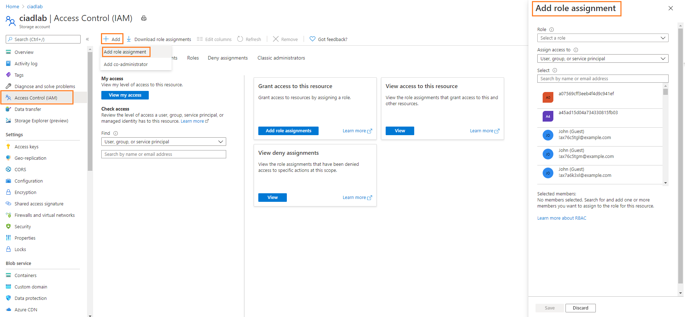
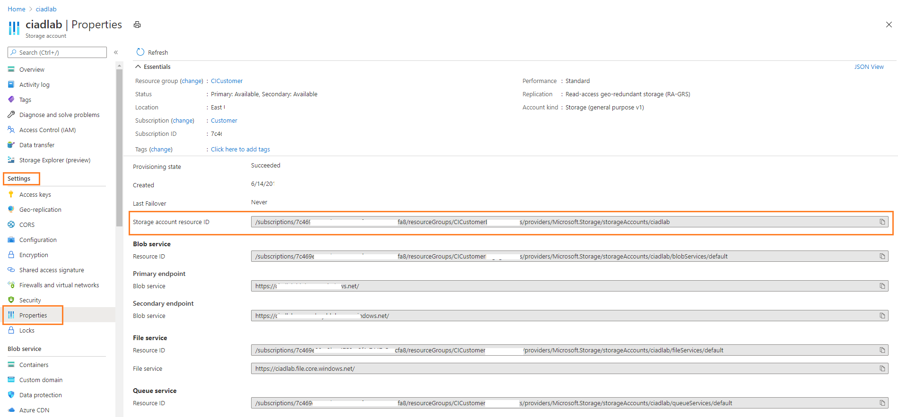
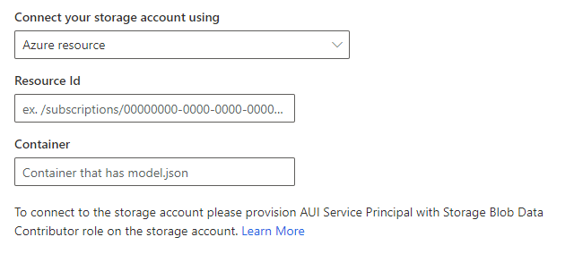

# Connect audience insights to an Azure Data Lake Storage Gen2 account with an Azure service principal

Automated tools that use Azure services should always have restricted permissions. Instead of having applications sign in as a fully privileged user, Azure offers service principals. This article provides information on how to connect audience insights with an Azure Data Lake Storage Gen2 account by an Azure service pricincap instead of storage account keys. 
In addition to increased security when connecting with a service principal, you won't have to update your account keys if the are updated.

You need admin permissions for your Azure subscription to create the service princpial.

## Create Azure service principal for audience insights

Before creating a new service principal for audience insights, check if it already exiss in your organization.

### Look for an existing service principal

1. Go to the [Azure admin portal(]https://portal.azure.com) and sign in to your organization.

2. Select **Azure Active Directory** from the Azure services.

3. Under **Manage**, select **Enterprise Applications**.

4. Search for the audience insights first party application ID `0bfc4568-a4ba-4c58-bd3e-5d3e76bd7fff` or the name `Dynamics 365 AI for Customer Insights`.

5. If you find a matching record, it means that the service principal for audience insights exists. You don't need to create it again..
   
   :::image type="content" source="media/ADLS-SP-AlreadyProvisioned.png" alt-text="Screenshot showing the existing service principal.":::
   
6. If no results are returned, [create a new service princpial](#create-a-new-service-princpial).

### Create a new service princpial

1. Install the latest version of the **Azure Active Directory PowerShell for Graph**. For more information, see [Install Azure Active Directory PowerShell for Graph](https://docs.microsoft.com/powershell/azure/active-directory/install-adv2).
   - On your PC, select the Windows key on your keyboard and search for **Windows PowerShell** and **Run as Administrator**.
   
   - In the PowerShell window that opens, enter `Install-Module AzureAD`.

2. Create the  service principal for audience insights with the Azure AD PowerShell Module.
   - In the PowerShell window, enter `Connect-AzureAD -TenantId "[your tenant ID]" -AzureEnvironmentName Azure`. Replace “your tenant ID” with the actual ID of your tenant where you want create the service princpial. The environment name parameter `AzureEnvironmentName` is optional.
  
   - Enter `New-AzureADServicePrincipal -AppId "0bfc4568-a4ba-4c58-bd3e-5d3e76bd7fff" -DisplayName "Dynamics 365 AI for Customer Insights"`. This command create the service principal for audience insights on the selected tenant.  

## Grant permissions to the service princpial to access the storage account

Go to the Azure portal to grant permissions to the service principal for the storage account you want to use in audience insights.

2. Go to https://portal.azure.com and login to your tenant.

3. Search and navigate to the storage account you wish to grant Audience Insights Service Principal access.

4. Once opened that storage account, select “Access control (IAM)” from the left side navigation pane and select “+ Add” and select “Add role assignment”
   > [!div class="mx-imgBorder"]
   > 
   
5. In the “Add role assignment” blade/panel that opens, select the following.
- Role: Storage Blob Data Contributor

- Assign access to: User, group, or service principal.

- Select: Copy paste the CI First party app display name "Dynamics 365 AI for Customer Insights" to search.

- Select the item returned in the search

6. You will see that the Audience Insights Service Principal will be listed in the “Selected members:” list
   > [!div class="mx-imgBorder"]
   > 
   
7.	Click Save.

8.	You will get a confirmation message that the role assignment is granted for the Audience Insights Service Principal.

9.	You can go to either “Role assignment” tab or “Roles” tab and select “Contributor” role to confirm that the Audience Insights Service Principal is granted the required role assignment.

10.	It may take up to 15 minutes for the changes to propagate.

## Enter the Azure Resource Id or the Azure Subscription details in the storage account attachment to Audience Insights.

1. When you want to attach a ADLS storage account in Audience Insights to either store output or read data from, you will see an option to select either an Azure Resource based approach or Azure Subscription based approach.

Follow the below steps to provide the required information on the selected approach.

### Azure Resource based storage account connection

1. Go to https://portal.azure.com and open your storage account.

2. Go to Settings > Properties on the left side navigation panel

3. Copy the Storage account resource ID value.
   > [!div class="mx-imgBorder"]
   > 

4. Paste it in the resource field displayed in the storage account connection screen.
   > [!div class="mx-imgBorder"]
   > 
   
5. Once the resource id information is provided, proceed further with the next steps to attach the storage account.

### Azure Subscription based storage account connection

1. Go to https://portal.azure.com and open your storage account.

2. Go to Settings > Properties on the left side navigation panel

3. Copy the Storage account Subscription, Resource group and the storage account name values.

4. Paste it in or select from the respective fields displayed in the storage account connection screen.
   > [!div class="mx-imgBorder"]
   > 
   
 5. Once the resource id information is provided, proceed further with the next steps to attach the storage account.
 
 Click here to go to [add or edit a Common Data Model folder as a data source](connect-common-data-model.md)
 
 Click here to go to [create a new or update an existing environment](manage-environments.md#create-an-environment-in-an-existing-organization)
 
