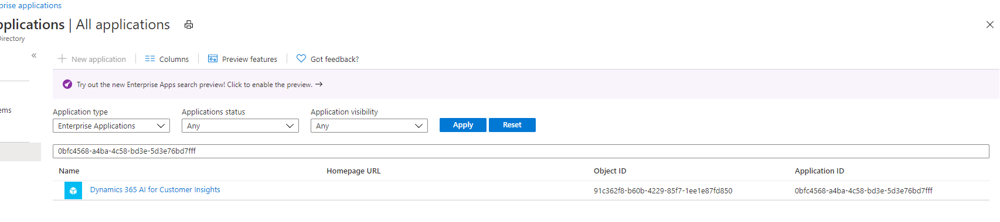

# Connect to an Azure Data Lake Storage Gen2 account by provisioning Audience Insights Azure AD Service Principal Name (SPN) to your Azure AD tenant.

This article provides information on how to connect to an Azure Data Lake Storage Gen2 account by provisioning Audience Insights Azure AD Service Principal Name (SPN) to your Azure AD tenant and not using storage account keys.

This approach can be followed to connect to any new storage account or update your existing account keys based stroage account connections to connect using the Azure Resource Id or the Azure Subscription details. 

The main advantages of connecting to a storage account using the Service Principal based approach is

1. This is in guidance and alignment with Azure security design principles to access Azure resources using resource information

2. Azure account key recycling is not secure and with this approach there will be no need to update the account keys in Audience Insights whenever account keys are updated on the Azure AD.

### This process involves three steps

1. Provision Audience Insights Azure AD Service Principal in your Azure AD tenant

2. Grant permissions to the Audience Insights Azure AD Service Principal access on your storage account.

3. Enter the Azure Resource Id or the Azure Subscription details in the storage account attachment to Audience Insights.

## Provision Audience Insights Azure AD Service Principal in your Azure AD tenant

### Prerequisites
- You should be a tenant admin to provision the Audience Insights Azure AD Service Principal in your Azure AD tenant.

As a first step, check if Audience Insights Service Principal is already provisioned on your tenant by following the below steps.

1. Go to https://portal.azure.com and login to your tenant.

2. Select "Azure Active Directory" from the Azure Services to go to the tenant overview page.

3. From the left side navigation under "Manage", select "Enterprise Applications".

4. Search for the Audience Insights first party application id "0bfc4568-a4ba-4c58-bd3e-5d3e76bd7fff" or the name "Dynamics 365 AI for Customer Insights".

5. If you find a matching record on either of the values, it means that the Audience Insights Service Principal is already provisioned in your tenant, and you can skip the steps to manually provision it.
   > [!div class="mx-imgBorder"]
   > 
   
6. If no results are returned, follow the below steps to manually provision the Audience Insights Service Principal.

### Instructions

1. Install the latest version of the “Azure Active Directory PowerShell for Graph” on your machine.
- On your machine, select the Windows key on your keyboard and search for “Windows PowerShell” and select “Run as Administrator”.

- In the PowerShell window that opens, type in / copy paste this instruction.
  
  Install-Module AzureAD
  
- Refer to this document for more information on installing the PowerShell for Azure AD https://docs.microsoft.com/en-us/powershell/azure/active-directory/install-adv2?view=azureadps-2.0

2. Tenant specific Service Principal Provisioning with Azure AD PowerShell Module
- In the PowerShell window opened from step #1 above, copy/paste the following command to provision Audience Insights Service Principal in your tenant. Replace “The tenant id” with your tenant where you want provision the CI Service Principal.

- The environment name parameter ‘AzureEnvironmentName’ is an optional field so you can skip this parameter if you choose to.

  Connect-AzureAD -TenantId "[your tenant Id]" -AzureEnvironmentName Azure
  
- Provision the Audience Insights App ID “0bfc4568-a4ba-4c58-bd3e-5d3e76bd7fff” and Display Name "Dynamics 365 AI for Customer Insights" by the following command.
  
  New-AzureADServicePrincipal -AppId "0bfc4568-a4ba-4c58-bd3e-5d3e76bd7fff" -DisplayName "Dynamics 365 AI for Customer Insights"
  
- You might be asked to login to the tenant using the user account from the tenant.

## Grant permissions to the Audience Insights Service Principal to access the storage account

### Prerequisites
- You should be a an admin/co-admin/owner  on the storage account to grant required roles for the Audience Insights Service Principal on the storage account.

### Instructions

1. Once the Audience Insights Service Principal is granted access as above, go to your Azure portal to manually grant permissions to the Audience Insights SP on the storage account you wish to attach to Audience Insights.

2. Go to https://portal.azure.com and login to your tenant.

3. Search and navigate to the storage account you wish to grant Audience Insights Service Principal access.

4. Once opened that storage account, select “Access control (IAM)” from the left side navigation pane and select “+ Add” and select “Add role assignment”
   > [!div class="mx-imgBorder"]
   > 
   
5. In the “Add role assignment” blade/panel that opens, select the following.
- Role: Storage Blob Data Contributor

- Assign access to: User, group, or service principal.

- Select: Copy paste the CI First party app display name "Dynamics 365 AI for Customer Insights" to search.

- Select the item returned in the search

6. You will see that the Audience Insights Service Principal will be listed in the “Selected members:” list
   > [!div class="mx-imgBorder"]
   > 
   
7.	Click Save.

8.	You will get a confirmation message that the role assignment is granted for the Audience Insights Service Principal.

9.	You can go to either “Role assignment” tab or “Roles” tab and select “Contributor” role to confirm that the Audience Insights Service Principal is granted the required role assignment.

10.	It may take up to 15 minutes for the changes to propagate.

## Enter the Azure Resource Id or the Azure Subscription details in the storage account attachment to Audience Insights.

1. When you want to attach a ADLS storage account in Audience Insights to either store output or read data from, you will see an option to select either an Azure Resource based approach or Azure Subscription based approach.

Follow the below steps to provide the required information on the selected approach.

### Azure Resource based storage account connection

1. Go to https://portal.azure.com and open your storage account.

2. Go to Settings > Properties on the left side navigation panel

3. Copy the Storage account resource ID value.
   > [!div class="mx-imgBorder"]
   > 

4. Paste it in the resource field displayed in the storage account connection screen.
   > [!div class="mx-imgBorder"]
   > 
   
5. Once the resource id information is provided, proceed further with the next steps to attach the storage account.

### Azure Subscription based storage account connection

1. Go to https://portal.azure.com and open your storage account.

2. Go to Settings > Properties on the left side navigation panel

3. Copy the Storage account Subscription, Resource group and the storage account name values.

4. Paste it in or select from the respective fields displayed in the storage account connection screen.
   > [!div class="mx-imgBorder"]
   > 
   
 5. Once the resource id information is provided, proceed further with the next steps to attach the storage account.
 
 Click here to go to [add or edit a Common Data Model folder as a data source](connect-common-data-model.md)
 
 Click here to go to [create a new or update an existing environment](manage-environments.md#create-an-environment-in-an-existing-organization)
 
