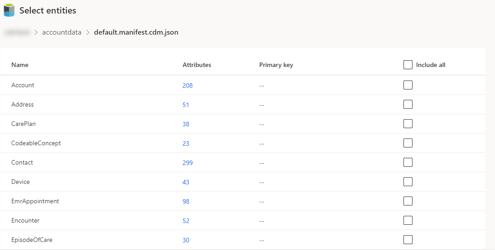
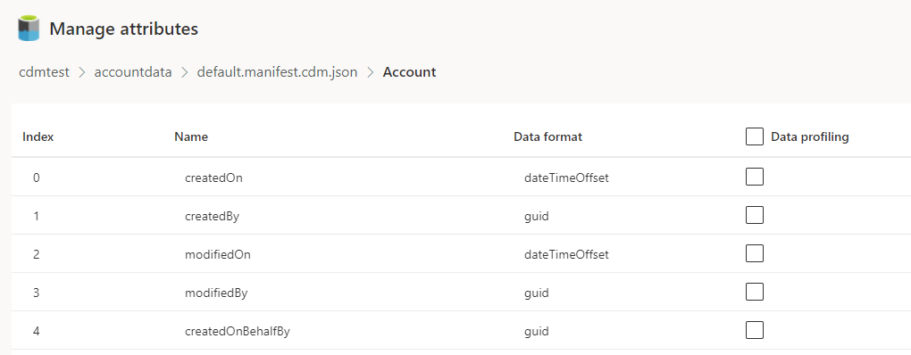
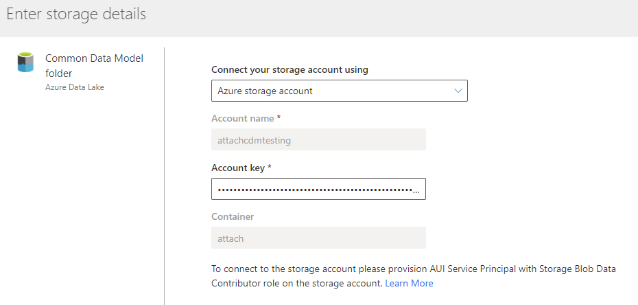

# Connect to a Common Data Model folder using an Azure Data Lake account

This article provides information on how to ingest data from a Common Data Model folder using your Azure Data Lake Storage Gen2 account.

## Important considerations

- Data in your Azure Data Lake needs to follow the Common Data Model standard. Other formats aren't supported at the moment.

- Data ingestion supports Azure Data Lake *Gen2* storage accounts exclusively. You can't use Azure Data Lake Gen1 storage accounts to ingest data.

- To authenticate with an Azure service principal, make sure it's configured in your tenant. For more information, see [Connect audience insights to an Azure Data Lake Storage Gen2 account with an Azure service principal](connect-service-principal.md).

- The Azure Data Lake you want to connect and ingest data from have to be in the same Azure region as the Dynamics 365 Customer Insights environment. Connections to a Common Data Model folder from a data lake in a different Azure region is not supported. To know the Azure region of the environment, go to **Admin** > **System** > **About** in audience insights.

- Data stored in online services, may be stored in a different location than where data is processed or stored in Dynamics 365 Customer Insights. By importing or connecting to data stored in online services, you agree that data can be transferred to and stored with Dynamics 365 Customer Insights. [Learn more at the Microsoft Trust Center.](https://www.microsoft.com/trust-center)

## Connect to a Common Data Model folder

1. In audience insights, go to **Data** > **Data sources**.

1. Select **Add data source**.

1. Select **Connect to a Common Data Model folder**, enter a **Name** for the data source, and select **Next**. Name guidelines: 
   - Start with a letter.
   - Use letters and numbers only. Special characters and spaces are not allowed.
   - Use between 3 and 64 characters.

1. You can choose between using a resource-based option and a subscription-based option for authentication. For more information, see [Connect audience insights to an Azure Data Lake Storage Gen2 account with an Azure service principal](connect-service-principal.md). Enter the **Container** information and select **Next**.
   > [!div class="mx-imgBorder"]
   > 
   > [!NOTE]
   > You need one of the following roles either to the container or the storage account referred above to be able to connect to and create a data source:
   >  - Storage Blob Data Reader
   >  - Storage Blob Data Owner
   >  - Storage Blob Data Contributor

1. In the **Select a Common Data Model folder** dialog, select the model.json or manifest.json file to import data from, and select **Next**.
   > [!NOTE]
   > Any model.json or manifest.json file associated with another data source in the environment won't show in the list.

1. You'll get a list of available entities in the selected model.json or manifest.json file. You can review and select from the list of available entities and select **Save**. All of the selected entities will be ingested from the new data source.
   > [!div class="mx-imgBorder"]
   > 

8. Indicate which data entities you want to enable data profiling and select **Save**. Data profiling enables analytics and other capabilities. You can select the whole entity, which selects all attributes from the entity, or select certain attributes of your choice. By default, no entity is enabled for data profiling.
   > [!div class="mx-imgBorder"]
   > 

9. After saving your selections, the **Data sources** page opens. You should now see the Common Data Model folder connection as a data source.

> [!NOTE]
> A model.json file or manifest.json can only associate with one data source in the same environment. However, the same model.json or manifest.json file can be used for data sources in multiple environments.

## Edit a Common Data Model folder data source

You can update the access key for the storage account containing the Common Data Model folder. You may also change the model.json or manifest.json file. To connect to a different container from your storage account, or change the account name, [create a new data source connection](#connect-to-a-common-data-model-folder).

1. In audience insights, go to **Data** > **Data sources**.

2. Next to the data source you'd like to update, select the ellipsis.

3. Select the **Edit** option from the list.

4. Optionally, update the **Access key** and select **Next**.

   

5. Optionally, you can update from an account key connection to a resource-based or a subscription-based connection. For more information, see [Connect audience insights to an Azure Data Lake Storage Gen2 account with an Azure service principal](connect-service-principal.md). You can't change **Container** information when updating the connection.
   > [!div class="mx-imgBorder"]

   > 

   > [!NOTE]
   > You need one of the following roles either to the container or the storage account referred above to be able to connect to and create a data source:
   >  - Storage Blob Data Reader
   >  - Storage Blob Data Owner
   >  - Storage Blob Data Contributo

6. Optionally, choose a different model.json or manifest.json file with a different set of entities from the container.

7. Optionally, you can select additional entities to ingest. You can also remove any already selected entities if there are no dependencies.

   > [!IMPORTANT]
   > If there are dependencies on the existing model.json or manifest.json file and the set of entities, you'll see an error message and can't select a different model.json or manifest.json file. Remove those dependencies before changing the model.json or manifest.json file or create a new data source with the model.json or manifest.json file that you want to use to avoid removing the dependencies.

8. Optionally, you can select additional attributes or entities to enable data profiling on or disable already selected ones.   

[!INCLUDE[footer-include](../includes/footer-banner.md)]