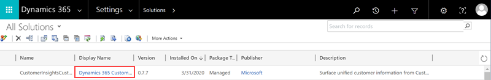

# Customer Card Add-in (preview)

[!INCLUDE [cc-data-platform-banner](../includes/cc-data-platform-banner.md)]

Get a 360-degree view of your customers directly in Dynamics 365 apps. With the Customer Card Add-in installed in a supported Dynamics 365 app you can choose to display demographics, insights, and activity timelines. The add-in will retrieve data from Customer Insights without affecting the data in the connected Dynamics 365 app. 

## Prerequisites

- The add-in only works with Dynamics 365 model-driven apps, such as Sales or Customer Service, version 9.0 and later.
- For your Dynamics 365 data to map to the audience insights customer profiles they need to be [ingested from the Dynamics 365 app using the Common Data Service connector](connect-power-query.md).
- All Dynamics 365 users of the Customer Card Add-in must be [added as users](permissions.md) in audience insights to see the data.
- [Configured search and filter capabilities](search-filter-index.md) in audience insights are required for lookup of data to work.
- Each add-in control relies on specific data in audience insights:
  - Measure control: Requires [configured measures](measures.md).
  - Intelligence control: Requires data generated using [predictions](predictions.md) or [custom models](custom-models.md).
  - Demographic control: Demographic fields(such as age or gender) are available in the unified customer profile.
  - Enrichment control: Requires active [enrichments](enrichment-hub.md) applied to customer profiles.
  - Timeline control: Requires [configured activities](activities.md).

## Install the Customer Card Add-in

The Customer Card Add-in is a solution for customer engagement apps in Dynamics 365. To install the solution, go to AppSource and search for **Dynamics Customer Card**. Select the [Customer Card Add-in on AppSource](https://appsource.microsoft.com/product/dynamics-365/mscrm.dynamics_365_customer_insights_customer_card_addin?tab=Overview) and select **Get It Now**.

You may need to sign in with your admin credentials for the Dynamics 365 app to install the solution.

It can take some time for the solution to be installed to your environment.

## Configure the Customer Card Add-in

1. As an admin, go to the **Settings** section in Dynamics 365 and select **Solutions**.

1. Select the **Display Name** link for the **Dynamics 365 Customer Insights Customer Card Add-in (Preview)** solution.

   > [!div class="mx-imgBorder"]
   > 

1. Select **Sign in** and enter the credentials for the admin account you use to configure Customer Insights.

   > [!NOTE]
   > Check that the browser pop-up blocker does not block the authentication window when you select the **Sign in** button.

1. Select the Customer Insights environment you want to fetch data from.

1. Define the field mapping to records in the Dynamics 365 app. Depending on your data in Customer Insights you can choose to map the following options:
   - To map with a contact, select the field in the Customer entity that matches the ID of your contact entity.
   - To map with an account, select the field in the Customer entity that matches the ID of your account entity.

   > [!div class="mx-imgBorder"]
   > 

1. Select **Save configuration** to save the settings.

1. Next, you need to assign security roles in Dynamics 365 so users can customize and see the customer card. In Dynamics 365, go to **Settings** > **Security** > **Users**. Select the users to edit user roles and select **Manage roles**.

1. Assign the **Customer Insights Card Customizer** role to users who will customize the content shown on the card for the whole organization.

## Add Customer Card controls to forms
  
1. To add the Customer Card controls to your Contact form, go to the **Settings** > **Customizations** in Dynamics 365.

1. Select **Customize the System**.

1. Browse to the **Contact** entity, expand it and select **Forms**.

1. Select the contact form to which you want to add the Customer Card controls.

    > [!div class="mx-imgBorder"]
    > 

1. To add a control, in the form editor, drag any field from the **Field Explorer** to where you want the control to appear.

1. Select the field on the form that you just added, and select **Change Properties**.

1. Go to the **Controls** tab and select **Add Control**. Choose one of the available custom controls and select **Add**.

1. In the **Field Properties** dialog, clear the **Display label on the form** check box.

1. Select the **Web** option for the control. For the Enrichment control, select which enrichment type you want to display by configuring the **enrichmentType** field. Add a separate enrichment control for each enrichment type.

1. Select **Save** and **Publish** to publish the updated contact form.

1. Go to the published contact form. You'll see the newly added control. You might need to sign in the first time you use it.

1. To customize what you want to show on the custom control, select the edit button in the upper-right corner.

## Upgrade Customer Card Add-in
The Customer Card Add-in doesn't upgrade automatically. To upgrade to the latest version, follow this procedure in the Dynamics 365 app that has the Add-in installed.

1. In the Dynamics 365 app, go to **Settings** > **Customization** and select **Solutions**.

1. In the table of add-ins look for **CustomerInsightsCustomerCard** and select the row.

1. Select the **Apply Solution Upgrade** in the action bar.

   :::image type="content" source="media/customer-card-add-in-upgrade.png" alt-text="Upgrade the solution in the Customization area of Dynamics 365 apps":::

1. After starting the upgrade process, you'll see a loading indicator until the upgrade completes. If there's no newer version, the upgrade will show an error message.

[!INCLUDE[footer-include](../includes/footer-banner.md)]
