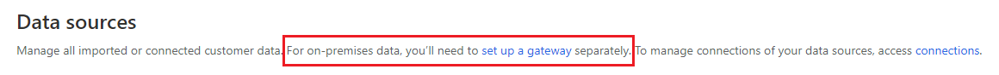

# Data sources overview

[!INCLUDE [cc-data-platform-banner](../includes/cc-data-platform-banner.md)]

The audience insights capability in Dynamics 365 Customer Insights connects to data from a broad set of sources. Connecting to a data source is often referred to as the process of *data ingestion*. After ingesting the data, you can [unify](data-unification.md) and take action on it.

## Add a data source

Refer to the detailed articles on how to add a data source, depending on which option you choose.

You can add a data source in three main ways:

- [Through dozens of Power Query connectors](connect-power-query.md)
- [From a Common Data Model folder](connect-common-data-model.md)
- [From your own Common Data Service lake](connect-common-data-service-lake.md)

## Add data from on-premises data sources

Ingesting data from on-premises data sources in Audience Insights is supported based on the Power Platform dataflows (PPDF). Power Platform dataflows can be enabled in Customer Insights by [providing the Microsoft Dataverse environment](manage-environments.md#create-an-environment-in-an-existing-organization)

Any new data sources created after associating a Microsoft Dataverse environment to Customer Insights will default to Power Platform dataflows and therefore can support on-prem connectivity using the data gateways. Existing data sources still cannot support on-prem gateways yet. You need to remove and recreate them to also start supporting on-prem connectivity or create new data sources altogether.

Any existing data gateways from your existing Power BI and/or Power Apps will be visible and can be repurposed in Customer Insights as well. Data sources page will display links to go the Power Platform environment where you can view and configure on-premises data gateways.

> [!div class="mx-imgBorder"]
> 

## Review ingested data

You'll see the name of each ingested data source, its status, and the last time the data was refreshed for that source. You can sort the list of data sources by every column.

> [!div class="mx-imgBorder"]
> 

|Status  |Description  |
|---------|---------|
|Successful   |Data source was successfully ingested if a time is mentioned in the **Refreshed** column.
|Not started   |The data source has no data ingested yet or still in draft mode.         |
|Refreshing    |Data ingestion is in progress. You can cancel this operation by selecting **Stop refreshing** in the **Actions** column. Stopping the refresh of a data source will revert it to its last refresh state.       |
|Failed     |Data ingestion ran into errors.         |

Select the value in the **Status** column of any data source to review more details. In the **Progress details** pane, expand **Data sources**. Select **See details** for more information about the refresh status, including error details and downstream process updates.

Loading data can take some time. After a successful refresh, the ingested data can be reviewed from the **Entities** page. For more information, see [Entities](entities.md).

## Refresh a data source

Data sources can be refreshed on an automatic schedule or refreshed manually on demand. 

Go to **Admin** > **System** > [**Schedule**](system.md#schedule-tab) to configure scheduled refreshes of all your ingested data sources.

To refresh a data source on demand, follow these steps:

1. In audience insights, go to **Data** > **Data sources**

2. Select the vertical ellipsis next to the data source you want to refresh and select **Refresh** from the drop-down list.

3. The data source is now triggered for a manual refresh. Refreshing a data source will update both the entity schema as well as data for all the entities specified in the data source.

4. Select **Stop refreshing** if you want to cancel an existing refresh and the data source will revert to its last refresh status.

## Delete a data source

1. In audience insights, go to **Data** > **Data sources**.

2. Select the vertical ellipsis next to the data source you want to remove and select **Delete** from the drop-down menu.

3. Confirm your deletion.

[!INCLUDE[footer-include](../includes/footer-banner.md)]
