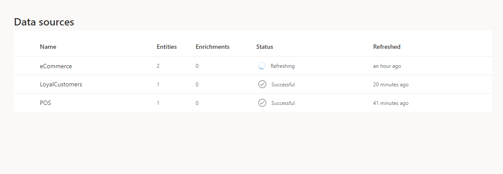

# Data sources overview

[!INCLUDE [cc-data-platform-banner](../includes/cc-data-platform-banner.md)]

The audience insights capability in Dynamics 365 Customer Insights connects to data from a broad set of sources. Connecting to a data source is often referred to as the process of *data ingestion*. After ingesting the data, you can [unify](data-unification.md) and take action on it.

## Add a data source

Refer to the detailed articles on how to add a data source, depending on which option you choose.

You can add a data source in three main ways:

- [Through dozens of Power Query connectors](connect-power-query.md)
- [From a Common Data Model folder](connect-common-data-model.md)
- [From your own Microsoft Dataverse lake](connect-dataverse-managed-lake.md)

## Add data from on-premises data sources

Ingesting data from on-premises data sources in audience insights is supported based on Microsoft Power Platform dataflows. Dataflows can be enabled in Customer Insights by [providing the Microsoft Dataverse environment URL](create-environment.md) when setting up the environment.

Data sources that are created after associating a Dataverse environment with Customer Insights will use [Power Platform dataflows](/power-query/dataflows/overview-dataflows-across-power-platform-dynamics-365) by default. Dataflows support on-premises connectivity using the data gateway. Remove and recreate data sources that existed before a Dataverse environment was associated to [use the on-premises data gateways](/data-integration/gateway/service-gateway-app).

Data gateways from an existing Power BI or Power Apps environment will be visible and you can reuse in Customer Insights. The data sources page shows links to go to the Microsoft Power Platform environment where you can view and configure on-premises data gateways.

## Review ingested data

You'll see the name of each ingested data source, its status, and the last time the data was refreshed for that source. You can sort the list of data sources by every column.

> [!div class="mx-imgBorder"]
> 

|Status  |Description  |
|---------|---------|
|Successful   |Data source was successfully ingested if a time is mentioned in the **Refreshed** column.
|Not started   |The data source has no data ingested yet or still in draft mode.         |
|Refreshing    |Data ingestion is in progress. You can cancel this operation by selecting **Stop refreshing** in the **Actions** column. Stopping the refresh of a data source will revert it to its last refresh state.       |
|Failed     |Data ingestion ran into errors.         |

Select the value in the **Status** column of any data source to review more details. In the **Progress details** pane, expand **Data sources**. Select **See details** for more information about the refresh status, including error details and downstream process updates.

Loading data can take time. After a successful refresh, the ingested data can be reviewed from the **Entities** page. For more information, see [Entities](entities.md).

## Refresh a data source

Data sources can be refreshed on an automatic schedule or refreshed manually on demand. 

Go to **Admin** > **System** > [**Schedule**](system.md#schedule-tab) to configure scheduled refreshes of all your ingested data sources.

To refresh a data source on demand, follow these steps:

1. In audience insights, go to **Data** > **Data sources**.

2. Select the vertical ellipsis next to the data source you want to refresh and select **Refresh** from the dropdown list.

3. The data source is now triggered for a manual refresh. Refreshing a data source will update both the entity schema and data for all the entities specified in the data source.

4. Select **Stop refreshing** if you want to cancel an existing refresh and the data source will revert to its last refresh status.

## Delete a data source

1. In audience insights, go to **Data** > **Data sources**.

2. Select the vertical ellipsis next to the data source you want to remove and select **Delete** from the dropdown menu.

3. Confirm your deletion.

[!INCLUDE[footer-include](../includes/footer-banner.md)]
