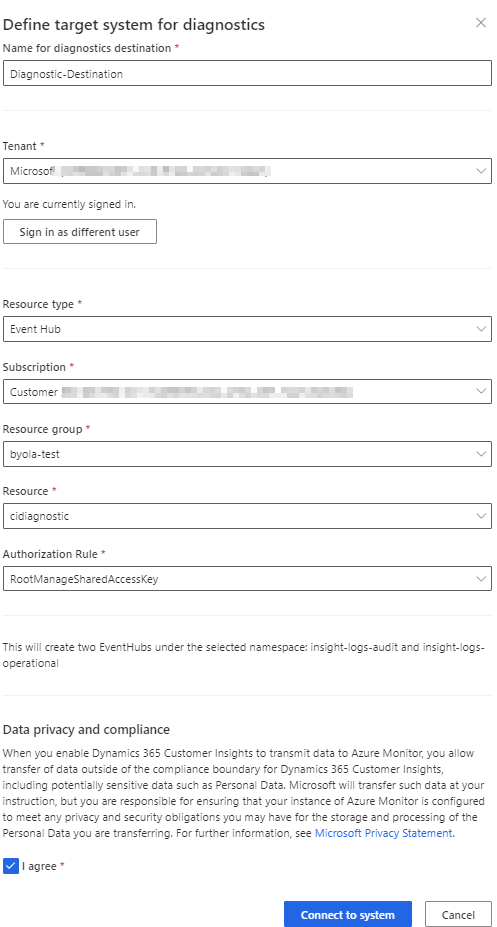

# Log forwarding in Dynamics 365 Customer Insights with Azure Monitor (Preview)

Dynamics 365 Customer Insights provides a direct integration with Azure Monitor. Azure Monitor resource logs let you monitor and send logs to [Azure Storage](https://azure.microsoft.com/services/storage/), [Azure Log Analytics](/azure/azure-monitor/logs/log-analytics-overview), or stream them to [Azure Event Hubs](https://azure.microsoft.com/services/event-hubs/).

Customer Insights is sends the following event logs:

- **Audit Events**
  - **APIEvent** - enables change tracking done via the Dynamics 365 Customer Insights UI.
- **Operational Events**
  - **WorkflowEvent** - The Workflow allows one to setup [Data Sources](data-sources.md), [unify](data-unification.md) and [enrich](enrichment-hub.md) and finally [export](export-destinations.md) data into other systems. All those steps can be done individually (e.g. trigger a single export) or orchestrated (e.g. data refresh from data sources which trigger the unification process which will pull in additional enrichments and once done export the data into another system). For more details see the [WorkflowEvent Schema](#workflow-event-schema).
  - **APIEvent** - all API calls to the customers instance to Dynamics 365 Customer Insights. For more details see the [APIEvent Schema](#api-event-schema).

## Set up the diagnostic settings

### Prerequisites

To configure diagnostics in Customer Insights, the following prerequisites must be met:

- You have an active [Azure Subscription](https://azure.microsoft.com/pricing/purchase-options/pay-as-you-go/).
- You have [Administrator](permissions.md#administrator) permissions in Customer Insights.
- You have the **Contributor** and **User Access Administrator** role on the destination resource on Azure. The resource can be an Azure Storage account, an Azure Event Hub, or an Azure Log Analytics workspace. For more information, see [Add or remove Azure role assignments using the Azure portal](/azure/role-based-access-control/role-assignments-portal).
- [Destination requirements](/azure/azure-monitor/platform/diagnostic-settings#destination-requirements) for Azure Storage, Azure Event Hub, or Azure Log Analytics met.
- You have at least the **Reader** role on the resource group the resource belongs to.

### Set up diagnostics with Azure Monitor

1. In Customer Insights, select **System** > **Diagnostics** to see the diagnostics destinations configured this instance.

1. Select **Add destination**.

   > [!div class="mx-imgBorder"]
   > 

1. Provide a name in the **Name for diagnostics destination** field.

1. Choose the **Tenant** of the Azure subscription with the destination resource and select **Sign in**.

1. Select the **Resource type** (Storage account, Event Hub, or log analytics).

1. Select the **Subscription** for the destination resource.

1. Select the **Resource group** for the destination resource.

1. Select the **Resource**.

1. Confirm the **Data privacy and compliance** statement.

1. Select **Connect to system** to connect to the destination resource. The logs start to appear in the destination after 15 minutes, if the API is in use and generates events.

### Remove a destination

1. Go to **System** > **Diagnostics**.

1. Select the diagnostics destination in the list.

1. In the **Actions** column, select the **Delete** icon.

1. Confirm the deletion to stop the log forwarding. The resource on the Azure subscription won't be deleted. You can select the link in the **Actions** column to open the Azure portal for the selected resource and delete it there.

## Log categories and event schemas

Currently [API events](apis.md) and workflow events are supported and the following categories and schemas apply.
The log schema follows the [Azure Monitor common schema](/azure/azure-monitor/platform/resource-logs-schema#top-level-common-schema).

### Categories

Customer Insights provides two categories:

- **Audit events**: [API events](#api-event-schema) to track the configuration changes on the service. `POST|PUT|DELETE|PATCH` operations go into this category.
- **Operational events**: [API events](#api-event-schema) or [workflow events](#workflow-event-schema) generated while using the service.  For example, `GET` requests or the execution events of a workflow.

## Configuration on the destination resource

Based on your choice on the resource type the following steps will automatically apply:

### Storage account

Customer Insights service principal gets the **Storage Account Contributor** permission on the selected resource and creates two containers under the selected namespace:

- `insight-logs-audit` containing **audit events**
- `insight-logs-operational` containing **operational events**

### Event Hub

Customer Insights service principal gets the **Azure Event Hubs Data Owner** permission on the resource and will create two Event Hubs under the selected namespace:

- `insight-logs-audit` containing **audit events**
- `insight-logs-operational` containing **operational events**

### Log Analytics

Customer Insights service principal gets the **Log Analytics Contributor** permission on the resource. The logs will be available under **Logs** > **Tables** > **Log Management** on the selected Log Analytics workspace. Expand the **Log Management** solution and locate the `CIEventsAudit` and `CIEventsOperational` tables.

- `CIEventsAudit` containing **audit events**
- `CIEventsOperational` containing **operational events**

Under the **Queries** window, expand the **Audit** solution and locate the example queries provided by searching for `CIEvents`.

## Event schemas

API events and workflow events have a common structure and details where they differ, see [API event schema](#api-event-schema) or [workflow event schema](#workflow-event-schema).

### API event schema

| Field             | DataType  | Required/Optional | Description       | Example        |
| ----------------- | --------- | ----------------- | --------------------- | ------------------------ |
| `time`            | Timestamp | Required          | Timestamp of the event (UTC)       | `2020-09-08T09:48:14.8050869Z`         |
| `resourceId`      | String    | Required          | ResourceId of the instance that emitted the event         | `/SUBSCRIPTIONS/XXXXXXXX-XXXX-XXXX-XXXX-XXXXXXXX/RESOURCEGROUPS/<RESOURCEGROUPNAME>/`<br>`PROVIDERS/MICROSOFT.D365CUSTOMERINSIGHTS/`<br>`INSTANCES/XXXXXXXX-XXXX-XXXX-XXXX-XXXXXXXX`  |
| `operationName`   | String    | Required          | Name of the operation represented by this event.                                                                                                                | `Workflows.GetWorkFlowStatusAsync`                                                                                                                                       |
| `category`        | String    | Required          | Log category of the event. Either `Operational` or `Audit`. All POST/PUT/PATCH/DELETE HTTP Requests are tagged with `Audit`, everything else with `Operational` | `2020-09-08T09:48:14.8050869Z`                                                                                                                                           |
| `resultType`      | String    | Required          | Status of the event. `Success`, `ClientError`, `Failure`                                                                                                        |                                                                                                                                                                          |
| `resultSignature` | String    | Optional          | Result status of the event. If the operation corresponds to a REST API call, it's the HTTP status code.        | `200`             |
| `durationMs`      | Long      | Optional          | Duration of the operation in milliseconds.     | `133`     |
| `callerIpAddress` | String    | Optional          | Caller IP address, if the operation corresponds to an API call that comes from a publicly available IP address.                                                 | `144.318.99.233`         |
| `identity`        | String    | Optional          | JSON object describing the identity of the user or application that did the operation.       | See [Identity](#identity-schema)  section.     |  |
| `properties`      | String    | Optional          | JSON object with more properties to the particular category of events.      | See [Properties](#api-properties-schema) section.    |
| `level`           | String    | Required          | Severity level of the event.    | `Informational`, `Warning`, `Error`, or `Critical`.           |
| `uri`             | String    | Optional          | Absolute request URI.    |               |

#### Identity schema

The `identity` JSON object has the following structure

```json
{
  "Authorization" : {
    "UserRole": "Admin",
    "RequiredRoles": [
      "Contributor",
      "Viewer"
      ]
    },
  "Claims" {
    "claimNameX" : "claimValueX",
    "claimNameY" : "claimValueY"
   }
}  
```

| Field                         | Description                                                                                                                          |
| ----------------------------- | ------------------------------------------------------------------------------------------------------------------------------------ |
| `Authorization.UserRole`      | Assigned role for the user or app. For more information, see [user permissions](permissions.md).                                     |
| `Authorization.RequiredRoles` | Required roles to do the operation. `Admin` role is allowed to do all operations.                                                    |
| `Claims`                      | Claims of the user or app JSON web token (JWT). Claim properties vary per organization and the Azure Active Directory configuration. |

#### API properties schema

[API events](apis.md) have following properties.

| Field                        | Description                                                                                                            |
| ---------------------------- | ---------------------------------------------------------------------------------------------------------------------- |
| `properties.eventType`       | Always `ApiEvent`, marking the log event as API event.                                                                 |
| `properties.userAgent`       | Browser agent sending the request or `unknown`.                                                                        |
| `properties.method`          | HTTP method: `GET/POST/PUT/PATCH/HEAD`.                                                                                |
| `properties.path`            | Relative path of the request.                                                                                          |
| `properties.origin`          | URI indicating where a fetch comes from or `unknown`.                                                                  |
| `properties.operationStatus` | `Success` for HTTP Status code < 400 <br> `ClientError` for HTTP Status code < 500 <br> `Error` for HTTP Status >= 500 |
| `properties.tenantId`        | Organization ID                                                                                                        |
| `properties.tenantName`      | Name of the organization.                                                                                              |
| `properties.callerObjectId`  | Azure Active Directory ObjectId of the caller.                                                                         |
| `properties.instanceId`      | Customer Insights `instanceId`                                                                                         |

### Workflow event schema

The workflow contains multiple steps. [Ingest data sources](data-sources.md), [unify](data-unification.md), [enrich](enrichment-hub.md), and [export](export-destinations.md) data. All those steps can run individually or orchestrated with following processes. 

#### Operation types

| OperationType     | Group                                     |
| ----------------- | ----------------------------------------- |
| Ingestion         | [Data sources](data-sources.md)           |
| DataPreparation   | [Data sources](data-sources.md)           |
| Map               | [Data unification](data-unification.md)   |
| Match             | [Data unification](data-unification.md)   |
| Merge             | [Data unification](data-unification.md)   |
| ProfileStore      | [Customer profiles](customer-profiles.md) |
| Search            | [Customer profiles](customer-profiles.md) |
| Activity          | [Activities](activities.md)                  |
| AttributeMeasures | [Segments and Measures](segments.md)      |
| EntityMeasures    | [Segments and Measures](segments.md)      |
| Measures          | [Segments and Measures](segments.md)      |
| Segmentation      | [Segments and Measures](segments.md)      |
| Enrichment        | [Enrichment](enrichment-hub.md)                                          |
| Intelligence      | [Predictions](predictions-overview.md)                                          |
| AiBuilder         | [Predictions](predictions-overview.md)                                          |
| Insights          | [Predictions](predictions-overview.md)                                          |
| Export            | [Exports](export-destinations.md)                                          |
| ModelManagement   | [Predictions](custom-models.md)                                           |
| Relationship      | [Data unification](relationships.md)                                           |

#### Field description

| Field           | DataType  | Required/Optional | Description                                                                                                                                                   | Example                                                                                                                                                                  |
| --------------- | --------- | ----------------- | ------------------------------------------------------------------------------------------------------------------------------------------------------------- | ------------------------------------------------------------------------------------------------------------------------------------------------------------------------ |
| `time`          | Timestamp | Required          | Timestamp of the event (UTC).                                                                                                                                 | `2020-09-08T09:48:14.8050869Z`                                                                                                                                           |
| `resourceId`    | String    | Required          | ResourceId of the instance that emitted the event.                                                                                                            | `/SUBSCRIPTIONS/XXXXXXXX-XXXX-XXXX-XXXX-XXXXXXXX/RESOURCEGROUPS/<RESOURCEGROUPNAME>/`<br>`PROVIDERS/MICROSOFT.D365CUSTOMERINSIGHTS/`<br>`INSTANCES/XXXXXXXX-XXXX-XXXX-XXXX-XXXXXXXX` |
| `operationName` | String    | Required          | Name of the operation represented by this event. `{OperationType}.[WorkFlow|Task][Started|Completed]`. See [Operation Types](#operation-types) for reference. | `Segmentation.WorkflowStarted`,<br> `Segmentation.TaskStarted`, <br> `Segmentation.TaskCompleted`, <br> `Segmentation.WorkflowCompleted`                                 |
| `category`      | String    | Required          | Log category of the event. Always `Operational` for Workflow events                                                                                           | `Operational`                                                                                                                                                            | 
| `resultType`    | String    | Required          | Status of the event. `Running`, `Skipped`, `Successful`, `Failure`                                                                                            |                                                                                                                                                                          |
| `durationMs`    | Long      | Optional          | Duration of the operation in milliseconds.                                                                                                                    | `133`                                                                                                                                                                    |
| `properties`    | String    | Optional          | JSON object with more properties to the particular category of events.                                                                                        | See sub section [Workflow Properties](#workflow-properties-schema)                                                                                                       |
| `level`         | String    | Required          | Severity level of the event.                                                                                                                                  | `Informational`, `Warning`, or `Error`                                                                                                                                   |
|                 |

#### Workflow properties schema

Workflow events have following properties.

| Field              | Workflow | Task | Description            |
| ------------------------------- | -------- | ---- | ----------- |
| `properties.eventType`                       | Yes      | Yes  | Always `WorkflowEvent`, marking the event as workflow event.                                                                                                                                                                                                |
| `properties.workflowJobId`                   | Yes      | Yes  | Identifier of the workflow run. All workflow and task events within the workflow execution have the same `workflowJobId`.                                                                                                                                   |
| `properties.operationType`                   | Yes      | Yes  | Identifier of the operation, see [Operation types].(#operation-types)                                                                                                                                                                                       |
| `properties.tasksCount`                      | Yes      | No   | Workflow only. Number of tasks the workflow triggers.                                                                                                                                                                                                       |
| `properties.submittedBy`                     | Yes      | No   | Optional. Workflow events only. The Azure Active Directory [objectId of the user](/azure/marketplace/find-tenant-object-id#find-user-object-id) who triggered the workflow, see also `properties.workflowSubmissionKind`.                                   |
| `properties.workflowType`                    | Yes      | No   | `full` or `incremental` refresh.                                                                                                                                                                                                                            |
| `properties.workflowSubmissionKind`          | Yes      | No   | `OnDemand` or `Scheduled`.                                                                                                                                                                                                                                  |
| `properties.workflowStatus`                  | Yes      | No   | `Running` or  `Successful`.                                                                                                                                                                                                                                 |
| `properties.startTimestamp`                  | Yes      | Yes  | UTC Timestamp `yyyy-MM-ddThh:mm:ss.SSSSSZ`                                                                                                                                                                                                                  |
| `properties.endTimestamp`                    | Yes      | Yes  | UTC Timestamp `yyyy-MM-ddThh:mm:ss.SSSSSZ`                                                                                                                                                                                                                  |
| `properties.submittedTimestamp`              | Yes      | Yes  | UTC Timestamp `yyyy-MM-ddThh:mm:ss.SSSSSZ`                                                                                                                                                                                                                  |
| `properties.instanceId`                      | Yes      | Yes  | Customer Insights `instanceId`                                                                                                                                                                                                                              |  |
| `properties.identifier`                      | No       | Yes  | - For OperationType = `Export`, the identifier is the guid of the export configuration. <br> - For OperationType = `Enrichment`, it's the guid of the enrichment <br> - For OperationType `Measures` and `Segmentation`, the identifier is the entity name. |
| `properties.friendlyName`                    | No       | Yes  | User-friendly name of the export or the entity that is processed.                                                                                                                                                                                           |
| `properties.error`                           | No       | Yes  | Optional. Error message with more details.                                                                                                                                                                                                                  |
| `properties.additionalInfo.Kind`             | No       | Yes  | Optional. For OperationType `Export` only. Identifies the type of the export. For more information, see [overview of export destinations](export-destinations.md).                                                                                          |
| `properties.additionalInfo.AffectedEntities` | No       | Yes  | Optional. For OperationType `Export` only. Contains a list of configured entities in the export.                                                                                                                                                            |
| `properties.additionalInfo.MessageCode`      | No       | Yes  | Optional. For OperationType `Export` only. Detailed message for the export.                                                                                                                                                                                 |
| `properties.additionalInfo.entityCount`      | No       | Yes  | Optional. For OperationType `Segmentation` only. Indicates the total numbers of members the segment has.                                                                                                                                                    |
