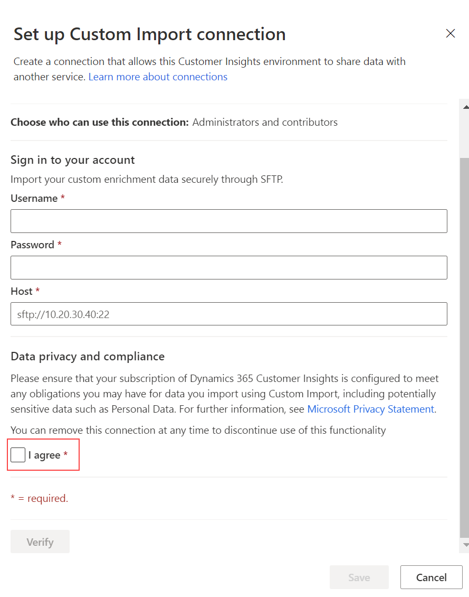

# Enrich customer profiles with custom data (preview)

Secure File Transfer Protocol (SFTP) custom import enables you to import data that does not have to go through the process of data unification. It's a flexible, secure, and easy way to bring in your data. SFTP custom import can be used in combination with [SFTP export](export-sftp.md) that lets you export the customer profile data that is needed for enrichment. The data can then be processed, enriched, and SFTP custom import can be used to bring the enriched data back to the audience insights capability of Dynamics 365 Customer Insights.

## Prerequisites

To configure SFTP custom import, the following prerequisites must be met:

- You have the filename and location (path) of the file to be imported on the SFTP host.
- There is a *model.json* file that specifies [the Common Data Model schema](/common-data-model/) for the data to be imported. This file must be in the same directory as the file to import.
- An SFTP connection has already been configured by an administrator *or* you have [administrator](permissions.md#administrator) permissions. You'll need the user credentials, URL, and port number for the SFTP location where you want to import data from.


## Configure the import

1. Go to **Data** > **Enrichment** and select the **Discover** tab.

1. On the **SFTP custom import tile**, select **Enrich my data** and then select **Get started**.

   :::image type="content" source="media/SFTP_Custom_Import_tile.png" alt-text="SFTP custom import tile.":::

1. Select a [connection](connections.md) from the drop-down. Contact an administrator if no connection is available. If you are an administrator, you can create a connection by selecting **Add connection** and choosing **SFTP Custom Import** from the drop-down.

1. Select **Connect to Custom Import** to confirm the selected connection.

1.	Select **Next** and enter the **Filename** and **Path** of the data file that you want to import.

    :::image type="content" source="media/enrichment-SFTP-path-and-filename.png" alt-text="Screenshot when entering data location.":::

1. Select **Next** and provide a name for the enrichment and a name for the output entity. 

1. Select **Save enrichment** after reviewing your choices.

## Configure the connection for SFTP Custom Import 

You need to be an administrator to configure connections. Select **Add connection** when configuring an enrichment *or* go to **Admin** > **Connections** and select **Set up** on the Custom Import tile.

1. Enter a name for the connection in the **Display name** box.

1. Enter valid user name, password, and host URL for the STFP server the data to be imported resides on.

1. Review and provide your consent for **Data privacy and compliance** by selecting the **I agree** checkbox.

1. Select **Verify** to validate the configuration.

1. Once the verification has completed, the connection can be saved by clicking **Save**.

> [!div class="mx-imgBorder"]
   > 


## Defining field mappings 

The directory that contains the file to be imported on the SFTP server must also contain a *model.json* file. This file defines the schema to use for importing the data. The schema has to use [the Common Data Model](/common-data-model/) to specify the field mapping. A simple example of a model.json file looks like this:

```
{
	"name": "EnrichmentFromMicrosoft",
	"description": "Model containing data enrichment",
	"entities": [
		{
			"name": "CustomImport",
			"attributes": [
				{
					"name": "CustomerId",
					"friendlyName": "Client id",
					"dataType": "string"
				},
				{
					"name": "PreferredCity",
					"friendlyName": "Preferred City for vacation",
					"dataType": "string"
				},
				{
					"name": "PreferredTransportation",
					"friendlyName": "Preferred transportation",
					"dataType": "string"
				}
			],
			"annotations": [
				{
					"name": "c360:PrimaryKey",
					"value": "CustomerId"
				}
			]
		}
	],
	"modifiedTime": "2020-01-02T12:00:00+08:00",
	"annotations": [
		{
			"name": "testAnnotation",
			"value": "testValue"
		}
	]
}
```

## Enrichment results

To start the enrichment process, select **Run** from the command bar. You can also let the system run the enrichment automatically as part of a [scheduled refresh](system.md#schedule-tab). The processing time will depend on the size of the data to be imported and the connection to the SFTP server.

After the enrichment process completes, you can review your newly imported custom enrichment data under **My enrichments**. Additionally, you'll find the time of the last update and the number of enriched profiles.

You can access a detailed view of each enriched profile by selecting **View enriched data**.

## Next steps

Build on top of your enriched customer data. Create [segments](segments.md), [measures](measures.md), and [export the data](export-destinations.md) to deliver personalized experiences to your customers.

[!INCLUDE[footer-include](../includes/footer-banner.md)]
