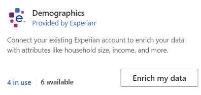

# Enrich customer profiles with demographics from Experian (preview)

Experian is a global leader in consumer and business credit reporting and marketing services. With Experian’s data enrichment services, you can build a deeper understanding of your customers by enriching your customer profiles with demographic data such as household size, income, and more.

## Prerequisites

To configure Experian, the following prerequisites must be met:

- You have an active Experian subscription. To get a subscription, [contact Experian](https://www.experian.com/marketing-services/contact) directly. [Learn more about Experian Data Enrichment](https://www.experian.com/marketing-services/microsoft?cmpid=ems_web_mci_cdppage).

- An Experian connection has already been configured by an administrator *or* you have [administrator](permissions.md#administrator) permissions. You also need the User ID, Party ID, and Model Number for your SSH-enabled Secure Transport (ST) account that Experian created for you.

## Supported countries/regions

We currently support enriching customer profiles in the United States only.

## Configure the enrichment

1. Go to **Data** > **Enrichment** and select the **Discover** tab.

1. Select **Enrich my data** on the Experian tile.

   > [!div class="mx-imgBorder"]
   > 
   > 

1. Select a [connection](connections.md) from the dropdown list. Contact an administrator if no connection is available. If you are an administrator, you can create a connection by selecting **Add connection** and choosing Experian from the dropdown list. 

1. Select **Connect to Experian** to confirm the connection selection.

1.	Select **Next** and choose the **Customer data set** you want to enrich with demographics data from Experian. You can select the **Customer** entity to enrich all your customer profiles or select a segment entity to enrich only customer profiles contained in that segment.

    :::image type="content" source="media/enrichment-Experian-configuration-customer-data-set.png" alt-text="Screenshot when choosing the customer data set.":::

1. Select **Next** and define which type of fields from your unified profiles should be used to look for matching demographics data from Experian. At least one of the fields **Name and address**, **Phone**, or **Email** is required. For a higher match accuracy, up to two other fields can be added. This selection will affect the mapping fields you have access to in the next step.

    > [!TIP]
    > More key identifier attributes sent to Experian likely yield a higher match rate.

1. Select **Next** to start the field mapping.

1. Define which fields from your unified profiles should be used to look for matching demographics data from Experian. Required fields are marked.

1. Provide a name for the enrichment and a name for the output entity.

1. Select **Save enrichment** after reviewing your choices.

## Configure the connection for Experian 

You need to be an administrator to configure connections. Select **Add connection** when configuring an enrichment *or* go to **Admin** > **Connections** and select **Set up** on the Experian tile.

1. Select **Get Started**.

1. Enter a name for the connection in the **Display name** box.

1. Enter valid User ID, Party ID, and Model Number for your Experian Secure Transport account.

1. Review and provide your consent for **Data privacy and compliance** by selecting **I agree**.

1. Select **Verify** to validate the configuration.

1. After completing the verification, select **Save**.
   
   :::image type="content" source="media/enrichment-Experian-connection.png" alt-text="Experian connection configuration pane.":::

## Enrichment results

To start the enrichment process, select **Run** from the command bar. You can also let the system run the enrichment automatically as part of a [scheduled refresh](system.md#schedule-tab). The processing time will depend on the size of your customer data and the enrichment processes set up for your account by Experian.

After the enrichment process completes, you can review the newly enriched customer profiles data under **My enrichments**. Additionally, you'll find the time of the last update and the number of enriched profiles.

You can access a detailed view of each enriched profile by selecting **View enriched data**.

## Next steps

[!INCLUDE [next-steps-enrichment](../includes/next-steps-enrichment.md)]

## Data privacy and compliance

When you enable Dynamics 365 Customer Insights to transmit data to Experian, you allow transfer of data outside of the compliance boundary for Dynamics 365 Customer Insights, including potentially sensitive data such as Personal Data. Microsoft will transfer such data at your instruction, but you are responsible for ensuring that Experian meets any privacy or security obligations you may have. For more information, see [Microsoft Privacy Statement](https://go.microsoft.com/fwlink/?linkid=396732).
Your Dynamics 365 Customer Insights administrator can remove this enrichment at any time to discontinue use of this functionality.

[!INCLUDE[footer-include](../includes/footer-banner.md)]
