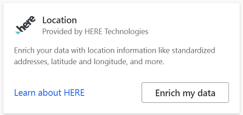
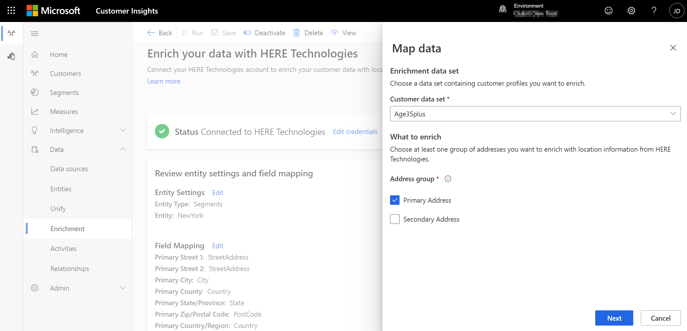
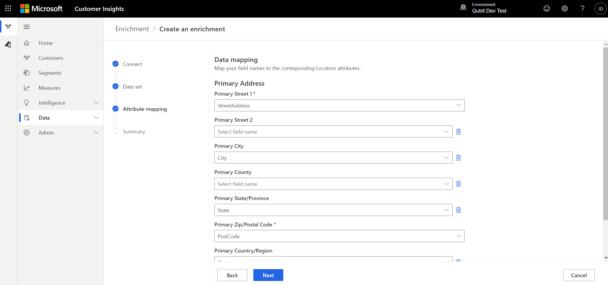

# Enrichment of customer profiles with HERE Technologies (preview)

HERE Technologies is a location platform company that provides location-centric data and services. With HERE Technologies' data enrichment services, you can build a more precise location understanding of your customers with address normalization, latitude and longitude extraction, and more.

## Prerequisites

To configure HERE Technologies enrichments, the following prerequisites must be met:

- You have an active HERE Technologies subscription. To get a subscription, you can [sign-up here](https://developer.here.com/sign-up?utm_medium=referral&utm_source=Microsoft-Dynamics-CI&create=Freemium-Basic) or [contact HERE Technologies](https://developer.here.com/help?utm_medium=referral&utm_source=Microsoft-Dynamics-CI#how-can-we-help-you) directly. [Learn more about HERE Technologies Location Enrichment.](https://developer.here.com/location-enrichment?cid=Dev-MicrosoftDynamics-DB-0-Dev-&utm_source=MicrosoftDynamics&utm_medium=referral&utm_campaign=Online_Dev_ReferralMicrosoft)

- You have the HERE Technologies API key.

- You have [Administrator](permissions.md#administrator) permissions.

## Configuration

1. Go to **Data** > **Enrichment**.

1. Select **Enrich my data** on the HERE Technologies tile.

   > [!div class="mx-imgBorder"]
   > 

1. Enter an active **HERE Technologies API key**. Review and provide your consent for **Data privacy and compliance** by selecting the **I agree** checkbox. 

1. Confirm both inputs by selecting **Connect to HERE**.

1.	Select **Add data** and choose the **Customer data set** you want to enrich with location data from HERE Technologies. You can select the **Customer** entity to enrich all your customer profiles or select a segment entity to enrich only customer profiles contained in that segment.

   > [!div class="mx-imgBorder"]
   > 

1. Choose if you want to map fields to the primary and/or secondary address. You can specify a field mapping for both addresses (for example, a home and a business address) and enrich the profiles for both addresses separately. Select **Next**.

1. Define which fields from your unified profiles should be used to look for matching location data from HERE Technologies. The **Street 1** and **Zip/Postal Code** fields are required for the selected primary and/or secondary address. For a higher match accuracy, more fields can be added.

   > [!div class="mx-imgBorder"]
   > 

1. Select **Apply** to complete the field mapping.

## Enrichment results

To start the enrichment process, select **Run** from the command bar. You can also let the system run the enrichment automatically as part of a [scheduled refresh](system.md#schedule-tab). The processing time will depend on the size of your customer data and the API response times from HERE Technologies.

After the enrichment process completes, you can review the newly enriched customer profiles data under **My enrichments**. Additionally, you'll find the time of the last update and the number of enriched profiles.

You can access a detailed view of each enriched profile by selecting **View enriched data**.

## Next steps

Build on top of your enriched customer data. Create [segments](segments.md), [measures](measures.md), and even [export the data](export-destinations.md) to deliver personalized experiences to your customers.

## Data privacy and compliance

When you enable Dynamics 365 Customer Insights to transmit data to HERE Technologies, you allow transfer of data outside of the compliance boundary for Dynamics 365 Customer Insights, including potentially sensitive data such as Personal Data. Microsoft will transfer such data at your instruction, but you are responsible for ensuring that HERE Technologies meets any privacy or security obligations you may have. For more information, see [Microsoft Privacy Statement](https://go.microsoft.com/fwlink/?linkid=396732).
Your Dynamics 365 Customer Insights Administrator can remove this enrichment at any time to discontinue use of this functionality.
