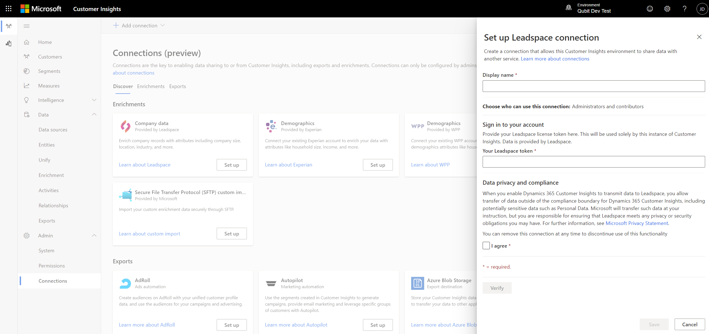

# Enrichment of company profiles with Leadspace (preview)

Leadspace is a data science company that provides a B2B Customer Data Platform. It enables customers with unified customer profiles for companies to enrich their data. Enrichments include additional attributes such as company size, location, industry, and more.

## Prerequisites

To configure Leadspace, the following prerequisites must be met:

- You have an active Leadspace license.
- You have [unified customer profiles](customer-profiles.md) for companies.
- A Leadspace connection has already been configured by an Administrator or you have [Administrator](permissions.md#administrator) permissions and and the “perpetual key” (referred to as **Leadspace token**). Contact directly [Leadspace](https://www.leadspace.com/products/leadspace-on-demand/) for details about their product.

## Configuration

1. In audience insights, go to **Data** > **Enrichment**.

1. Select **Enrich my data** on the Leadspace tile and then click **Get started**.

   :::image type="content" source="media/leadspace-tile.png" alt-text="Screenshot of the Leadspace tile.":::

1. Select a [connection](connections.md) from the drop-down. Reach out to an administrator if no connection is available. If you are an administrator you will be able to create a connection by clicking **Add connection** and selecting Leadspace from the drop-down, see the section below. 

1. Confirm connection selection by clicking **Connect to Leadspace**.

1.	Now, click **Next** and select the **Customer data set** you want to enrich with company data from Leadspace. You can select the **Customer** entity to enrich all your customer profiles or select a segment entity to enrich only customer profiles contained in that segment.

    :::image type="content" source="media/enrichment-Leadspace-configuration-customer-data-set.png" alt-text="Screenshot when choosing the customer data set.":::

1. Click **Next** and define which fields from your unified profiles should be used to look for matching company data from Leadspace. The **Name of company** field is required. For a higher match accuracy, up to two other fields, **Company website** and **Company location**, can be added.

   :::image type="content" source="media/enrichment-leadspace-mapping.png" alt-text="Leadspace field mapping pane.":::

1. Select **Next** to complete the field mapping.

1. Finally, you provide a name for the enrichment. Save the enrichment by clicking on **Save enrichment** after reviewing your choices.

## Configuring connection for Leadspace 

You need to be an administrator to be able to configure connections. You can click on **Add connection** in the wizard flow as described above *or* go to **Admin** > **Connections** and select Leadspace from the dropdown or click **Set up** on the Leadspace tile.

1. Select **Get Started** and then enter an active **Leadspace token** (perpetual key). Review and provide your consent for **Data privacy and compliance** by selecting the **I agree** checkbox. Confirm both inputs by selecting **Connect to Leadspace**.

1. Enter a name for the connection in the **Display name** box.

1. Provide a valid HERE Technologies API key.

1. Review and provide your consent for Data privacy and compliance by selecting the **I agree** checkbox

1. Click verify to get the configuration verified.

1. Once the verification has completed the connection can be saved by clicking **Save**.

> [!div class="mx-imgBorder"]
   > 

## Enrichment results

After refreshing the enrichment, you can review the newly enriched company data under [My enrichments](enrichment-hub.md). You can find the time of the last update and the number of enriched profiles.

You can access a detailed view of each enriched profile by selecting **View enriched data**.

For more information, see [Leadspace APIs](https://support.leadspace.com/hc/en-us/sections/201997649-API).

## Next steps

Build on top of your enriched customer data. Create [segments](segments.md), [measures](measures.md), and even [export the data](export-destinations.md) to deliver personalized experiences to your customers.

## Data privacy and compliance

When you enable Dynamics 365 Customer Insights to transmit data to Leadspace, you allow transfer of data outside of the compliance boundary for Dynamics 365 Customer Insights, including potentially sensitive data such as Personal Data. Microsoft will transfer such data at your instruction, but you are responsible for ensuring that Leadspace meets any privacy or security obligations you may have. For more information, see [Microsoft Privacy Statement](https://go.microsoft.com/fwlink/?linkid=396732).
Your Dynamics 365 Customer Insights Administrator can remove this enrichment at any time to discontinue use of this functionality.

[!INCLUDE[footer-include](../includes/footer-banner.md)]
