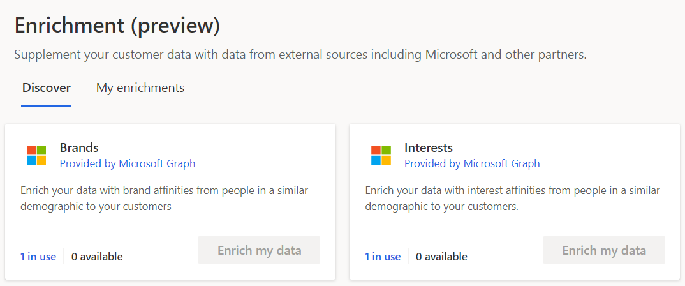

# Enrich customer profiles with brand and interest affinities (preview)

Use Microsoft's proprietary data to enrich your customer data with brand and interest affinities. These affinities are determined based on data from people with similar demographics to your customers. This information helps you to better understand and segment your customers based on their affinities to specific brands and interests.

In audience insights, go to **Data** > **Enrichment** to [configure and view enrichments](enrichment-hub.md).

To configure brand affinities enrichment, go to the **Discover** tab and select **Enrich my data** on the **Brands** tile.

To configure interest affinities enrichment, go to the **Discover** tab and select **Enrich my data** on the **Interests** tile.

   > [!div class="mx-imgBorder"]
   > 

## How we determine affinities

We use Microsoft’s online search data to find affinities for brands and interests across various demographic segments (defined by age, gender, or location). The online search volume for a brand or interest determines how much affinity a demographic segment, compared to other segments, has to that brand or interest.

## Affinity level and score

On every enriched customer profile, we provide two related values – affinity level and affinity score. These values help you determine how strong the affinity is for that profile’s demographic segment, for a brand or interest, as compared to other demographic segments.

*Affinity level* consists of four levels and *affinity score* is calculated on a 100-point scale that maps to the affinity levels.

|Affinity level |Affinity score  |
|---------|---------|
|Very high     | 85-100       |
|High     | 70-84        |
|Medium     | 35-69        |
|Low     | 1-34        |

Depending on the granularity you would like for measuring the affinity, you can use either affinity level or score. Affinity score gives you more precise control.

## Supported countries/regions

We currently support the following country/region options: Australia, Canada (English), France, Germany, United Kingdom, or United States (English).

To select a country, open the **Brands enrichment** or **Interest enrichment** and select **Change** next to **Country/Region**. In the **Country/Region settings** pane, choose an option and select **Apply**.

### Implications related to country selection

- When [choosing your own brands](#define-your-brands-or-interests), the system provides suggestions based on the selected country or region.

- When [choosing an industry](#define-your-brands-or-interests), you'll get the most relevant brands or interests based on the selected country or region.

- When [enriching profiles](#refresh-enrichment), we'll enrich all customer profiles for which we get data for the selected brands and interests. Including profiles that are not in the selected country or region. For example, if you selected Germany, we'll enrich profiles located in the United States if we have data available for the selected brands and interests in the US.

## Configure Enrichment

A guided experience helps you through the configuration of the enrichments. 

### Define your brands or interests

Choose up to five brands or interests using one of these options:

- **Industry**: Select your industry from the drop-down list and then choose from the top brands or interests for that industry.
- **Choose your own**: Enter a brand or interest that is relevant to your organization and then choose from the matching suggestions. If we don't list a brand or interest you're looking for, send us feedback using the **Suggest** link.

### Review enrichment preferences

Review your default enrichment preferences and update them as needed.

:::image type="content" source="media/affinity-enrichment-preferences.png" alt-text="Screenshot of the enrichment preferences window.":::

### Select entity to enrich

Select **Enriched entity** and choose the data set you want to enrich with company data from the Microsoft. You can select the Customer entity to enrich all your customer profiles or select a segment entity to enrich only customer profiles contained in that segment.

### Map your fields

Map fields from your unified customer entity to define the demographic segment you want the system to use for enriching your customer data. Map Country/Region and at least Date of Birth or Gender attributes. Additionally, you must map at least one of City (and State/Province) or Postal code. Select **Edit** to define the mapping of the fields and select **Apply** when you're done. Select **Save** to complete the field mapping.

The following formats and values are supported, values are not case-sensitive:

- **Date of Birth**: We recommend that date of birth is converted to DateTime type during data ingestion. Alternatively, it can be a string in [ISO 8601](https://www.iso.org/iso-8601-date-and-time-format.html) format "yyyy-MM-dd" or "yyyy-MM-ddTHH:mm:ssZ".
- **Gender**: Male, Female, Unknown
- **Postal code**: Five-digit ZIP Codes for US, standard postal code everywhere else
- **City**: City name in English
- **State/Province**: Two-letter abbreviation for the US and Canada. Two or three letter abbreviation for Australia. Not applicable for France, Germany, or the UK.
- **Country/Region**:

  - US: United States of America, United States, USA, US, America
  - CA: Canada, CA
  - GB: United Kingdom, UK, Great Britain, GB, United Kingdom of Great Britain and Northern Ireland, United Kingdom of Great Britain
  - AU: Australia, AU, Common Wealth of Australia
  - FR: France, FR, French Republic
  - DE: Germany, German, Deutschland, Allemagne, DE, Federal Republic of Germany, Republic of Germany

## Review and name the enrichment

Finally, you get to review the information and provide a name for the enrichment.

:::image type="content" source="media/enrichment-interests-summary.png" alt-text="Interests review and naming page.":::

## Refresh enrichment

Run the enrichment after configuring brands, interests, and the field mapping for demographics. To start the process, select **Run** on the brand or interest configuration page. Additionally, you can let the system run the enrichment automatically as part of a scheduled refresh.
Depending on the size of your customer data, it may take several minutes for an enrichment run to complete.

> [!TIP]
> There are [six types of status](system.md#status-types) for tasks/processes. Additionally, most processes [depend on other downstream processes](system.md#refresh-policies). You can select the status of a process to see details on the progress of the entire job. After selecting **See details** for one of the job's tasks, you find additional information: processing time, the last processing date, and all errors and warnings associated with the task.

## Enrichment results

After running the enrichment process, go to **My enrichments** to review the total number of enriched customers and a breakdown of brands or interests in the enriched customer profiles.

:::image type="content" source="media/my-enrichments.png" alt-text="Preview of results after running the enrichment process":::

Review the enriched data by selecting **View enriched data** in the chart. Enriched data for brands goes to the **BrandAffinityFromMicrosoft** entity. Data for interests is in the **InterestAffinityFromMicrosoft** entity. You'll also find these entities listed in the **Enrichment** group in **Data** > **Entities**.

## See enrichment data on the customer card

Brand and interest affinities can also be viewed on individual customer cards. Go to **Customers** and select a customer profile. In the customer card, you'll find charts for the brands or interests that people in that customer's demographic profile have affinity for.

:::image type="content" source="media/enrichment-customer-card.png" alt-text="Customer card with enriched data":::

## Next steps

Build on top of your enriched customer data. Create [Segments](segments.md), [Measures](measures.md), and even [export the data](export-destinations.md) to deliver personalized experiences to your customers.

[!INCLUDE[footer-include](../includes/footer-banner.md)]
