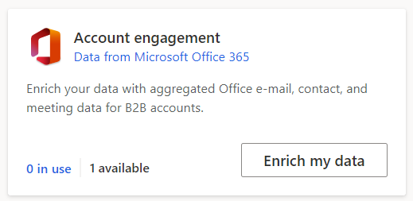
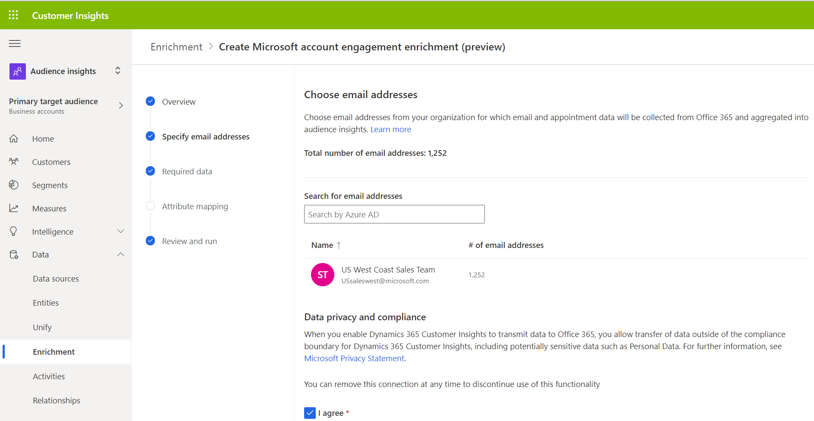

# Enrich customer profiles with engagement data (preview)

Use data from Microsoft Office 365 to enrich your customer account profiles with engagement data. The engagement data consists of email and meeting activity aggregated to the account level. This enrichment is available in the following regions: UK, Europe, North America.

## Prerequisites

To configure engagement data, the following prerequisites must be met:

- You have an active Office 365 cloud license.
- You have [unified customer profiles](customer-profiles.md) based on accounts.
- You have [administrator](permissions.md#administrator) permissions.
- You have Office 365 tenant administrator permissions or can get consent to use aggregated Office data in CI from a Office 365 tenant administrator.

# Configure the enrichment

1. In audience insights, go to **Data** > **Enrichment**.

1. Go to the **Discover** tab and select **Enrich my data** on the **Account Engagement** tile.

   > [!div class="mx-imgBorder"]
   > 
   
1. Click **Next** on the overview screen and select email addresses from your organization for which Office data is going to be aggregated. This ensures that data is only processed for relevant communication. A best practice is to use email groups, for example, *US Sales team*, which are easily managed in Office 365. The number of email addresses in the groups are resolved and shown. The total number of email addresses must be at least 2 and cannot exceed 2,500.

   > [!div class="mx-imgBorder"]
   > 

1. Review the consent statement, check the **I agree** check box, and click **Next**.

1. Select the customer data set and click **Next**.

1. Now, map the contact email address field and click **Next**.

1. Finally, review the enrichment configuration, give the enrichment a name, and click **Save enrichment** to save the enrichment.

## Office 365 tenant administrator consent

Consent from an Office 365 tenant administrator is required to activate the enrichment. An email is sent to the Office 365 tenant administators when the enrichment is saved, which asks them to review and consent to aggregating the Office data into Customer Insights. The Office 365 tenant administator can also consent directly in their Office 365 admin console.

## Running the Account Engagement enrichment for the first time

When the enrichment is started for the first time, the data download will commence. Therefore, there are no data available for aggregation, so the enrichment will not yield any results. It is recommended to run the enrichment again when data has been downloaded, which takes between several hours to several days depending on the volume of email and meeting data.

To start the process, select **Run** on the Account engagement configuration page. Additionally, you can let the system run the enrichment automatically as part of a scheduled refresh.

Depending on the size of your customer data, it may take several hours for an enrichment run to complete.

> [!TIP]
> There are [six types of status](system.md#status-types) for tasks/processes. Additionally, most processes [depend on other downstream processes](system.md#refresh-policies). You can select the status of a process to see details on the progress of the entire job. After selecting **See details** for one of the job's tasks, you'll find additional information: processing time, the last processing date, and all errors and warnings associated with the task.

## Enrichment results

After running the enrichment process, go to **My enrichments** to review the enrichment results. You will see the total number of enriched customers and a high-level overview of the enrichment results, including the number of emails and meetings processed, the number of days for which data has been aggregated (if data is still downloading you may abtain a longer data window by running the enrichment again at a later time), and more.

You will also see a chart of the number of enriched customers over time as well as a preview of the enrichment data.  

All data is aggregated up to the account level. An engagement score, which ranges from 0 to 100, with 100 being the highest engagement, is calculated for every account. The engagement score provides a composite measure of the account engagement across emails and meetings relative to your other accounts. 

:::image type="content" source="media/enrichment-office-results-overview.png" alt-text="Preview of results after running the enrichment process.":::

Review the enriched data by selecting **See more** in the preview tile. Doing so takes you to the **Office** entity. You will also find the entity listed in the **Enrichment** group in **Data** > **Entities**. Here you will also find the **Office_UserEntity**, which contains the Active Directory IDs for the email addresses from your organization that were chosen for processing in the configuration step. 

## See enrichment data on the customer card

Account engagement can also be viewed on individual customer cards. Go to **Customers** and select a customer profile. In the customer card, you'll find the account's engagement score, the total number of emails, and the total number of meetings aggregated over the time period that is selected from the dropdown in the top right hand corner. You will also find charts that show the email and meeting history.

:::image type="content" source="media/enrichment-customer-card.png" alt-text="Customer card with enriched data.":::

## Create segments and measures based on the enriched data

## Next steps

[!INCLUDE [next-steps-enrichment](../includes/next-steps-enrichment.md)]

[!INCLUDE[footer-include](../includes/footer-banner.md)]
