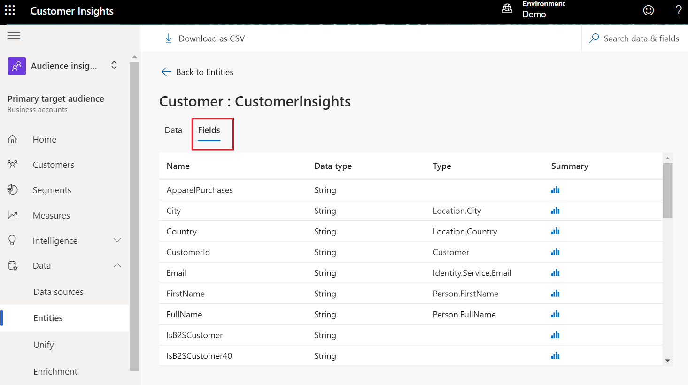
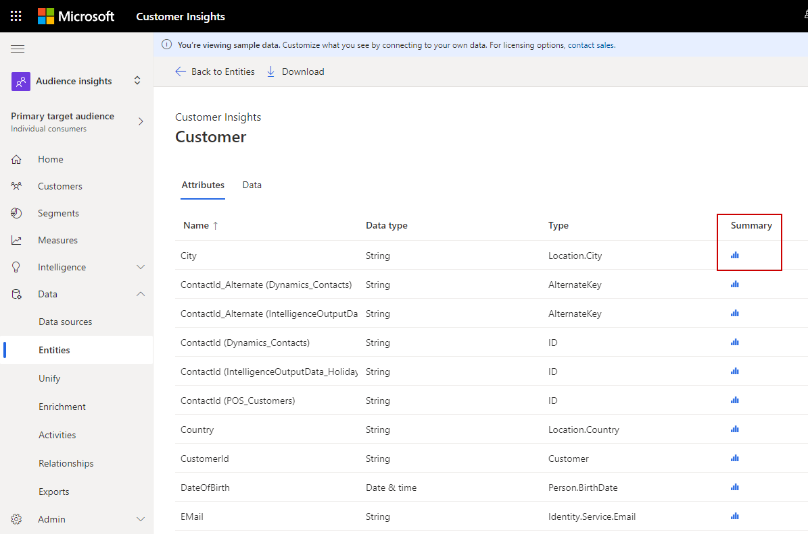

# Entities in audience insights

After [configuring your data sources](data-sources.md), go to the **Entities** page to evaluate the quality of the ingested data. Entities are considered datasets. Multiple capabilities of Dynamics 365 Customer Insights are built around these entities. Reviewing them closely can help you validate the output of those capabilities.

The **Entities** page lists entities and includes several columns:

- **Name**: The name of your data entity. If you see a warning symbol next to an entity name, it means that the data for that entity didn't load successfully.
- **Source**: The type of data source that ingested the entity
- **Created by**: Name of the person who created the entity
- **Created**: Date and time of the entity creation
- **Updated by**: Name of the person who updated the entity
- **Last updated**: Date and time of the last update of the entity
- **Last refresh**: Date and time of the last data refresh

## Explore a specific entity's data

Select an entity to explore the different fields and records included within that entity.

> [!div class="mx-imgBorder"]
> 

- The **Data** tab shows a table listing details about individual records of the entity.

> [!div class="mx-imgBorder"]
> 

- The **Attributes** tab is selected by default and shows a table to review details for the selected entity, such as field names, data types, and types. The **Type** column shows Common Data Model associated types, which are either auto-identified by the system or [manually mapped](map-entities.md) by users. These are semantic types that can differ from the attributes' data types—for example, the field *Email* below has a data type *Text* but its (semantic) Common Data Model type might be *Email* or *EmailAddress*.

> [!NOTE]
> Both tables show only a sample of your entity's data. To view the full data set, go to the **Data sources** page, select an entity, select **Edit**, and then view this entity's data with the Power Query editor as explained in [Data sources](data-sources.md).

To learn more about the data ingested in the entity, the **Summary** column provides you with some important characteristics of the data, such as nulls, missing values, unique values, counts, and distributions, as applicable to your data.

Select the chart icon to see the summary of the data.

> [!div class="mx-imgBorder"]
> 

## Entity-specific information

The following section provides information about some system-created entities.

### Corrupted data sources

Some fields from an ingested data source might contain fields with corrupted data. Records with corrupted fields are exposed in separate system-created entities. This helps you to identify which data you can review and update on the source system. After the next refresh of the data source, the corrected records are ingested to Custoemr Insights and passed on to downstream processes. 

Although the corrupted records are exposed, Customer Insights still processes them. However, they might cause issues when working with the unified data subsequently.

The following checks run on the ingested data to expose corrupted records: 

- The datatype of a column doesn't match with its schema.
- Fields contain character that can cause the columns to not match the expected schema, such as incorrectly formatted quotes, un-escaped quotes, or newline characters.
- If there are datetime/date/datetimeoffset columns, their format needs to be specified in the model if doesn't follow the standard ISO format.

### Next step

See the [Unify](data-unification.md) topic to learn how to *map*, *match*, and *merge* the ingested data.

[!INCLUDE[footer-include](../includes/footer-banner.md)]
