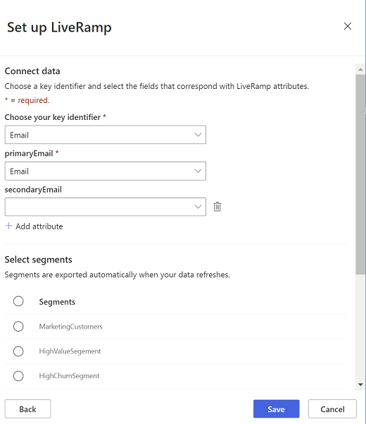

# Export segments to LiveRamp&reg; (preview)

Activate your data in LiveRamp to connect with over 500 platforms across digital, social, and TVs. Work with your data in LiveRamp to target, suppress, and personalize ad campaigns.

## Prerequisites for a connection

- You need a LiveRamp subscription to use this connector.
- To get a subscription, [contact LiveRamp](https://liveramp.com/contact/) directly. [Learn more about LiveRamp Onboarding](https://liveramp.com/our-platform/data-onboarding/).

## Set up connection to LiveRamp

1. Go to **Admin** > **Connections**.

1. Select **Add connection** and choose **LiveRamp** to configure the connection.

1. Give your connection a recognizable name in the **Display name** field. The name and the type of the connection describe this connection. We recommend choosing a name that explains the purpose and target of the connection.

1. Choose who can use this connection. If you take no action, the default will be Administrators. For more information, see [Allow contributors to use a connection for exports](connections.md#allow-contributors-to-use-a-connection-for-exports).

1. Provide a **Username** and **Password** for your LiveRamp Secure FTP (SFTP) account.
These credentials may be different from your LiveRamp Onboarding credentials.

1. Select **Verify** to test the connection to LiveRamp.

1. After successful verification, provide your consent for **Data privacy and compliance** by selecting the **I agree** checkbox.

1. Select **Save** to complete the connection.

## Configure an export

You can configure this export if you have access to a connection of this type. For more information, see [Permissions needed to configure an export](export-destinations.md#set-up-a-new-export).

1. Go to **Data** > **Exports**.

1. To create a new export, select **Add destination**.

1. In the **Connection for export** field, choose a connection from the LiveRamp section. If you don't see this section name, there are no connections of this type available to you.

1. In the **Choose your key identifier** field, select **Email**,  **Name and address**, or **Phone** to send to LiveRamp for identity resolution.
   > [!div class="mx-imgBorder"]
   > 

1. Map the corresponding attributes from your *Customer* entity for the selected key identifier.

1. Select **Add attribute** to map more attributes to send to LiveRamp.

   > [!TIP]
   > Sending more key identifier attributes to LiveRamp is likely to get you a higher match rate.

1. Select the segments you want to export to LiveRamp.

1. Select **Save**.

Saving an export doesn't run the export immediately.

The export runs with every [scheduled refresh](system.md#schedule-tab). 
You can also [export data on demand](export-destinations.md#run-exports-on-demand). 

## Data privacy and compliance

When you enable Dynamics 365 Customer Insights to transmit data to Liveramp, you allow transfer of data outside of the compliance boundary for Dynamics 365 Customer Insights, including potentially sensitive data such as Personal Data. Microsoft will transfer such data at your instruction, but you are responsible for ensuring that Liveramp meets any privacy or security obligations you may have. For more information, see [Microsoft Privacy Statement](https://go.microsoft.com/fwlink/?linkid=396732).
Your Dynamics 365 Customer Insights Administrator can remove this export destination at any time to discontinue use of this functionality.

[!INCLUDE[footer-include](../includes/footer-banner.md)]
