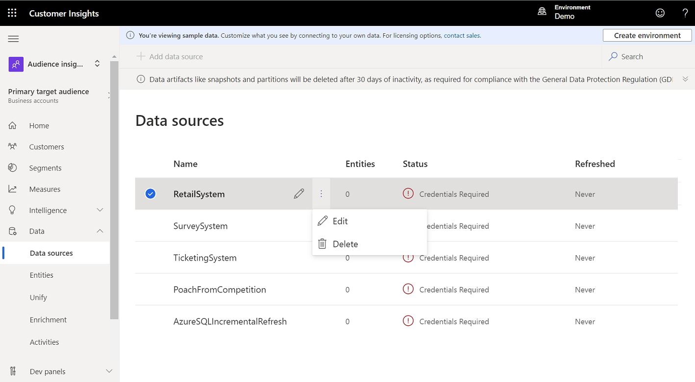

# Get started with a paid subscription

This article explains how to create a new organization and how to provision an environment.

## Sign up and create an organization

1. Go to the [Dynamics 365 Customer Insights](https://dynamics.microsoft.com/ai/customer-insights/) website.

2. Select **Get Started**.

3. Choose your preferred sign-up scenario and select the corresponding link.

4. Accept the terms and conditions and select **Continue** to start creating the organization.

5. After the environment is created, you'll be redirected to [Customer Insights](https://home.ci.ai.dynamics.com).

6. Use the demo environment to explore the app, or create a new environment by following the steps in the next section.

7. After specifying the environment settings, select **Create**.

8. You'll be signed in after the environment was created successfully.

## Create an environment in an existing organization

There are two ways to create a new environment. You can either specify an entirely new configuration, or you can copy some configuration settings from an existing environment.

> [!NOTE]
> Organizations can create *two* environments for every Customer Insights license. If your organization purchases more than once license, please [contact our support team](https://go.microsoft.com/fwlink/?linkid=2079641) to increase the number of available environments. For more information about capacity and add-on capacity, download [Dynamics 365 licensing guide](https://go.microsoft.com/fwlink/?LinkId=866544).

To create an environment:

1. Select the **Environment** picker in the header of the app.

1. Select **New**.

   > [!div class="mx-imgBorder"]
   > 

1. In the **Create an environment** dialog, select **New environment**.

   If you want to [copy data from the current environment](#considerations-for-copy-configuration-preview), select **Copy from existing environment**. You'll see a list of all available environments in your organization where you can copy data from.

1. Provide the following details:
   - **Name**: The name for this environment. This field is already filled in if you've copied an existing environment, but you can change it.
   - **Type**: Select whether you want to create a Production or Sandbox environment.
   - **Region**: The region into which the service is deployed and hosted.
   
1. Optionally, you can select **Advanced settings**:

   - **Save all data to**: Specifies where you want to store the output data generated from Customer Insights. You'll have two options: **Customer Insights storage** (an Azure Data Lake managed by the Customer Insights team) and **Azure Data Lake Storage** (your own Azure Data Lake Storage). By default, the Customer Insights storage option is selected.

     > [!NOTE]
     > By saving data to Azure Data Lake Storage, you agree that data will be transferred to and stored in the appropriate geographic location for that Azure storage account, which may differ from where data is stored in Dynamics 365 Customer Insights. [Learn more at the Microsoft Trust Center.](https://www.microsoft.com/trust-center)
     >
     > Currently, ingested entities are always stored in the Customer Insights Managed Data Lake. 
     > 
     > We support only Azure Data Lake Storage accounts from the same Azure region you selected when creating the environment. 
     > 
     > We support only Azure Data Lake Storage accounts that have hierarchical namespace enabled.

   - For the Azure Data Lake Storage option, you can choose between a resource-based option and a subscription-based option for authentication. For more information, see [Connect audience insights to an Azure Data Lake Storage Gen2 account with an Azure service principal](connect-service-principal.md). The **Container** name can't be changed and will be `customerinsights`.
   
   - If you want to use [predictions](predictions.md), configure data sharing with Microsoft Dataverse, or enable data ingestion from on-premises data sources, provide the Microsoft Dataverse environment URL under **Configure data sharing with Microsoft Dataverse and enable additional capabilities**. Select **Enable data sharing** to share Customer Insights output data with a Microsoft Dataverse Managed Data Lake.

     > [!NOTE]
     > - Data sharing with Microsoft Dataverse Managed Data Lake is currently not supported when you save all data to your own Azure Data Lake Storage.
     > - [Prediction of missing values in an entity](predictions.md) is not currently supported when you enable data sharing with Microsoft Dataverse Managed Data Lake.

     > [!div class="mx-imgBorder"]
     > 

   When you run processes, such as data ingestion or segment creation, corresponding folders will be created in the storage account you specified above. Data files and model.json files will be created and added to folders based on the process name.

   If you create multiple environments of Customer Insights and choose to save the output entities from those environments in your storage account, separate folders will be created for each environment with ci_<environmentid> in the container.

### Considerations for copy configuration (preview)

The following configuration settings are copied:

- Feature configurations
- Ingested/imported data sources
- Data unification (Map, Match, Merge) configuration
- Segments
- Measures
- Relationships
- Activities
- Search & filter Index
- Export destinations
- Scheduled refresh
- Enrichments
- Model management
- Role assignments

The following settings are *not* copied:

- Customer profiles.
- Data source credentials. You'll have to provide the credentials for every data source and refresh the data sources manually.
- Data sources from Common Data Model folder and Dataverse managed Data Lake. You'll have to create those data sources manually with the same name as in the source environment.

When you copy an environment, you'll see a confirmation message that the new environment has been created. Select **Go to data sources** to see the list of data sources.

All the data sources will show a **Credentials Required** status. Edit the data sources and enter the credentials to refresh them.

> [!div class="mx-imgBorder"]
> 

After refreshing the data sources, go to **Data** > **Unify**. Here you'll find settings from the source environment. Edit them as needed or select **Run** to start the data unification process and create the unified customer entity.

When the data unification is complete, go to **Measures** and **Segments** to refresh them too.