|Sr.No|Step  |Description  |Details  |
|--|--|--|--|
|1|Add Dataset(s)  |Create three datasets  a. **[HotelActivity ](https://cidatasets.blob.core.windows.net/hotel-scenario/ContosoHotel_HotelActivity_1.csv)**  b. **[Customers](https://cidatasets.blob.core.windows.net/hotel-scenario/Customer_1.csv)** c. **[ServiceUsage](https://cidatasets.blob.core.windows.net/hotel-scenario/ContosoHotel_ServiceUsage_1.csv)**   |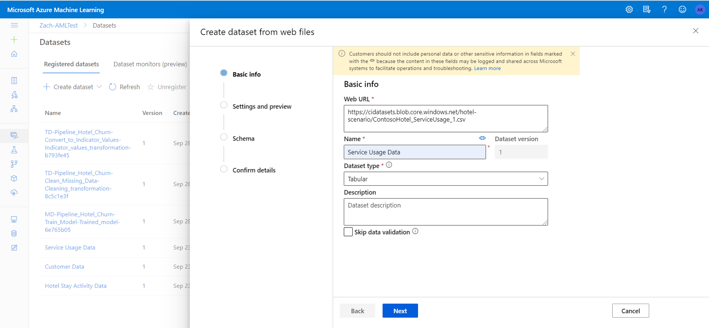|
|2|Select Columns | Select the following columns for each dataset   a. **HotelActivity**   <ul><li>HotelCustomerID</li><li>CheckInDate</li><li>CheckOutDate</li><li>RoomType</li><li>DollarsSpent</li><li>BookingType</li><li>TravelCategory</li><li>NumberOfNights</li></ul>   b. **Customers**   <ul><li>CustomerId</li><li>ContosoHotel_HotelCustomers_HotelCustomerID</li></ul>   c. **ServiceUsage**   <ul><li>ServicesCustomerID</li><li>ServiceName</li><li>ServiceDate</li><li>ServiceCost</li></ul>  | 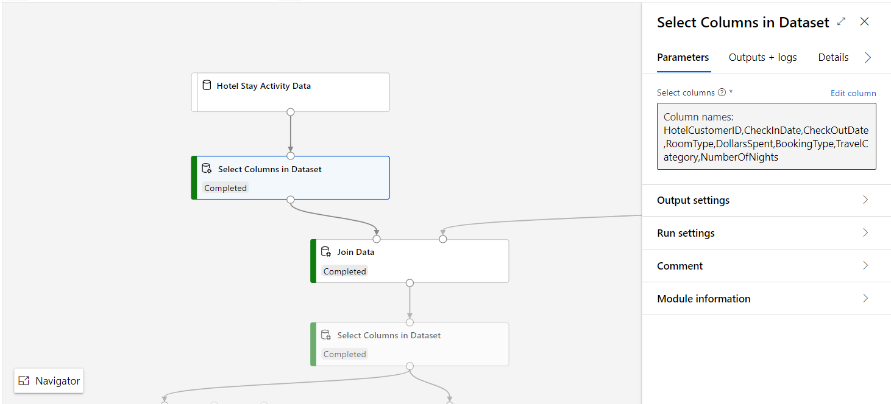 |
|3|Join Data|Join the data between the HotelActivity and Customers datasets. Use the following columns for the join:   **HotelActivity** - HotelCustomerID   **Customers** - ContosoHotel_HotelCustomers_HotelCustomerID |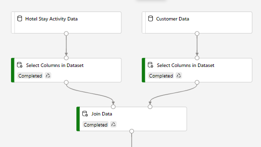    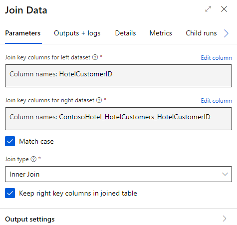|
|4|Select Columns|Select the following columns from your results from **Step 3**:     HotelCustomerID, RoomType, DollarsSpent, BookingType, TravelCategory, CheckInDate, CheckOutDate, NumberOfNights, CustomerId|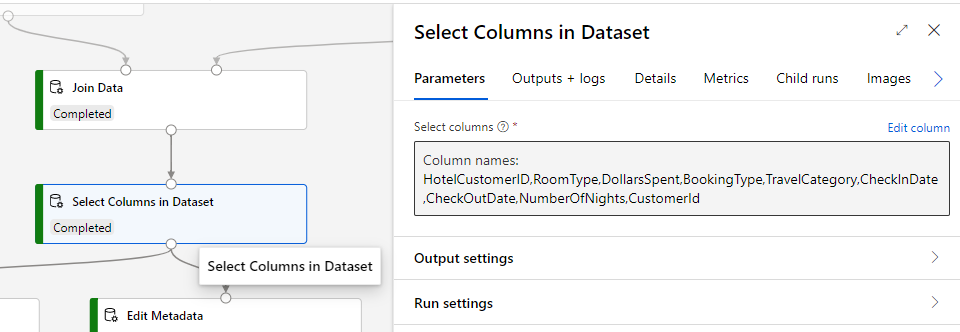|
|5|Apply SQL transformation|Apply the following SQL transformation to filter the data from the Join step    _select * from t1 where [CheckInDate] < "2016-12-31T00:00:00"_|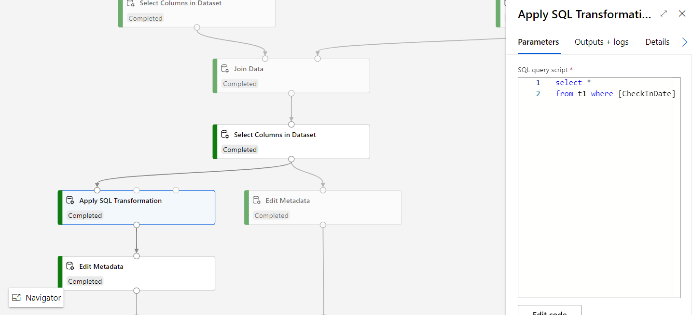|
|6|Edit Metadata|Change the Data type of the NumberOFNights column to Integer|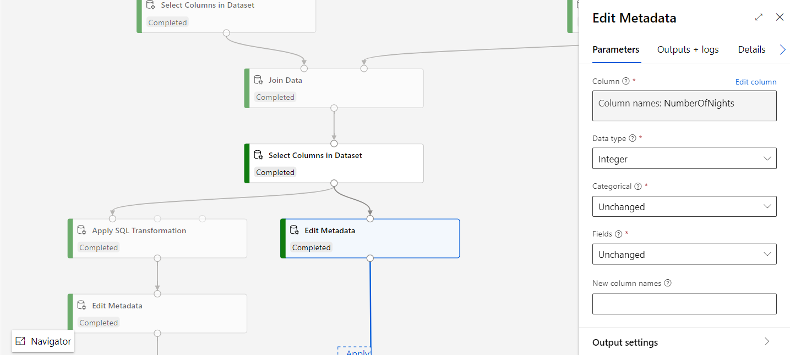|
|7|Convert to Indicator Values|Convert the following categorical columns to a series of binary indicator values:   RoomType, BookingType, TravelCategory|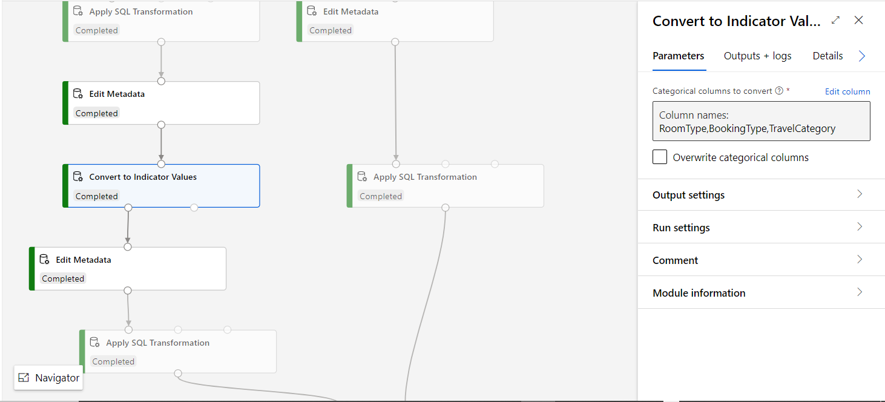|
|8 |Edit Metadata |Change the data types of the following columns to Integer. Additionally, specify that the columns should be treated as **Features**.   RoomType-Large, RoomType-Small, BookingType-Online, BookingType-Phone Call, TravelCategory-Business, TravelCategory-Leisure |  |
|9|Apply SQL transformation|Apply the following SQL  transformation:    _select HotelCustomerID, CustomerId, sum([RoomType-Large]) as RoomTypeLargeCount, sum([RoomType-Small]) as RoomTypeSmallCount, sum([BookingType-Online]) as BookingTypeOnlineCount, sum([BookingType-Phone Call]) as BookingTypePhoneCallCount, sum([TravelCategory-Business]) as TravelCategoryBusinessCount, sum([TravelCategory-Leisure]) as TravelCategoryLeisureCount, sum([DollarsSpent]) as TotalDollarSpent from t1 group by HotelCustomerID;_|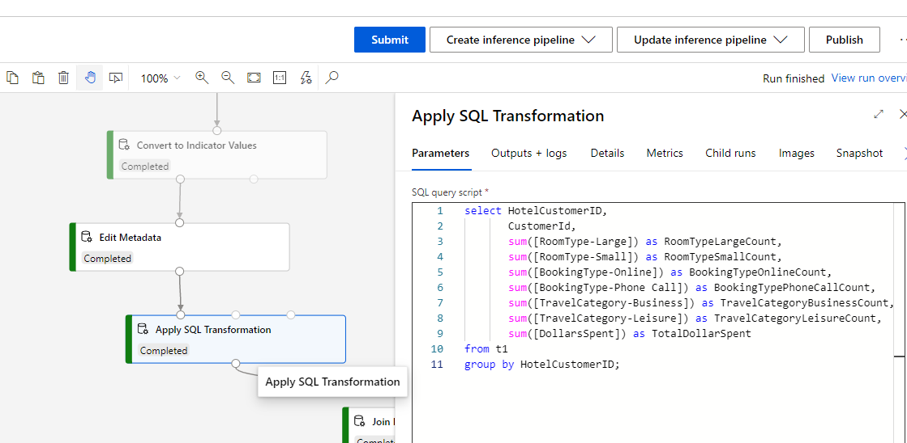|
|10|Edit Metadata | Change the data type of the **NumberOfNights** column from the results of **Step 4** to Integer| 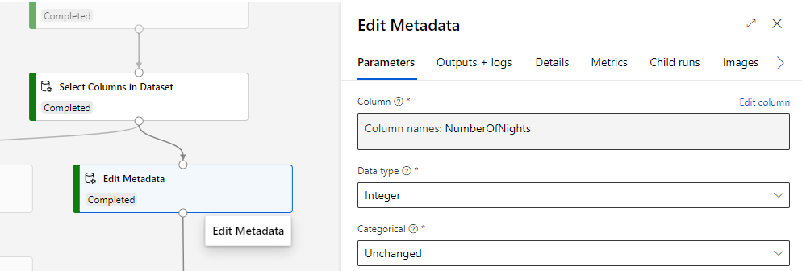|
|11 | Apply SQL Transformation | Apply the following SQL transformation:    _with StayInfo as (  select HotelCustomerID,  sum(case when [CheckOutDate] <= "2016-12-31T00:00:00" then [NumberOfNights] else 0 end) as StayDayCount,  sum(case when [CheckOutDate] <= "2016-12-31T00:00:00" and [CheckOutDate] >= "2015-01-01T00:00:00" then [NumberOfNights] else 0 end) as StayDayCount2016,  sum(case when [CheckOutDate] <= "2015-12-31T00:00:00" and [CheckOutDate] >= "2014-01-01T00:00:00" then [NumberOfNights] else 0 end) as StayDayCount2015,  sum(case when [CheckOutDate] <= "2014-12-31T00:00:00" and [CheckOutDate] >= "2013-01-01T00:00:00" then [NumberOfNights] else 0 end) as StayDayCount2014,  sum(case when [CheckOutDate] <= "2016-12-31T00:00:00" then 1 else 0 end) as StayCount,  sum(case when [CheckOutDate] <= "2016-12-31T00:00:00" and [CheckOutDate] >= "2015-01-01T00:00:00" then 1 else 0 end) as StayCount2016,  sum(case when [CheckOutDate] <= "2015-12-31T00:00:00" and [CheckOutDate] >= "2014-01-01T00:00:00" then 1 else 0 end) as StayCount2015,  sum(case when [CheckOutDate] <= "2014-12-31T00:00:00" and [CheckOutDate] >= "2013-01-01T00:00:00" then 1 else 0 end) as StayCount2014,  min([CheckInDate]) as FirstStay,  max([CheckOutDate]) as LastStay  from t1   group by HotelCustomerID)_    _select HotelCustomerID, StayDayCount, StayDayCount2016, StayDayCount2015, StayDayCount2014, StayCount, StayCount2016, StayCount2015, StayCount2014, julianday("2016-12-31T00:00:00") - julianday(FirstStay) as UsageTenure, case when LastStay > "2016-12-31T00:00:00" then 0 else 1 end as Label from StayInfo_; |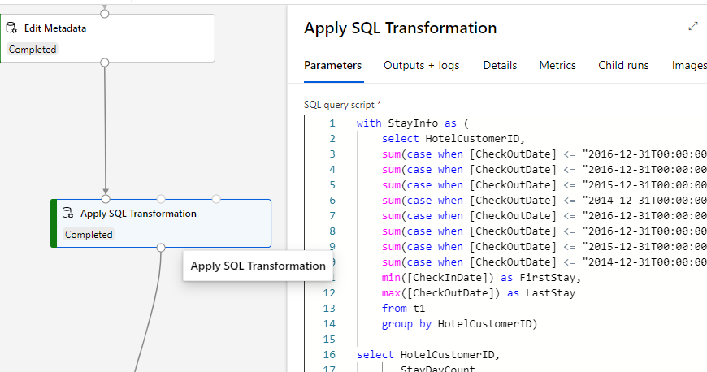|
|12 |Join Data | Join the data between the results from **Steps 9 and 11.** Use the following columns for the join:   **Left** - HotelCustomerID   **Right** - HotelCustomerID | 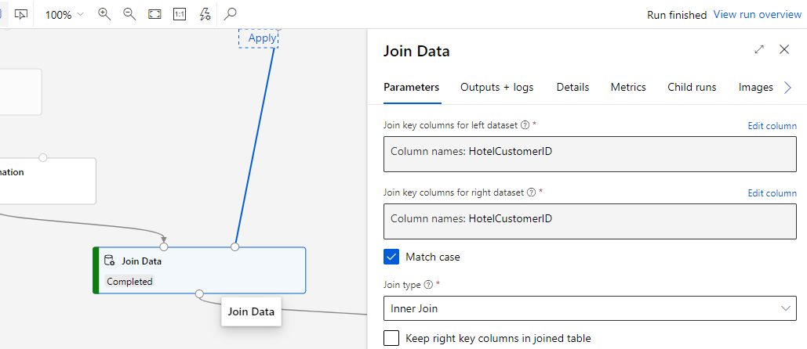 |
|13 | Apply SQL Transformation | Apply the following SQL transformation to the results from selecting columns from the ServiceUsage dataset in **Step 2**:    _select ServicesCustomerID,   sum(case when ServiceName='concierge' then ServiceCost else 0 end) as ConciergeUsage,   sum(case when ServiceName='courier' then ServiceCost else 0 end) as CourierUsage,   sum(case when ServiceName='dry_cleaning' then ServiceCost else 0 end) as DryCleaningUsage,   sum(case when ServiceName='gym' then ServiceCost else 0 end) as GymUsage,   sum(case when ServiceName='phone' then ServiceCost else 0 end) as PhoneUsage,   sum(case when ServiceName='restaurant' then ServiceCost else 0 end) as RestaurantUsage,   sum(case when ServiceName='spa' then ServiceCost else 0 end) as SpaUsage,   sum(case when ServiceName='television' then ServiceCost else 0 end) as TelevisionUsage,   sum(case when ServiceName='wifi' then ServiceCost else 0 end) as WifiUsage   from t1 where ServiceDate < "2016-12-31T00:00:00"   group by ServicesCustomerID;_ |  |
|14 | Join Data | Join the data between the results from **Steps 12 and 13.** Use the following columns for the join:   **Left** - HotelCustomerID   **Right** - ServicesCustomerID| 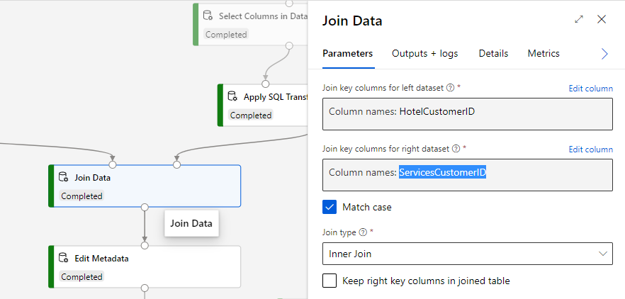 |
|15 | Edit Metadata | Mark the following columns as ClearFeatures:    HotelCustomerID, CustomerId | 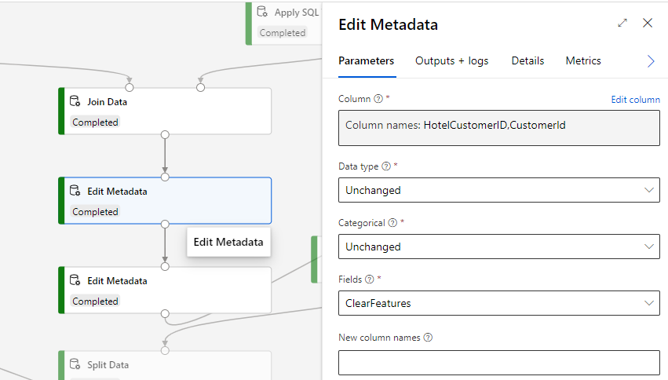 |
|16 | Edit Metadata | Select the **Label** column to be used as as Label |  |
|17 | Clean Missing Data | Handle any missing values by specifying the settings from the screenshot | 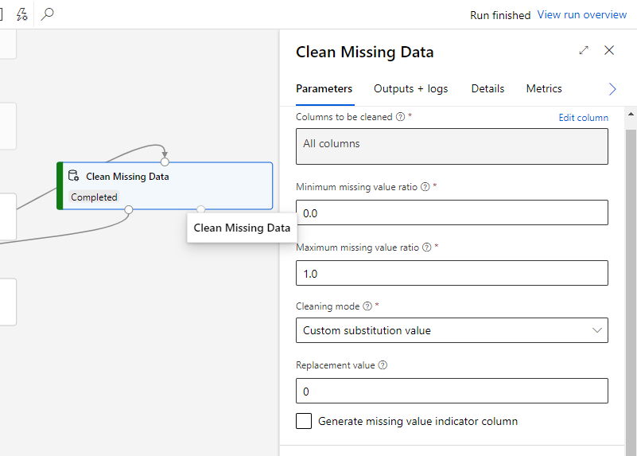 |
|18 | Split Data | Split the results of the cleaned data into 2: 70% for training your model and 30% for testing the trained model | 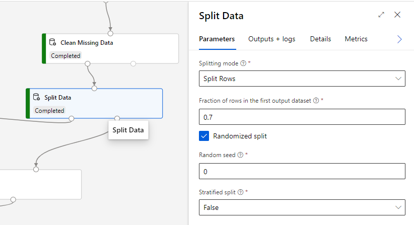 | 
|19 | Train Model | Add the **Train Model** module and connect the left hand side results of the **Split Data** module (Step 18) to the right hand side of the **Train Model** module.    Specify the column that column that contains the Label or Outcome column. It is the **Label** column in our case. | 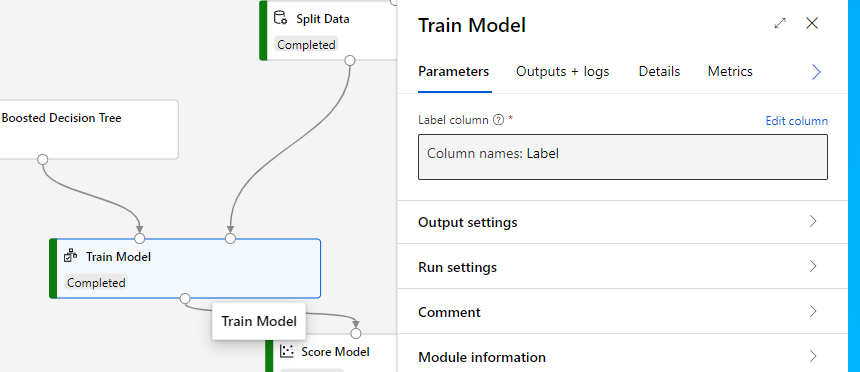 |
|20 | Two-Class Boosted Decision Tree | Use the Two-Class Boosted Decision Tree to train your model. Connect the Two-Class Boosted Decision Tree module to the left hand side of the Train Model module (Step 19). Specify the settings shown in the screenshot. | 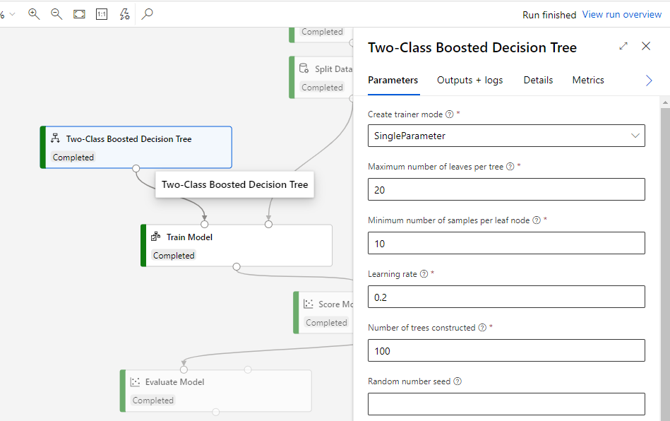 |
|21 | Score Model | Make predictions using the trained model on your test data. Connect the trained model from the **Train Model** module (Step 19) to the left hand side of the **Score Model** module. Connect the right hand side results of the **Split Data** module (Step 18) to the right hand side of the **Score Model** module.    Check the **Append score columns to output** checkbox so that the columns in your final output will contain all the columns in addition to the Label columns |  |
|22 | Evaluate Model | Evaluate the results of your trained model with standard metrics. |  |
|23 | Submit the pipeline | Click on the **Submit** button to set up your pipeline run. Enter the required details such as **Experiment Name**, and **Run Description**.   Create and select a Compute target for the run if you don't already have one.    Submit the run| 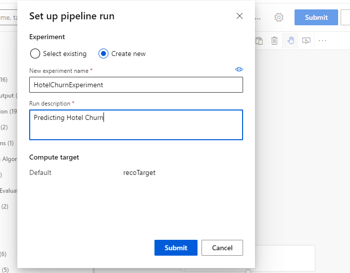 |
|24 | Create Batch Inference Pipeline | Once the training pipeline has completed successfully, click _Create inference pipeline -> Batch inference pipeline_ to create a batch inference pipeline from your training pipeline.   |  |
|25 | Dataset Parameterization | In this step, we'll parameterize the 3 datasets so that we can pass in new data from Customer Insights for making predictions.    Select the **HotelActivity** dataset node, and check the _Set as pipeline parameter_ checkbox in the **Parameters** tab of the right side pane. Enter a **Parameter name**, for example, **HotelActivity**, to represent the selected dataset. Repeat for the **Customers** and **ServiceUsage** datasets. | 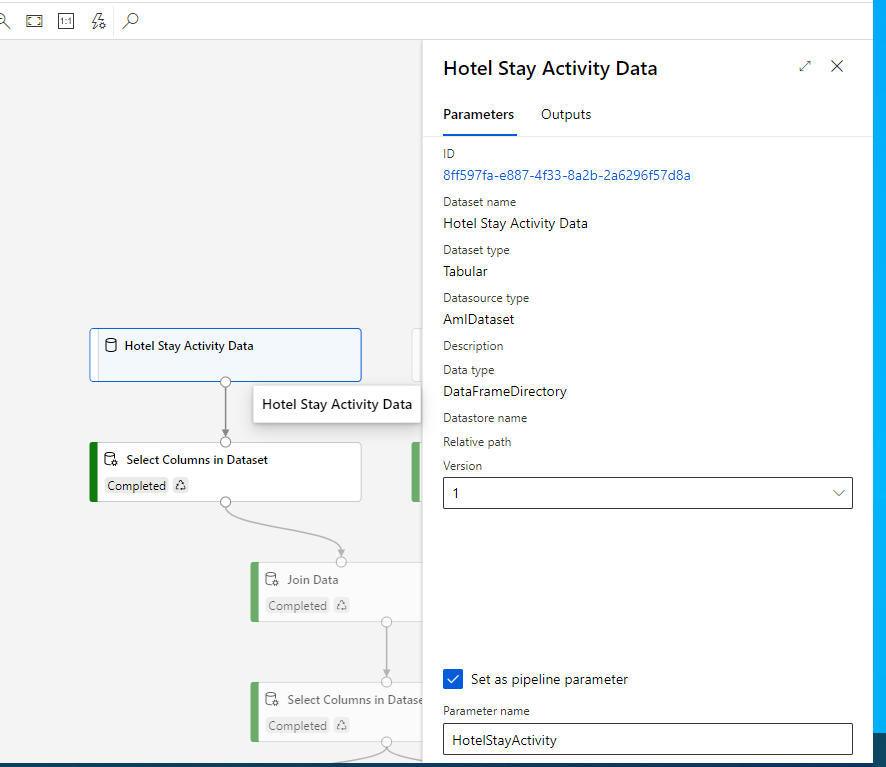 |
|26 | Export Data | Add the **Export Data** module to your Batch inference pipeline. This module allows us to get our predicted results into Customer Insights. Connect the bottom of the **Score Model** module to the **Export Data** module.    Click on the Export Data module to open the side pane. Make the following changes:    <ul><li>**Datastore type**: Select _Azure Blob Storage_</li><li>**Datastore**: Select _workspaceblobstore_</li><li>**Path**: Enter a name for your predictions output. E.g. _HotelChurnPredictions_</li><li>**File format**: Select _csv_</li></ul> | 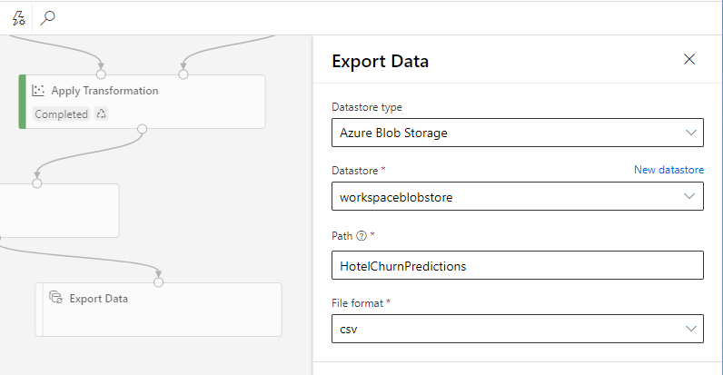 |
|27 | Export Data Parameterization | In this step, we'll parameterize our Export Data module so that our predictions can be imported and used within Customer Insights.    Click on the Export Data module to open the side pane and then click on the ellipses on top of the datastore dropdown.  Click on Add to pipeline parameter. Enter a name in the **Parameter Name** textbox that you can easily identify in Customer Insights. Click Save.        Repeat for the Path field.|      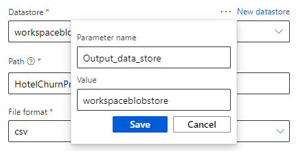    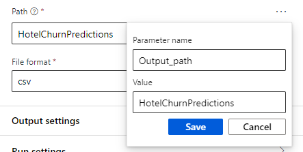|
|28 | Submit and Publish Pipeline Endpoint | **Submit** the batch inference pipeline.   Once it has completed successfully, click on **Publish** to open the published pipeline dialog.   Select **Create new** and enter a name for your endpoint. Enter a name that you can easily identify later on.   Click on **Publish** to publish your batch inference pipeline endpoint. It is now discoverable in Customer Insights! | 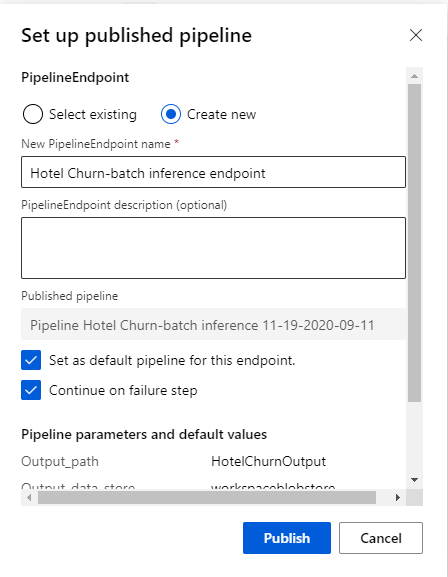 |

