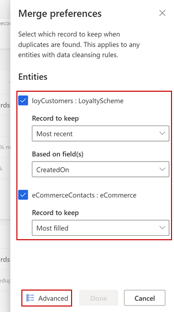
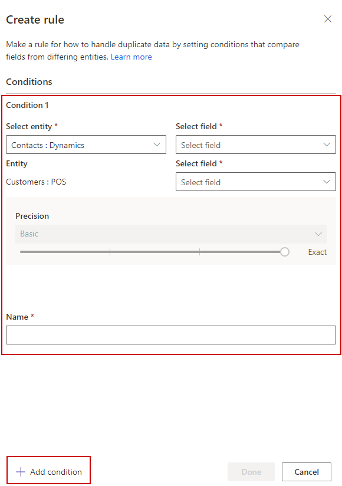

# Match entities

The match phase specifies how to combine your datasets into a unified customer profile dataset. After completing the [map step](map-entities.md) in the data unification process, you're ready to match your entities. The match phase requires at least two mapped entities.

The match page consists of three sections: 
- Key metrics that summarize the number of matched records
- Match order and rules for cross-entity matching
- Rules for deduplication of match entities

## Specify the match order

Go to **Data** > **Unify** > **Match** and select **Set order** to start the match phase.

Each match unifies two or more entities into a single, consolidated entity. At the same time, it keeps the unique customer records. For example, we selected two entities: **eCommerce:eCommerceContacts** as the primary entity and **LoyaltyScheme:loyCustomers** as second entity. The order of the entities specifies in which order the system will try to match the records.

:::image type="content" source="media/match-page.png" alt-text="Screenshot of the Match page in the Unify area of the data unification process.":::
  
The primary entity *eCommerce:eCommerceContacts* is matched with the next entity *LoyaltyScheme:loyCustomers*. The dataset that results from the first match step is matched with the following entity if you have more than two entities.

> [!IMPORTANT]
> The entity that you choose as your primary entity will serve as the basis for your unified profiles dataset. Additional entities that are selected during the match phase will be added to this entity. This doesn't mean that the unified entity will include *all* of the data included in this entity.
>
> There are two considerations that can help you choose the hierarchy of your entities:
>
> - Choose the entity with the most complete and reliable profile data about your customers as primary entity.
> - Choose the entity that hast several attributes in common with other entities (for example, name, phone number, or email address) as primary entity.

After specifying the match order, you'll see the defined match pairs in the **Matched records details** section on **Data** > **Unify** > **Match**. The key metrics will be empty until the match process completes.

## Define rules for match pairs

Match rules specify the logic by which a specific pair of entities will be matched.

The **Needs rules** warning next to an entity name suggests that no match rule is defined for a match pair. 

:::image type="content" source="media/match-rule-add.png" alt-text="Screenshot of the Matched record details section with control to add rules highlighted.":::

1. Select **Add rules** under an entity in the **Matched records details** section to define match rules.

1. In the **Create rule** pane, configure the conditions for the rule.

   :::image type="content" source="media/match-rule-conditions.png" alt-text="Screenshot of an opened match rule with conditions added.":::

   - **Entity/Field (first row)**: Choose a related entity and an attribute to specify a record property that is likely unique to a customer. For example, a phone number or email address. Avoid matching by activity-type attributes. For example, a purchase ID will likely find no match in other record types.

   - **Entity/Field (second row)**: Choose an attribute that relates to the attribute of the entity specified in the first row.

   - **Normalize**: Select from following normalization options for the selected attributes. 
     - Whitespace: Removes all spaces. *Hello   World* becomes *HelloWorld*.
     - Symbols: Removes all symbols and special characters. *Head&Shoulder* becomes *HeadShoulder*.
     - Text to lower case: Converts all character to lower case. *ALLCAPS and CamelCase* becomes *allcaps and camelcase*.
     - Unicode to ASCII: Converts unicode notation to ASCII characters. */u00B2* becomes *2*.
     - Numerals: Converts other numeral systems, such as Roman numerals, to Arabic numerals. *VIII* becomes *8*.
     - Semantic types: Standardizes names, titles, phone numbers, addresses, etc. 

   - **Precision**: Set the level of precision to apply for this condition. 
     - **Basic**: Choose from *Low*, *Medium*, *High*, and *Exact*. Select **Exact** to only match records that that match 100 percent. Select one of the other levels to match records that aren't 100 percent identical.
     - **Custom**: Set a percentage that records need to match. The system will only match records passing this threshold.

1. Provide a **Name** for the rule.

1. [Add more conditions](#add-conditions-to-a-rule) or select **Done** to finalize the rule.

1. Optionally, [add more rules](#add-rules-to-a-match-pair).

1. Select **Save** to apply your changes.

### Add conditions to a rule

To match entities only if attributes meet multiple conditions, add more conditions to a match rule. Conditions are connected with a logical AND operator and thus only executed if all conditions are met.

1. Go to **Data** > **Unify** > **Match** and select **Edit** on the rule you want to add conditions to.

1. In the **Edit rule** pane, select **Add condition**.

1. Select **Done** so save the rule.

### Add rules to a match pair

Match rules represent sets of conditions. To match entities by conditions based on multiple attributes, add more rules

1.  Go to **Data** > **Unify** > **Match** and select **Add rule** on the entity you want to add rules to.

2. Follow the steps in [Define rules for match pairs](#define-rules-for-match-pairs).

> [!NOTE]
> The order of rules matters. The matching algorithm tries to match on the basis of your first rule and continues to the second rule only if no matches were identified with the first rule.

## Define deduplication on a match entity

In addition to [cross-entity match rules](#define-rules-for-match-pairs), you can also specify deduplications rules. *Deduplication* is another process when matching records. It identifies duplicate records and merges them into one record. Source records get linked to the merged record with alternate IDs.

Deduplicated records will be used in the cross-entity matching process. Deduplication happens on individual entities and can be configured every entity used in match pairs.

Specifying deduplication rules isn't mandatory. If no such rules are configured, the system-defined rules are applied. They combine all records into a single record before passing the entity data to cross-entity matching for enhanced performance.

### Add deduplication rules

1. Go to **Data** > **Unify** > **Match**.

1. In the **Merged duplicates** section, select **Set entities**. In case deduplication rules are already created, select **Edit**.

1. In the **Merge preferences** pane, choose the entities you want to run deduplication on.

1. Specify how to combine the duplicate records and choose one of three options:
   - **Most filled**: Identifies the record with most populated attribute fields as the winner record. It's the default merge option.
   - **Most recent**: Identifies the winner record based on the most recency. Requires a date or a numeric field to define the recency.
   - **Least recent**: Identifies the winner record based on the least recency. Requires a date or a numeric field to define the recency.
 
   > [!div class="mx-imgBorder"]
   > 
 
1. Once the entities are selected and their merge preference is set, select **Add rule** to define the deduplication rules at an entity level.
   - **Select field** lists all the available fields from that entity. Choose the field you want to check for duplicates. Choose fields that are likely unique for every single customer. For example, an email address, or the combination of name, city, and phone number.
   - Specify the normalization and precision settings.
   - Define more conditions by selecting **Add condition**.
 
   > [!div class="mx-imgBorder"]
   > 

  You can create multiple deduplication rules for an entity. 

1. Running the match process now groups the records based on the conditions defined in the deduplication rules. After grouping the records, the merge policy is applied to identify the winner record.

1. This winner record is then passed on to the cross-entity matching, along with the non-winner records (for example, alternate IDs) to improve the matching quality.

1. Any custom match rules defined overwrite deduplication rules. If a deduplication rule identifies matching records, and a custom match rule is set to never match those records, then these two records won't be matched.

1. After [running the match process](#run-the-match-process), you will see the deduplication stats in the key metrics tiles.

### Deduplication output as an entity

The deduplication process creates a new entity for every entity from the match pairs to identify the deduplicated records. These entities can be found along with the **ConflationMatchPairs:CustomerInsights** in the **System** section in the **Entities** page, with the name **Deduplication_DataSource_Entity**.

A deduplication output entity contains the following information:
- IDs / Keys
  - Primary key field and its alternate IDs field. Alternate IDs field consists of all the alternate IDs identified for a record.
  - Deduplication_GroupId field shows the group or cluster identified within an entity that groups all the similar records based on the specified deduplication fields. It's used for system processing purposes. If there are no manual deduplication rules specified and system defined deduplication rules apply, you may not find this field in the deduplication output entity.
  - Deduplication_WinnerId: This field contains the winner ID from the identified groups or clusters. If the Deduplication_WinnerId is same as the Primary key value for a record, it means that the record is the winner record.
- Fields used to define the deduplication rules.
- Rule and Score fields to denote which of the deduplication rules got applied and the score returned by the matching algorithm.
   
## Run the match process

With configured match rules, including cross-entity matching and deduplication rules, you can run the match process. 

Go to **Data** > **Unify** > **Match** and select **Run** to start the process. The matching algorithm takes some time to complete and you can't change the configuration until it completes. To make changes, you can cancel the run. Select the status of the job and select **Cancel job** on the **Progress details** pane.

You'll find the result of a successful run, the unified customer profile entity, on the **Entities** page. Your unified customer entity is called **Customers** in the **Profiles** section. The first successful match run creates the unified *Customer* entity. All subsequent match runs expand that entity.

> [!TIP]
> There are [six types of status](system.md#status-types) for tasks/processes. Additionally, most processes [depend on other downstream processes](system.md#refresh-policies). You can select the status of a process to see details on the progress of the entire job. After selecting **See details** for one of the job's tasks, you find additional information: processing time, the last processing date, and all errors and warnings associated with the task.

## Review and validate your matches

Go to **Data** > **Unify** > **Match** to evaluate the quality of your match pairs and refine them if necessary.

The tiles on top of the page show key metrics, summarizing the number of matched records and duplicates.

:::image type="content" source="media/match-KPIs.png" alt-text="Cropped screenshot of the key metrics on the Match page with numbers and details.":::

- **Unique source records** shows the number of individual source records that were processed in last match run.
- **Matched and non-matched records** highlights how many unique records remain after processing the match rules.
- **Matched records only** shows the number of matches across all of your match pairs.

You can assess the results of each match pair and its rules in the **Matched records details** table. Compare the number of records that came from a match pair against the percentage of successfully matched records.

Review the rules of a match pair to see the percentage of successfully matched records at the rule level. Select the ellipsis (...) and then select **Match preview** to view all these records on the rule level. We recommend that you take a look at some records to validate that they were matched correctly.

Try different precision thresholds on conditions to find the optimal value.

  1. Select the ellipsis (...) for the rule that you want to experiment with and select **Edit**.

  2. Change the precisions values in the conditions you want to revise.

  3. Select **Preview** so see the number of matched and unmatched records for the selected condition.

## Manage match rules

You can reconfigure and fine-tune most of the match parameters.

:::image type="content" source="media/match-rules-management.png" alt-text="Screenshot of the drop-down menu with match rule options.":::

- **Change the order of your rules** if you defined multiple rules. You can reorder the match rules by selecting the **Move Up** and **Move Down** options or by drag and drop.

- **Change rule conditions** by selecting **Edit** and choose different fields.

- **Deactivate a rule** to retain a match rule while excluding it from the matching process.

- **Duplicate your rules** if you've defined a match rule and would like to create a similar rule with modifications, select **Duplicate**.

- **Delete a rule** by selecting the **Delete** symbol.

## Specify custom match conditions

You can specify conditions that certain records should always match or never match. These rules can be uploaded to override the standard match process. For example, if there are John Doe I and John Doe II in our records, the system might match them as one person. Custom match rules let you speficy that their profiles refer to different people. 

1. Go to **Data** > **Unify** > **Match** and select **Custom match** in the **Matched records details** section.

  :::image type="content" source="media/custom-match-create.png" alt-text="Screenshot of the match rules section with Custom match control highlighted.":::

1. If you have no custom match rules set, you'll see a new **Custom match** pane with more details.

1. Select **Fill in the template** to get a template file that can specify which records from which entities should always match or never match. You'll need to separately fill in the "always match" records and "never match" records in two different files.

1. The template contains fields to specify the entity and the entity primary key values to be used in the custom match. For example, if you want primary key *12345* from *Sales* entity to always match with primary key *34567* from *Contact* entity, fill in the template:
    - Entity1: Sales
    - Entity1Key: 12345
    - Entity2: Contact
    - Entity2Key: 34567

   The same template file can specify custom match records from multiple entities.
   
   If you want to specify custom matching for deduplication on an entity, provide the same entity as both Entity1 and Entity2 and set the different primary key values.

1. After adding all the overrides you want to apply, save the template file.

1. Go to **Data** > **Data sources** and ingest the template files as new entities. Once ingested, you can use them to specify the Match configuration.

1. After uploading the files and entities are available, select the **Custom match** option again. You'll see options to specify the entities you want to include. Select the required entities from the drop-down menu.

   :::image type="content" source="media/custom-match-overrides.png" alt-text="Screenshot of the dialog to choose overrides for a custom match scenario.":::

1. Select the entities you want to use for **Always match** and **Never match**, select **Done**.

1. Select **Save** on the **Match** page to apply the custom match configuration.

1. Select **Run** on the **Match** page to start the matching process. Other specified match rules are overridden by the custom match configuration.

> [!TIP]
> Go to **Data** > **Entities** and review the **ConflationMatchPair** entity to confirm that the overrides are applied.

## Next step

After completing the match process for at least one match pair, you may resolve possible contradictions in your data by going through the [**Merge**](merge-entities.md) article.
