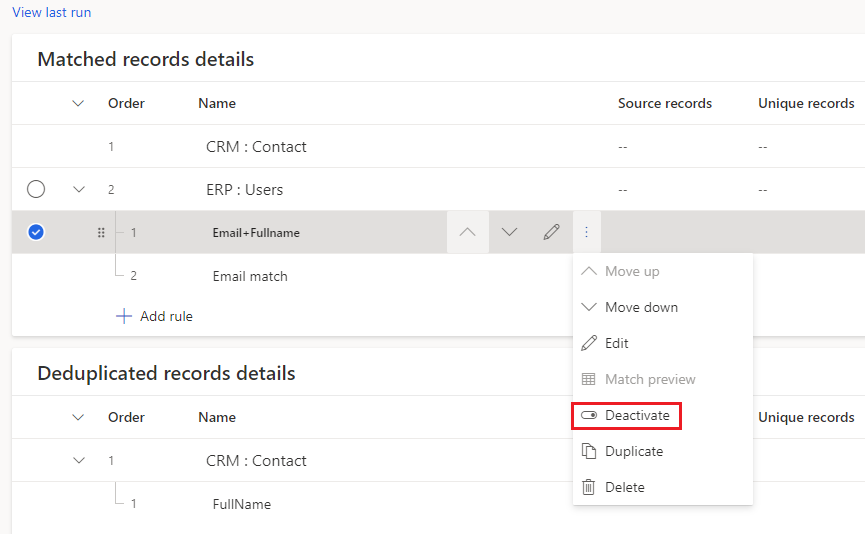
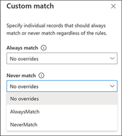

# Match entities

The match phase specifies how to combine your datasets into a unified customer profile dataset. After completing the [map step](map-entities.md) in the data unification process, you're ready to match your entities. The match phase requires at least two mapped entities.

The match page consists of three sections: 
- Key metrics that summarize the number of matched records
- Match order and rules for cross-entity matching
- Entities for deduplication

## Specify the match order

Go to **Data** > **Unify** > **Match** and select **Set order** to start the match phase. To change the order of entities in a configured match phase, select **Edit** in the **Matched records details** section.

Each match unifies two or more entities describing a into a single entity. At the same time, it keeps the unique customer records. In the following example, we selected three entities: **eCommerce:eCommerceContacts** as the primary entity, **LoyaltyScheme:loyCustomers** as second entity, and **NewsletterSubscribers:Subscriptions** as third entity. The order of the entities specifies in which order the system will try to match the records.

> [!div class="mx-imgBorder"]
> 
  
The primary entity *eCommerce:eCommerceContacts* is matched with the next entity *LoyaltyScheme:loyCustomers*. The dataset that results from the first match step is matched with the followin entity *NewsletterSubscribers:Subscriptions*.

> [!IMPORTANT]
> The entity that you choose as your primary entity will serve as the basis for your unified profiles dataset. Additional entities that are selected during the match phase will be added to this entity. At the same time, this doesn't mean that the unified entity will include *all* of the data included in this entity.
>
> There are two considerations that can help you choose the hierarchy of your entities:
>
> - Choose the entity with the most complete and reliable profile data about your customers as primary entity.
> - Choose the entity that hast several attributes in common with other entities (for example, name, phone number, or email address) as primary entity.

After specifying the match order, you'll see the defined match pairs in the **Matched records details** section on **Data** > **Unify** > **Match**. The key metrics will be empty until the match process completes.

## Define rules for match pairs

Match rules specify the logic by which a specific pair of entities will be matched.

> [!div class="mx-imgBorder"]
> 

The **Needs rules** warning next to an entity name suggests that no match rule is defined for a match pair. 

1. Select **Add rules** under an entity in the **Matched records details** section to define match rules.

   > [!div class="mx-imgBorder"]
   > 

1. In the **Create rule** pane, configure the conditions for the rule.

   > [!div class="mx-imgBorder"]
   > 

   - **Entity/Field (first row)**: Choose an related entitiy and an attribute to specify a record property that is likely unique to a customer. For example, a phone number or email address. Avoid matching on the basis of activity-type attributes. For example, a purchase ID will likely find no match in other record types.

   - **Entity/Field (second row)**: Choose an attribute that relates to the attribute of the entity specified in the first row.

   - **Normalize**: Select from various normalization options for the selected attributes. For example, removing punctuation, capitalization, or spaces.

   > [!div class="mx-imgBorder"]
   > 

   - **Precision**: Set the level of precision to apply for this condition. 
     - **Basic**: Choose from *Low*, *Medium*, *High*, and *Exact*. Select **Exact** to only match records that that match 100 percent. Select one of the other levels to match records that aren't 100 percent identical.
     - **Custom**: Set a percentage that records need to match. The system will only match records passing this threshold.

1. [Add more conditions](#add-conditions-to-a-rule) or select **Done** to finalize the rule.

1. Optionally, [add more rules](#add-rules-to-a-match-pair).

1. Select **Save** to apply your changes.

### Add conditions to a rule

To match entities only if attributes meet multiple conditions, add more conditions to a match rule.

1. Go to **Data** > **Unify** > **Match** and select **Edit** on the rule you want to add conditions to.

1. In the **Edit rule** pane, select **Add condition**.

1. Select **Done** so save the rule.

### Add rules to a match pair

Match rules represent sets of conditions. To match entities by conditions based on muliple attributes, add more rules

1.  Go to **Data** > **Unify** > **Match** and select **Add rule** on the entity you want to add rules to.

2. Follow the steps in [Define rules for match pairs](#define-rules-for-match-pairs).

> [!NOTE]
> The order of rules matters. The matching algorithm tries to match on the basis of your first rule and continues to the second rule only if no matches were identified with the first rule.

## Define deduplication on a match entity

Along with specifying cross entity matching rules as outlined in the above sections, you can also specify deduplications rules. *Deduplication* is a process. It identifies duplicate records, merges them into one record, and links all the source records to this merged record with alternate IDs to the merged record.

After a deduplicated record is identified, that record will be used in the cross-entity matching process. Deduplication is implemented at the entity level and can be applied to every entity used in the Match process.

### Add deduplication rules

1. In audience insights, go to **Data** > **Unify** > **Match**.

1. In the **Merged duplicates** section, select **Set entities**.

1. In the **Merge preferences** section, select the entities you want to apply deduplication to.

1. Specify how to merge the duplicate records and choose one of three merge options:
   - *Most filled*: Identifies the record with most filled attributes as the winner record. This is the default merge option.
   - *Most recent*: Identifies the winner record based on the most recency. Requires a date or a numeric field to define the recency.
   - *Least recent*: Identifies the winner record based on the least recency. Requires a date or a numeric field to define the recency.
 
   > [!div class="mx-imgBorder"]
   > 
 
1. Once the entities are selected and their merge preference is set, select **Create new rule** to define the deduplication rules at an entity level.
   - **Select field** lists all the available fields from that entity you want to deduplicate source data on.
   - Specify the normalization and precision settings in similar way as specified in the cross entity matching.
   - You can define additional conditions by selecting **Add condition**.
 
   > [!div class="mx-imgBorder"]
   > 

  You can create multiple deduplication rules for an entity. 

1. Running the match process now groups the records based on the conditions defined in the deduplication rules. After grouping the records, the merge policy is applied to identify the winner record.

1. This winner record is then passed on to the cross-entity matching, along with the non-winner records (for example, alternate IDs) to improve the matching quality.

1. Any custom match rules defined for always match and never match overrule deduplication rules. If a deduplication rule identifies matching records, and a custom match rule is set to never match those records, then these two records won't be matched.

1. After running the match process, you will see the deduplication stats.
   
> [!NOTE]
> Specifying deduplication rules isn't mandatory. If no such rules are configured, the system-defined rules are applied. They collapse all records that share the same value combination (exact match) from primary key and the fields in the matching rules into a single record before passing the entity data to cross-entity matching for enhanced performance and system sanity.

## Run your match order

After defining the match rules, including cross-entity matching and deduplication rules, you can run the match order. On the **Match** page, select **Run** to start the process. The matching algorithm might take some time to complete. You can't change properties on the **Match** page until the match process completes. You'll find the unified customer profile entity that was created on the **Entities** page. Your unified customer entity is called **ConflationMatchPairs:CustomerInsights**.

To make additional changes and rerun the step, you can cancel a match in progress. Select the **Refreshing ...** text and select **Cancel job** at the bottom of the side pane that appears.

When the match process is complete, the **Refreshing ...** text will change to **Successful** and you can use all functionality of the page again.

The first match process results in the creation of a unified master entity. All subsequent match runs result in the expansion of that entity.

> [!TIP]
> There are [six types of status](system.md#status-types) for tasks/processes. Additionally, most processes [depend on other downstream processes](system.md#refresh-policies). You can select the status of a process to see details on the progress of the entire job. After selecting **See details** for one of the job's tasks, you find additional information: processing time, the last processing date, and all errors and warnings associated with the task.

## Deduplication output as an entity
In addition to the unified master entity created as part of the cross entity matching, the deduplication process also generates a new entity for every entity from the match order to identify the deduplicated records. These entities can be found along with the **ConflationMatchPairs:CustomerInsights** in the **System** section in the **Entities** page, with the name **Deduplication_Datasource_Entity**.

A deduplication output entity contains the following information:
- IDs / Keys
  - Primary key field and its alternate IDs field. Alternate IDs field consists of all the alternate IDs identified for a record.
  - Deduplication_GroupId field shows the group or cluster identified within an entity that groups all the similar records based on the specified deduplication fields. This is  used for system processing purposes. If there are no manual deduplication rules specified and system defined deduplication rules apply, you may not find this field in the deduplication output entity.
  - Deduplication_WinnerId: This field contains the winner ID from the identified groups or clusters. If the Deduplication_WinnerId is same as the Primary key value for a record, it means that the record is the winner record.
- Fields used to define the deduplication rules.
- Rule and Score fields to denote which of the deduplication rules got applied and the score returned by the matching algorithm.

## Review and validate your matches

Evaluate the quality of your match pairs and refine it:

- On the **Match** page, you'll find two tiles showing initial insights about your data.

  - **Unique customers**: shows the number of unique profiles that the system identified.
  - **Matched records**: shows the number of matches across all of your match pairs.

- In the **Match order** table, you can assess the results of each match pair by comparing the number of records that came from this match-pair entity against the percentage of successfully matched records.

- In the **Rules** section of an entity in the **Match order** table, you'll find the percentage of successfully matched records at the rule level. By selecting the table symbol next to a rule, you can view all these records on the rule level. We recommend that you review a subset of the records to validate that they were matched correctly.

- Experiment with different precision thresholds around your conditions to identify the optimal value.

  1. Select the ellipsis (...) for the match pair rule that you want to experiment with and select **Edit**.

  2. Select the condition that you want to experiment with. Each criterion is represented by one row in the **Match rule** pane.

  3. What you'll see on the **Criteria preview** page depends on the precision level you've selected for a condition. Find the number of matched and unmatched records for the selected condition.

     Get a rich understanding of the effects of different threshold levels. You can compare how many records will be matched under each of the threshold levels, and view the records under each option. Select each of the tiles and review the data in the table section.

## Manage match rules

Increase the quality by reconfiguring some of your match parameters:

- **Change the match order** by selecting **Edit** and change the match order fields.

  > [!div class="mx-imgBorder"]
  > 

- **Change the order of your rules** if you defined multiple rules. You can reorder the match rules by selecting the **Move Up** and **Move Down** options in the match rules grid.

  > [!div class="mx-imgBorder"]
  > 

- **Duplicate your rules** if you've defined a match rule and would like to create a similar rule with modifications. Do so by selecting **Duplicate**.

  > [!div class="mx-imgBorder"]
  > 

- **Deactivate a rule** to retain a match rule while excluding it from the matching process.

  > [!div class="mx-imgBorder"]
  > 

- **Edit your rules** by selecting the **Edit** symbol. You can apply the following changes:

  - Change attributes for a condition: Select new attributes within the specific condition row.
  - Change the threshold for a condition: Adjust the precision slider.
  - Change the normalization method for a condition: Update the normalization method.

## Specify your custom match records

You can specify conditions that certain records should always match or never match. These rules can be uploaded in bulk to the match process.

1. Select the **Custom match** option on the **Match order** screen.

   > [!div class="mx-imgBorder"]
   > 

2. If you have no uploaded entities, you'll see a new **Custom match** dialog box that requires you to fill in some details. If you've provided these details earlier, skip to step 8.

   > [!div class="mx-imgBorder"]
   > 

3. Select **Fill in the template** to get a template file that can specify which records from which entities should always match or never match. You'll need to separately fill in the "always match" records and "never match" records in two different files.

4. The template contains fields to specify the entity and the entity primary key values to be used in the custom match. For example, if you want primary key 12345 from Sales entity to always match with primary key 34567 from Contact entity, you'll need to specify as follows:
    - Entity1: Sales
    - Entity1Key: 12345
    - Entity2: Contact
    - Entity2Key: 34567

   The same template file can specify custom match records from multiple entities.
   
   If you want to specify custom matching for deduplication on an entity, provide the same entity as both Entity1 and Entity2 and set the different primary key values.

5. After adding all the overrides you want to apply, save the template file.

6. Go to **Data** > **Data sources** and ingest the template files as new entities. Once ingested, you can use them to specify the Match configuration.

7. After uploading the files and entities are available, select the **Custom match** option again. You'll see options to specify the entities you want to include. Select the required entities from the drop-down menu.

   > [!div class="mx-imgBorder"]
   > 

8. Select the entities you want to use for **Always match** and **Never match**, select **Done**.

9. Select **Save** on the **Match** page for the custom match configuration you just set up.

10. Select **Run** on the **Match** page to start the matching process, and the custom match configuration will be taken into effect. Any system matched rules are overridden by the configuration set.

11. Once the matching is complete, you can verify the **ConflationMatchPair** entity to confirm that the overrides are applied in the conflation matches.

## Next step

After completing the match process for at least one match pair, you may resolve possible contradictions in your data by going through the [**Merge**](merge-entities.md) topic.
