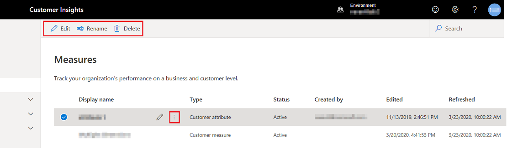

# Define and manage measures

Measures help you to better understand customer behaviors and business performance by retrieving relevant values from [unified profiles](data-unification.md). For example, a business wants to see the *total spend per customer* to understand individual customer’s purchase history. Or measure *total sales of the company* to understand the aggregate-level revenue in the whole business.  

Measures are created using the measure builder, a data query platform with various operators and simple mapping options. It also lets you filter the data, group results by attribute, detect [entity relationship paths](relationships.md), and preview the output.

Use the measure builder to query desired data and extract insights on customer data by creating different measures to plan business activities. For example, creating a measure of *total spend per customer* and *total return per customer* can you identify a group of customers with high spend yet high return for you to [create a segment](segments.md) for next best actions. 

## Create a measure

This section walks you through creating a new measure from scratch. You can build a measure by mapping data attributes from applicable data entities that have relationship set up to connect with the Customer entity. 

1. In audience insights, go to **Measures**.

1. Select **New**.

1. Select **Edit name** and provide a **Name** for the measure. 
   > [!NOTE]
   > If your new measure configuration has only two fields, for exmample, CustomerID and one calculation, the output will be added as a new column to the system generated entity called Customer_Measure. And you will be able to see the measure’s value in the unified customer profile. Other measures will generate their own entities.

1. In the configuration area, choose the aggregation function from the **Select Function** drop-down menu. Aggregation functions include: **Sum**, **Average**, **Count**, **Count Unique**, **Max**, **Min**, **First** (takes the first value of the data record), **Last** (takes the last value that was added to the data record). 

   :::image type="content" source="media/measure-operators.png" alt-text="Operators for measure calcuations.":::

1. Select **Add attribute** to map the data you need to create this measure.
   
   1. Select the **Attributes** tab. 
   1. Choose the entity that includes the attribute you want to map. 
   1. Choose the attribute you want to map. You can only map one attribute at a time.
   1. Alternatively, you can select a data attribute from an existing measure by selecting the **Measures** tab. Or, you can search for an entity or measure name. 
   1. Select **Add** to add the selected attribute to the measure.

   :::image type="content" source="media/measure-attribute-selection.png" alt-text="Select an attribute to use in calculations.":::

1. To build more complex measures, you can add more attributes or use math operators on your measure function.

   :::image type="content" source="media/measure-math-operators.png" alt-text="Create a complex measure with math operators.":::

1. To add filters, select the **Filter** in the configuration area. 
  
   1. In **Add attribute** section of the **Filters** pane, select the attribute you want to use to create filters.
   1. Set the filter operators to define the filter for every selected attribute.
   1. Select **Apply** to add the filters to the measure.

1. To add dimensions, select **Dimension** in the configuration area. Dimensions will show as columns in the measure output entity.
   1. Select **Edit dimensions** to add data attributes you want to group the measure values by. For example, city or gender. By default, the *CustomerID* dimension is selected.
   1. Select **Done** to add the dimensions to the measure.

1. If there are multiple paths between the data entity you mapped and the Customer entity, you have to choose one of the identified [entity relationship paths](relationships.md). Measure results can vary depending on the selected path.
   1. Select **Data preferences** and choose the entity path that should be used to identify your measure.
   1. Select **Done** to apply your selection. 

   :::image type="content" source="media/measures-data-preferences.png" alt-text="Select the entity path for the measure.":::

1. To add more calculations for the measure, select **New calculation**. You can only use entities on the same entity path for new calculations. More calculations will show as new columns in the measure output entity.

1. Select **...** on the calculation to **Duplicate**, **Rename**, or **Remove** a calculation from a measure.

1. In the **Preview** area, you'll see the data schema of the measure output entity, including filters and dimensions. The preview reacts dynamically to changes in the configuration.

1. Select **Run** to calculate results for the configured measure. Select **Save and close** if you want to keep the current configuration and run the measure later.

1. Go to **Measures** to see the newly created measure in the list.

## Manage your measures

After [creating a measure](#create-a-measure), you see a list of measures on the **Measures** page.

You'll find information about the measure type, the creator, creation date, status, and state. When you select a measure from the list, you can see a preview of its output and download a .CSV file.

To refresh all of your measures at the same time, select **Refresh all** without selecting a specific measure.

> [!div class="mx-imgBorder"]
> 

You can also select a measure from the list and perform one of the following actions:

- Select the measure name to see its details.
- **Edit** the configuration of the measure.
- **Refresh** the measure based on the latest data.
- **Rename** the measure.
- **Delete** the measure.
- **Activate** or **Deactivate**. Inactive measures won't get refreshed during a [scheduled refresh](system.md#schedule-tab).

> [!TIP]
> There are [six types of status](system.md#status-types) for tasks/processes. Additionally, most processes [depend on other downstream processes](system.md#refresh-policies). You can select the status of a process to see details on the progress of the entire job. After selecting **See details** for one of the job's tasks, you find additional information: processing time, the last processing date, and all errors and warnings associated with the task.

## Next step

You cam use existing measures to create [a customer segment](segments.md).
