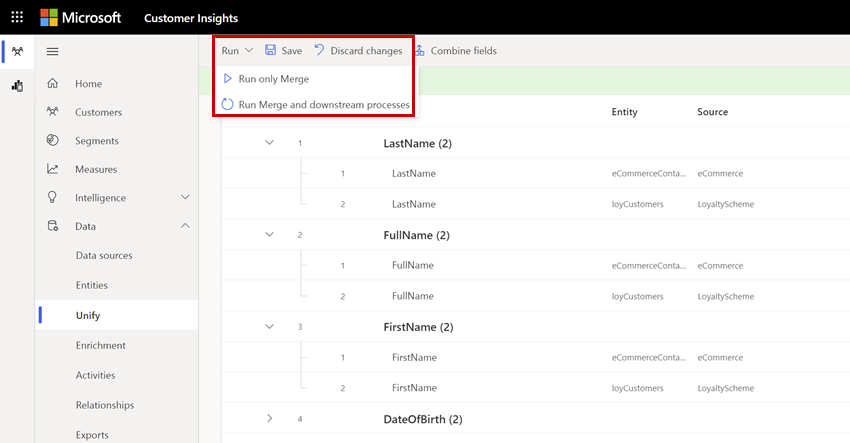

# Merge entities

The merge phase is the last phase in the data unification process. Its purpose is reconciling conflicting data. Examples of conflicting data could include a customer name found in two of your datasets but that shows up a little differently in each ("Grant Marshall" versus "Grant Marshal"), or a phone number that differs in format (617-803-091X versus 617803091X). Merging those conflicting data points is done on an attribute-by-attribute basis.

:::image type="content" source="media/merge-fields-page.png" alt-text="Merge page in the data unification process showing table with merged fields that define the unified customer profile.":::

After completing the [match phase](match-entities.md), you start the merge phase by selecting the **Merge** tile on the **Unify** page.

## Review system recommendations

On **Data** > **Unify** > **Merge**, you choose and exclude attributes to merge within your unified customer profile entity. The unified customer profile is the result of the data unification process. Some attributes are automatically merged by the system.

To view the attributes that are included in one of your automatically merged attributes, select that merged attribute in the **Customer fields** tab of the table. The attributes that compose that merged attribute display in two new rows beneath the merged attribute.

## Separate, rename, exclude, and edit merged fields

You can change how the system processes merged attributes to generate the unified customer profile. Select **Show more** and choose what you want to change.

:::image type="content" source="media/manage-merged-attributes.png" alt-text="Options in the Show more drop-down menu to manage merged attributes.":::

For more information, see the following sections.

## Separate merged fields

To separate merged fields, find the attribute in the table. Separated fields show as individual data points on the unified customer profile. 

1. Select the merged field.
  
1. Select **Show more** and choose **Separate fields**.
 
1. Confirm the separation.

1. Select **Save** and **Run** to process the changes.

## Rename merged fields

Change the display name of merged attributes. You can't change the name of the output entity.

1. Select the merged field.
  
1. Select **Show more** and choose **Rename**.

1. Confirm the changed display name. 

1. Select **Save** and **Run** to process the changes.

## Exclude merged fields

Exclude an attribute from the unified customer profile. If the field is used in other processes, for example in a segment, remove it from these processes before excluding it from the customer profile. 

1. Select the merged field.
  
1. Select **Show more** and choose **Exclude**.

1. Confirm the exclusion.

1. Select **Save** and **Run** to process the changes. 

On the **Merge** page, select **Excluded fields** to see the list of all excluded fields. This pane lets you add excluded fields back.

## Manually combine fields

Specify a merged attribute manually. 

1. On the **Merge** page, select **Combine fields**.

1. Provide a **Name** and an **Output field name**.

1. Choose a field to add. Select **Add fields** to combine more fields.

1. Confirm the exclusion.

1. Select **Save** and **Run** to process the changes. 

## Change the order of fields

Some entities contain more details than others. If an entity includes the latest data about a field, you can prioritize it over other entities when merging values.

1. Select the merged field.
  
1. Select **Show more** and choose **Edit**.

1. In the **Combine fields** pane, select **Move up/down** to set the order or drag and drop them in the desired position.

1. Confirm the change.

1. Select **Save** and **Run** to process the changes.

## Run your merge

Whether you manually merge attributes or let the system merge them, you can always run your merge. Select **Run** on the **Merge** page to start the process.

> [!div class="mx-imgBorder"]
> 

Choose **Run only Merge** if you only want to see the output reflected in the unified customer entity. Downstream processes will be refreshed as [defined in the refresh schedule](system.md#schedule-tab).

Choose **Run Merge and downstream processes** to refresh the system with your changes. All processes, including enrichment, segments, and measures will rerun automatically. After all downstream processes have completed, the customer profiles reflect any changes you made.

To make more changes and rerun the step, you can cancel an in-progress merge. Select **Refreshing ...** and select **Cancel job**  in the side pane that appears.

> [!TIP]
> After running the merge process, select the process status to open the **Task details** pane. It gives an overview about the processing time, the last processing date, and all errors and warnings associated with the task. Select **See details** to see which entities participated in the match process, if the conflict resolution succeeded, and if the updates were published successfully.  
> There are [six types of status](system.md#status-types) for tasks/processes. Additionally, most processes [depend on other downstream processes](system.md#refresh-policies).  

## Next Step

Configure [activities](activities.md), [enrichment](enrichment-hub.md), or [relationships](relationships.md) to gain more insights about your customers.

If you already configured activities, enrichment, or segments, they'll be processed automatically to use the latest customer data.

[!INCLUDE[footer-include](../includes/footer-banner.md)]
