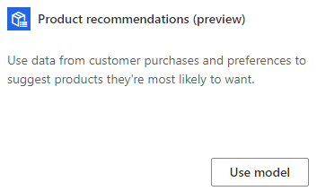
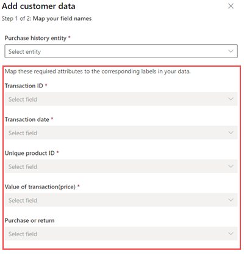
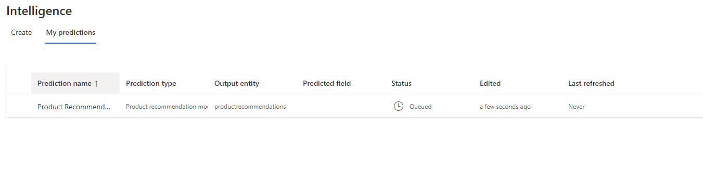
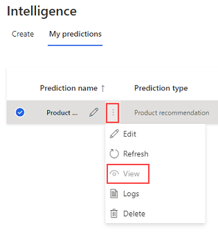
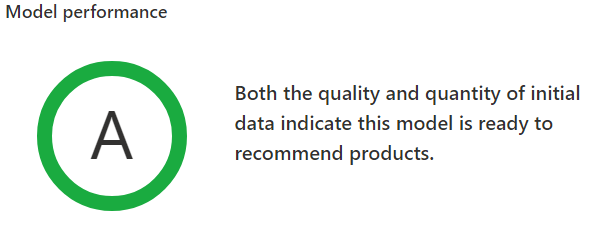
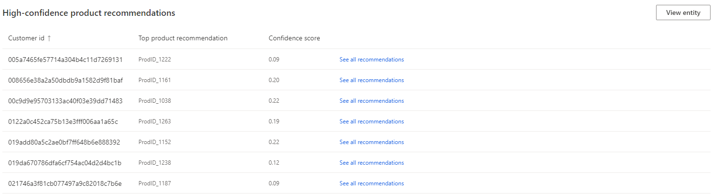

# Product recommendation prediction (preview)

The product recommendation model creates sets of predictive product recommendations. Recommendations are based on previous purchase behavior and customers with similar purchase patterns. You can create new product recommendation predictions on the **Intelligence** > **Predictions** page. Select **My predictions** to see other predictions that you've created.

Product recommendations may be subject to local laws and regulations as well as customer expectations, which the model is not built to specifically take into account.  As a user of this predictive capability, **you must review the recommendations prior to delivering them to your customers** to ensure you are complying with any applicable laws or regulations, as well as customer expectations for what you may recommend. 

Additionally, the output of this model will give you recommendations based on the product ID. Your delivery mechanism will need to take predicted product IDs and map them to appropriate content for your customers to account for localization, image content, and other business specific content or behavior.

## Sample Guide

If you're interested in trying this feature but don't have data to complete the requirements below, you can [create a sample implementation](sample-guide-predict-product-recommendation.md).

## Prerequisites

- At least [Contributor permissions](permissions.md) in Customer Insights.
- Business knowledge to understand different types of products for your business and how your customers interact with them. We support recommending products that have been previously purchased by your customers or recommendations for new products.
- Data about transactions, purchases, and their history:
    - Transaction identifiers to distinguish purchases or transactions.
    - Customer identifiers to map transactions to your customers.
    - Transaction event dates that specify dates the transaction occurred on.
    - (Optional) Product ID information for the transaction.
    - (Optional) If a transaction is a return or not.
    - The semantic data schema requires the following information:
        - **Transaction ID:** A unique identifier of a purchase or transaction.
        - **Transaction date:** The date the of the purchase or transaction.
        - **Value of the transaction:** The numerical value of the purchase or transaction.
        - **Unique product ID:** The ID of the product or service purchased if your data is at a line item level.
        - (Optional) **Purchase or return:** A true/false field that identifies if the transaction was a return or not. If the **Value of the transaction** is negative, we will also use this information to infer a return.

## Create a product recommendation prediction

1. In Customer Insights, go to **Intelligence** > **Predictions**.

1. Select the **Product recommendations model (preview)** tile and select **Use this model**.
   > [!div class="mx-imgBorder"]
   > 

1. Review the information about the model requirements. If you have the required data, select **Get started**.

### Name model

1. Provide a name for the model to distinguish it from other models.

1. Enter a name for the output entity using letters and numbers only, without any spaces. That's the name that the model entity will use. Then, select **Next**.

### Define product recommendation configuration

1. Set the **Number of products** you want to recommend to a customer. This value depends on how your delivery method fills data. If you can recommend three products, set this value accordingly.
   
   >[!TIP]
   > You can select **Save and close** at any time to save the prediction as a draft. You'll find the draft prediction in the **My predictions** tab.

1. Choose if you want to **Suggest products customers have recently purchased**.

1. If you've selected to *not* recommend recently purchased products, set the **Look back window**. This setting specifies the time frame the model considers before recommending the product to the user again. For example, indicate a customer purchases a laptop every 2 years. This window will look at the purchase history for the last 2 years, and if they find an item, the item will be filtered from the recommendations.

1. Select **Next**

### Add required data

1. Select **Add data** for **Customer transaction history** and choose the entity that provides the transaction/purchase history information as described in the [prerequisites](#prerequisites).

1. Map the semantic fields to attributes within your purchase history entity and select **Next**. For descriptions of the fields, have a look at the [prerequisites](#prerequisites).
   > [!div class="mx-imgBorder"]
   > 

1. If the fields aren't filled in, configure the relationship from your purchase history entity to the *Customer* entity.
    1. Select the **Purchase history entity**.
    1. Select the **Field** that identifies the customer in the purchase history entity. It needs to relate to the primary customer ID of your *Customer* entity.
    1. Select the **Customer entity** that matches your primary customer entity.
    1. Enter a name that describes the relationship.
       > [!div class="mx-imgBorder"]
       > 

1. Select **Save**.

1. Select **Next**.

### Set schedule and review configuration

1. Set a frequency to retrain your model. This setting is important to update the accuracy of predictions as new data is imported into Customer Insights. Most businesses can retrain once per month and get a good accuracy for their prediction.

1. Select **Next**.

1. Review the configuration. You can go back to any part of the prediction configuration by selecting **Edit** under the shown value. Or you can select a configuration step from the progress indicator.

1. If all values are configured correctly, select **Save and run** to begin the prediction process. On the **My predictions** tab, you can see the status of your predictions. The process may take several hours to complete depending on the amount of data used in the prediction.

## Review a prediction status and results

1. Go to the **My predictions** tab on **Intelligence** > **Predictions**.
   > [!div class="mx-imgBorder"]
   > 

1. Select the prediction you want to review.
   - **Prediction name:** The name of the prediction provided when creating it.
   - **Prediction type:** The type of model used for the prediction
   - **Output entity:** Name of the entity to store the output of the prediction. You can find an entity with this name on **Data** > **Entities**.
   - **Predicted field:** This field is populated only for some types of predictions, and isn't used in churn prediction.
   - **Status:** The current status of the prediction's run.
        - **Queued:** The prediction is currently waiting for other processes to run.
        - **Refreshing:** The prediction is currently running the "score" stage of processing to produce results that will flow into the output entity.
        - **Failed:** the prediction has failed. Select **Logs** for more details.
        - **Succeeded:** the prediction has succeeded. Select **View** under the vertical ellipses to review the prediction
   - **Edited:** The date the configuration for the prediction was changed.
   - **Last refreshed:** The date the prediction refreshed results in the output entity.

1. Select the vertical ellipses next to the prediction you want to review results for and select **View**.
   > [!div class="mx-imgBorder"]
   > 

1. There are three primary sections of data within the results page:
    1. **Training model performance:** A, B, or C are possible scores. This score indicates the performance of the prediction, and can help you make the decision to use the results stored in the output entity.
        - Scores are determined based on the following rules:
            - **A** The model will be considered **A** quality if the "Success @ K" metric is at least 10% more the baseline. 
            - **B** The model will be considered **B** quality if the "Success @ K" metric is 0 to 10% more than the baseline.
            - **C** The model will be considered **C** quality if the "Success @ K" metric is less than than the baseline.
               
               > [!div class="mx-imgBorder"]
               > 
            - **Baseline**: The model takes the top most recommended products by purchase count across all customers, and uses learned rules identified by the model to create a set of recommendations for the customers. The predictions are then compared to the top products, as calculated by the number of customers that had purchased the product. If a customer has at least one product in their recommended products that was also seen in the top purchased products, they're considered a part of the baseline. If there were 10 of these customers that had a recommended product purchased out of 100 total customers, the baseline would be 10%.
            - **Success @ K**: Using a validation set of time period of transactions, recommendations are created for all customers and compared against the validation set of transactions. For example, in a 12 month period, month 12 might be set aside as a validation set of data. If the model predicts at least one thing you would purchase in month 12 based on what it learned from the previous 11 months, the customer would increase the "Success @ K" metric.
    
    1. **Key Recommendation Factors:** The AI model uses customer transaction history to make product recommendations. It learns patterns based on past purchases and implicitly finds similarities between customers and similarities between products, which it then utilizes to inform product recommendations.
We break down what the AI model learned and utilized to generate recommendations, into three influencing factors: _past transactions, customer similarity_ and _product similarity_.
        - **Past transactions** : A recommendation is influenced by past transactions if the customer&#39;s past purchase patterns were utilized by the model to generate the recommendation. Eg – John was recommended a _Surface Arc Mouse_ by the model as he recently purchased a _Surface Book 3_ and a _Surface Pen_. The model learned that historically, many customers had purchased a _Surface Arc Mouse_ after purchasing a _Surface Book 3_ and a _Surface Pen_.
        - **Customer similarity** : A recommendation is influenced by customer similarity if the recommended product was historically purchased by other customers similar to the customer for whom the recommendation was made. The model considers two customers to be similar if they have very similar purchase patterns. Eg – John was recommended _Surface Headphones 2_ because Jennifer and Brad recently purchased _Surface Headphones 2_. The model believes John is similar to Jennifer and Brad as all of them have historically had very similar purchase patterns.
        - **Product similarity** : A recommendation is influenced by product similarity if the recommended product was similar to other products that the customer had previously purchased. The model considers two products to be similar if they were bought together or by similar customers. Eg – John was recommended a _USB Storage Drive_ as he previously purchased a _Surface USB-C to USB Adapter_ and the model believes that _USB Storage Drive_ is similar to _Surface USB-C to USB Adapter_ based on historical purchase patterns.

Every product recommendation could be influenced by one or all three of these factors. The percentage of recommendations where each influencing factor played a role is highlighted as shown below. Eg – In the screenshot, 100% of the recommendations were influenced by past transactions, 60% by customer similarity and 22% by product similarity. On hovering over the horizontal bars, you will see the exact percentage of total recommendations where each of the influencing factors contributed.

This will help you understand how the model generated the product recommendations by highlighting the major factors that the model learned and to what degree those influencing factors contributed towards the model&#39;s recommendations.

    1. **Data Statistics** : An overview of the number of transactions, customers and products considered by the model (based on the input data) to learn patterns to generate the product recommendations.

This card displays statistics around the data points that were used by the model to learn patterns to generate product recommendations. Any filtering applied during the model configuration will apply on the outputs generated by the model as necessary, however, the model will always utilize all the input data provided to it to learn patterns. For instance, if you use product filtering in the model configuration, this card will display the number of products that the model analyzed to learn patterns, which might differ from the number of products in your filtering criteria.
 
    1. **Most suggested products (with tally):** The top 5 products that were predicted for your customers.
       > [!div class="mx-imgBorder"]
       > 
    
    1. **High-confidence product recommendations:** A sample of recommendations provided to your customers that the model believes are likely to be purchased by the customer.
       > [!div class="mx-imgBorder"]
       > 

## Fix a failed prediction

1. Go to the **My predictions** tab on **Intelligence** > **Predictions**.

1. Select the prediction you would like to view error logs for and select **Logs**.

1. Review all the errors. There are several types of errors that can occur, and they describe what condition caused the error. For example, an error that there's not enough data to accurately predict is typically resolved by loading additional data into Customer Insights.

## Refresh a prediction

Predictions automatically refresh on the same [schedule your data refreshes](system.md#schedule-tab) as configured in settings.

1. Go to the **My predictions** tab on **Intelligence** > **Predictions**.

1. Select the vertical ellipses next to the prediction you want to refresh.

1. Select **Refresh**.

## Delete a prediction

Deleting a prediction will also remove its output entity.

1. Go to the **My predictions** tab on **Intelligence** > **Predictions**.

1. Select the vertical ellipses next to the prediction you want to delete.

1. Select **Delete**.

[!INCLUDE[footer-include](../includes/footer-banner.md)]
