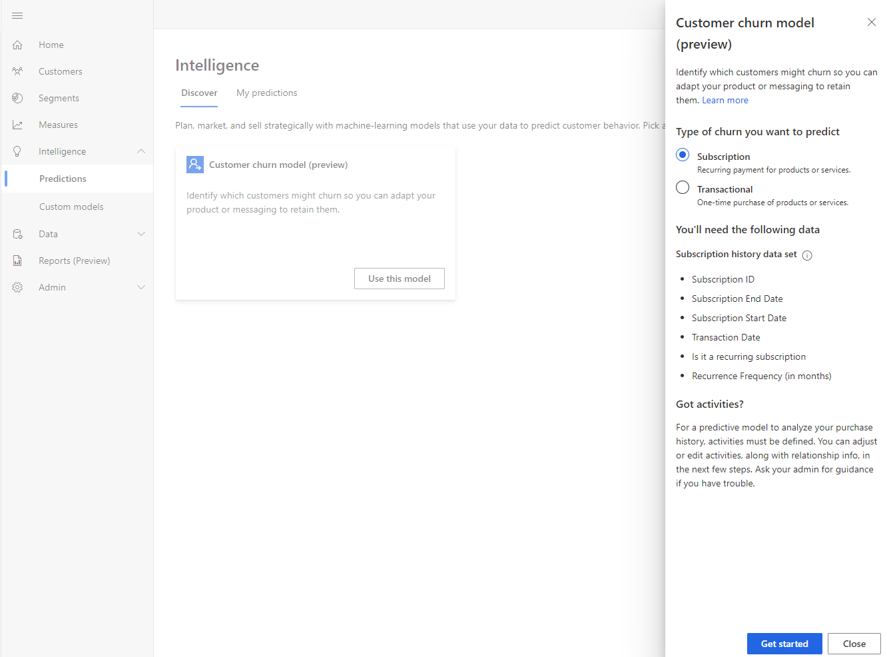
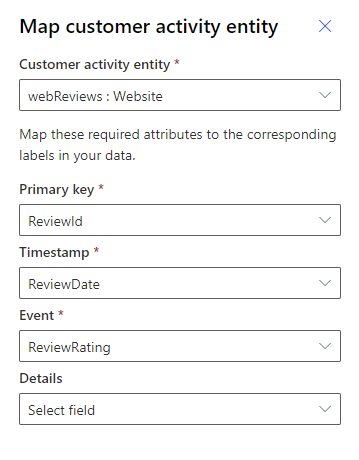
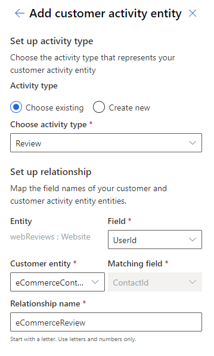
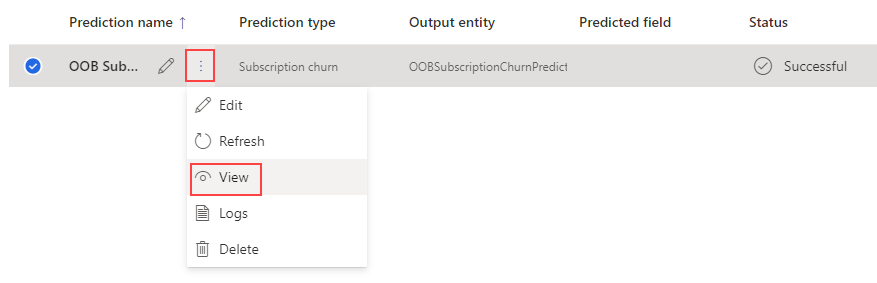

# Subscription churn prediction (preview) Sample Guide

This guide will walk you through an end to end example of Subscription Churn prediction in Customer Insights using the data provided below. All data used in this guide is not real customer data and is part of the Contoso dataset found in the *Demo* environment within your Customer Insights Subscription.

## Scenario

Contoso is a company that produces high-quality coffee and coffee machines, which they retail through their Contoso Coffee Website. They recently started a subscription business for their customers to acquire coffee on a regular basis. Their goal is to know which customers who have subscribed to  this service, will stop being an active customer and cancel their subscription in the next few months. Knowing which of their customers is **likely to churn**, can help them save a substantial amount of investment by focusing on retaining them.

## Prerequisites

- At least [Contributor permissions](permissions.md) in Customer Insights.
- For best results, it is recommended that you do this exercise in a new environment.

## Data Sources

**eCommerce Contacts** 

* Extract of Customers who have made an online purchase
  Text/CSV - https://aka.ms/ciadclasscontacts

**Loyalty Scheme** 

* Extract of Customers who’ve signed-up for the Contoso Retail Loyalty Card Scheme 
  Text/CSV - https://aka.ms/ciadclasscustomerloyalty

**Website Reviews**

* Online Website Reviews from online users
  Text/CSV - https://aka.ms/ciadclasswebsite

**Subscriptions**

* Subscription history for Contoso customers
  Text/CSV https://aka.ms/ciadchurnsubscriptionhistory

## Task 1 - Ingest Data

### Ingest Customer Data from eCommerce Platform

1. Sign-in to Customer Insights (http://home.ci.ai.dynamics.com) and select your Environment from the drop-down in the top right-hand corner.

2. Within Customer Insights, expand **Data** on the left menu and click **Data Sources**.

3. Click **Add Data Sources**.

4. Name the source **eCommerce**, then click **Next**

   [!div class="mx-imgBorder"]
   

5. Select the **Text/CSV** Connector.

6. Enter the URL for eCommerce Contacts https://aka.ms/ciadclasscontacts and click **Next**.

   [!div class="mx-imgBorder"]
   

7. While editing the data, click on **Transform** and then **Use First Row as Headers**.

   [!div class="mx-imgBorder"]
   

8. Update the datatype for the columns listed below:

   - **Column:** DateOfBirth	**New Data Type:** Date
   - **Column:** CreatedOn	  **New Data Type:** Date/Time/Zone

   [!div class="mx-imgBorder"]
   

9. In the 'Name' field on the right-hand pane, rename your data source from **Query** to **eCommerceContacts**

### Ingest Customer Data from Loyalty Scheme

1. Click **Add Data Source** and name the source **LoyaltyScheme**, then click **Next button**.
2. Select the **Text/CSV** Connector. Enter the URL for **Loyalty Contacts** data, https://aka.ms/ciadclasscustomerloyalty, and click **Next.** 
3. While editing the data, click on **Transform** and then **Use First Row as Headers**.
4. Update the datatype for the columns listed below:
   - **Column:** DateOfBirth       **New Data Type:** Date
   - **Column:** RewardsPoints  **New Data Type:** Whole Number
   - **Column:** CreatedOn     	**New Data Type:** Date/Time
5. Rename your data source from **Query** to **loyCustomers** and click **Save**.

### Ingest Customer Subscription information

1. Click **Add Data Source** and name the source **SubscriptionHistory**, then click **Next button**.
2. Select the **Text/CSV** Connector. Enter the URL for **Subscription** data, https://aka.ms/ciadchurnsubscriptionhistory, and click **Next.** 
3. While editing the data, click on **Transform** and then **Use First Row as Headers**.
4. Update the datatype for the columns listed below:
   - **Column:** SubscriptioID    			 **New Data Type:** Whole Number
   - **Column:** SubscriptionAmount    **New Data Type:** Currency
   - **Column:** SubscriptionEndDate   **New Data Type:** Date/Time
   - **Column:** SubscriptionStartDate **New Data Type:** Date/Time
   - **Column:** TransactionDate           **New Data Type:** Date/Time
   - **Column:** IsRecurring                    **New Data Type:** True/False
   - **Column:** Is_auto_renew              **New Data Type:** True/False
   - **Column:** RecurringFrequencyInMonths  **New Data Type:** Whole Number
5. Rename your data source from **Query** to **SubscriptionHistory** and click **Save**.

### Ingest Customer Data from Website Reviews

1. Click **Add Data Source** and name the source **Website**, then click **Next button**.
2. Select the **Text/CSV** Connector. Enter the URL for **Website reviews** data, https://aka.ms/ciadclasswebsite, and click **Next.** 
3. While editing the data, click on **Transform** and then **Use First Row as Headers**.
4. Update the datatype for the columns listed below:
   - **Column:** ReviewRating			**New Data Type:**  Whole Number
   - **Column:** ReviewDate     **New Data Type:** Date
5. Rename your data source from **Query** to **webReviews** and click **Save**.

## Task 2 - Data Unification

Having ingested the raw data from your data sources into ‘entities’ you will now begin the **Map, Match, Merge** process to create a single Unified Customer Profile by merging data from each customer profile source. 

### Map

1. After your data finishes refreshing, map contacts from eCommerce and Loyalty data to common data types. In the left menu click **Unify - Map - Select Entities**

   Select the entities that represent the customer profile – **eCommerceContacts** and **loyCustomers** then click **Apply**. 

   [!div class="mx-imgBorder"]
   

2. Select **ContactId** as the Primary Key for **eCommerceContacts**.

3. Select **LoyaltyID** as the Primary Key for **loyCustomers**. Then click **Save** in the top left-hand corner.

   [!div class="mx-imgBorder"]
   

### Match

1. Click **Match** and then on **Set Order**.

2. In the **Primary** drop-down list select **eCommerceContacts : eCommerce** as the primary source and choose to **Include all records.**

3. In the **Entity 2** drop-down list select **loyCustomers : LoyaltyScheme** and choose to include all records. Then click **Done.**

   [!div class="mx-imgBorder"]
   

4. Click **Create a new rule**

5. Add your first condition using FulName
   * For eCommerceContacts select **FullName** in the Field drop-down
   * For loyCustomers select **FullName** in the drop-down 
   * Click the **Normalize** drop down and select  
     **Type (Phone, Name, Address, ...)** This will normalize the values within the FullName field. 
   * Set Precision Level to **Basic** and Value to **High**

6. Enter the name **FullName, Email** for the new rule.

   * Add a second condition for email address by clicking **Add Condition**
   * For entity eCommerceContacts select **EMail** in Field drop-down.
   * For entity loyCustomers select **EMail** in Field drop-down - Leave Normalize blank 
   * Set Precision Level to **Basic** and Value to **High**.

   Click **Done.**

   [!div class="mx-imgBorder"]
   

7. In the top left-hand corner click **Save** and then **Run.**

### Merge

1. Click **Merge**.

2. On the **ContactId** for **loyCustomers** Entity, click the edit button and rename the Display Name to **ContactIdLOYALTY **to differentiate the item from the other IDs ingested.

   [!div class="mx-imgBorder"]
   

3. Cluck **Save** and **Run** to start the Merge Process.

## Task 3 - Configuring the Out of Box Subscription Churn prediction

1. In the left-hand menu click on **Intelligence** and then **Discover**.

2. Go to **Create** tab and click on the **Use this model** under **Customer churn model**.

3. Select **Subscription **and click on **Get started**.

   [!div class="mx-imgBorder"]
   

4. Name the model **OOB Subscription Churn Prediction** and the output entity name as **OOBSubscriptionChurnPrediction**.

   [!div class="mx-imgBorder"]
   

5. Next, we need to define two conditions for our Churn Model:

   * **Days since subscription ended:** If a customer has not renewed their subscription for this long after their subscription ended, then they are considered Churn. Select **at least 60** days.

   * **Churn definition:** The model will try to predict this far into the future which customers may or may not churn. The further in the future you look, the less accurate the results. Must be longer than the grace period defined above. Select **at least 93** days.

     [!div class="mx-imgBorder"]
     

6. Click on the next step **Add required data** and select **+ Add data** under Subscription History.

7. Add the **Subscription : SubscriptionHistory** Entity and map the fields from eCommerce to the corresponding fields required by the Model. Click on **Next** when done.

   [!div class="mx-imgBorder"]
   

8. Join the **Subscription : SubscriptionHistory** entity with **eCommerceContacts : eCommerce**, name the relationship **eCommerceSubscription** and click on Save.

   [!div class="mx-imgBorder"]
   

9. Under Customer Activities, add the **webReviews : Website** Entity and map the fields from webReviews to the corresponding fields required by the Model. Click on **Next** when done.

   [!div class="mx-imgBorder"]
   

10. Setup an Activity for Website Reviews

11. Select the activity **Review** and Join the **webReviews : Website** entity with **eCommerceContacts : eCommerce **and click on Save.

    [!div class="mx-imgBorder"]
    

12. Click on **Next** to set the model Schedule.

    The model needs to train with certain frequency so that it learns new patterns when there is new data ingested in CI. For this example, select **Monthly** and click on Next.

    [!div class="mx-imgBorder"]
    

13. After reviewing all the details in the next screen, click on **Save and Run.**

**Note:** After running the model, it can take some time to view the results.

## Task 4 - Visualize Model Training Results and Explanation

After the model has successfully completed the training and scoring of the data, you can view the Transaction Churn Model Explanation page by clicking on **view** next to the name of your model:

[!div class="mx-imgBorder"]

**Model results page:**

[!div class="mx-imgBorder"]

**Model level explanation page:**

[!div class="mx-imgBorder"]

The model is graded **A, B** or **C** depending on the following conditions:

**Baseline**

* **A** when the model accurately predicted at least 50% of the total predictions, and when the
  percentage of accurate predictions for customers who churned is greater than the historical
  average churn rate by at least 10% of the historical average churn rate.
*  **B** when the model accurately predicted at least 50% of the total predictions, and when the
  percentage of accurate predictions for customers who churned is up to 10% greater than the
  historical average churn rate of the historical average churn rate.
* **C** when the model accurately predicted less 50% of the total predictions, or when the
  percentage of accurate predictions for customers who churned is less than the historical
  average churn rate.

**Likelihood to churn (number of customers)**

[!div class="mx-imgBorder"]

Likelihood of churn shows Groups of customers based on their predicted risk of churn. This data can help you later if you want to create a segment of customers with high churn risk. 

[!div class="mx-imgBorder"]

There are many factors that are taken into account when creating your predictions. Each of the factors has their importance calculated for the aggregated predictions a model creates. You can use these factors to help validate your prediction results. Or you can use this information later to create segments that could help influence churn risk for customers.

## Task 5 - Setup a Segment of High Churn-risk users

Observe that the Workflow upon setup, created an Entity. You can see this within Data -> Entities from the left-hand menu. You will see a new Intelligence section with the entity in it.   

1. Open the Segments section from the left-hand menu. We will manually create a new dynamic segment, click New in the top menu bar.  You’ll notice there is now an Intelligence options in the New -> Create From section.  Choose the new Intelligence option. 

   [!div class="mx-imgBorder"]
   

2. Select your **OOBSubscriptionChurnPrediction** endpoint and setup the segment like this.

   [!div class="mx-imgBorder"]
   

3. Click Review and name your new Segment like this.

   [!div class="mx-imgBorder"]
   

   *Your results may look different

4. Click **Save**

Now you have a segment that is dynamically updated which identifies high churn-risk customers for this subscription business.  

You may want to re-run this task and take notice of all the fields that the model is outputting that you could create a segment or measure on as there are a number of them to play with. 