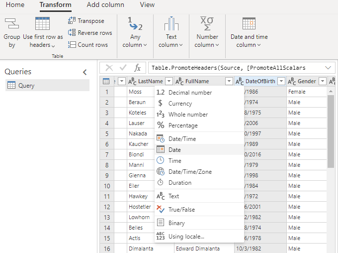

# Transactional churn prediction (preview) sample guide

This guide will walk you through an end to end example of Transactional Churn prediction in Customer Insights using the data provided below. All data used in this guide is not real customer data and is part of the Contoso dataset found in the *Demo* environment within your Customer Insights Subscription.

## Scenario

Contoso is a company that produces high-quality coffee and coffee machines, which they sell through their Contoso Coffee website. Their goal is to know which customers who typically purchase their products on a regular basis, will stop being active customers in the next 60 days. Knowing which of their customers is **likely to churn**, can help them save marketing efforts by focusing on keeping them.

## Prerequisites

- At least [Contributor permissions](permissions.md) in Customer Insights.
- We recommend that you implement the following steps [in a new environment](manage-environments.md).

## Task 1 - Ingest data

Review the articles [about data ingestion](data-sources.md) and [importing data sources using Power Query connectors](connect-power-query.md) specifically. The following information assumes you familiarized with ingesting data in general. 

### Ingest customer data from eCommerce platform

1. Create a data source named **eCommerce**, choose the import option, and select the **Text/CSV** connector.

1. Enter the URL for eCommerce contacts https://aka.ms/ciadclasscontacts.

1. While editing the data, select **Transform** and then **Use First Row as Headers**.

1. Update the datatype for the columns listed below:

   - **DateOfBirth**: Date
   - **CreatedOn**: Date/Time/Zone

   [!div class="mx-imgBorder"]
   

1. In the **Name** field on the right-hand pane, rename your data source from **Query** to **eCommerceContacts**

1. Save the data source.

### Ingest online purchase data

1. Add another data set to the same **eCommerce** data source. Choose the **Text/CSV** connector again.

1. Enter the URL for **Online Purchases** data https://aka.ms/ciadclassonline.

1. While editing the data, select **Transform** and then **Use First Row as Headers**.

1. Update the datatype for the columns listed below:

   - **PurchasedOn**: Date/Time
   - **TotalPrice**: Currency
   
1. In the **Name** field on the right-hand pane, rename your data source from **Query** to **eCommercePurchases**.

1. Save the data source.

### Ingest customer data from loyalty schema

1. Create a data source named **LoyaltyScheme**, choose the import option, and select the **Text/CSV** connector.

1. Enter the URL for eCommerce contacts https://aka.ms/ciadclasscustomerloyalty.

1. While editing the data, select **Transform** and then **Use First Row as Headers**.

1. Update the datatype for the columns listed below:

   - **DateOfBirth**: Date
   - **RewardsPoints**: Whole Number
   - **CreatedOn**: Date/Time

1. In the **Name** field on the right-hand pane, rename your data source from **Query** to **loyCustomers**.

1. Save the data source.

## Task 2 - Data unification

After ingesting the data we now begin the **Map, Match, Merge** process to create a unified customer profile. For more information, see [Data unification](data-unification.md).

### Map

1. After ingesting the data, map contacts from eCommerce and Loyalty data to common data types. Go to **Data** > **Unify** > **Map**.

1. Select the entities that represent the customer profile – **eCommerceContacts** and **loyCustomers**. 

   :::image type="content" source="media/unify-ecommerce-loyalty.PNG" alt-text="unify ecommerce and loyalty datasources.":::

1. Select **ContactId** as the primary key for **eCommerceContacts** and **LoyaltyID** as the primary key for **loyCustomers**.

   :::image type="content" source="media/unify-loyaltyid.PNG" alt-text="Unify LoyaltyId as primary key.":::

### Match

1. Go to the **Match** tab and select **Set Order**.

1. In the **Primary** dropdown list, choose **eCommerceContacts : eCommerce** as the primary source and include all records.

1. In the **Entity 2** dropdown list, choose **loyCustomers : LoyaltyScheme** and include all records.

   :::image type="content" source="media/unify-match-order.PNG" alt-text="Unify match eCommerce and Loyalty.":::

1. Select **Create a new rule**

1. Add your first condition using FullName.

   * For eCommerceContacts select **FullName** in the dropdown.
   * For loyCustomers select **FullName** in the dropdown.
   * Select the **Normalize** drop down and choose **Type (Phone, Name, Address, ...)**.
   * Set **Precision Level**: **Basic** and **Value**: **High**.

1. Enter the name **FullName, Email** for the new rule.

   * Add a second condition for email address by selecting **Add Condition**
   * For entity eCommerceContacts, choose **EMail** in dropdown.
   * For entity loyCustomers, choose **EMail** in the dropdown. 
   * Leave Normalize blank. 
   * Set **Precision Level**: **Basic** and **Value**: **High**.

   :::image type="content" source="media/unify-match-rule.PNG" alt-text="Unify match rule for name and email.":::

7. Select **Save** and **Run**.

### Merge

1. Go to the **Merge** tab.

1. On the **ContactId** for **loyCustomers** entity, change the display name to **ContactIdLOYALTY** to differentiate it from the other IDs ingested.

   :::image type="content" source="media/unify-merge-contactid.PNG" alt-text="rename contactid from loyalty id.":::

1. Select **Save** and **Run** to start the Merge Process.

## Task 3 - Configure transaction churn prediction

With the unified customer profiles in place, we can now run the subscription churn prediction. For detailed steps, see the [Subscription churn prediction (preview)](predict-subscription-churn.md) article. 

1. Go to **Intelligence** > **Discover** and select to use the **Customer churn model**.

1. Select the **Transactional** option and select **Get started**.

1. Name the model **OOB eCommerce Transaction Churn Prediction** and the output entity **OOBeCommerceChurnPrediction**.

1. Define two conditions for the churn model:

   * **Prediction window**: **at least 60** days. This setting defines how far into the future do we want to predict customer churn.

   * **Churn definition**: **at least 60** days. The duration without purchase after which a customer is considered churned.

     :::image type="content" source="media/model-levers.PNG" alt-text="Select the model levers Prediction Window and Churn Definition.":::

1. Select **Purchase History (required)** and select **Add data** for purchase history.

1. Add the **eCommercePurchases : eCommerce** entity and map the fields from eCommerce to the corresponding fields required by the model.

1. Join the **eCommercePurchases : eCommerce** entity with **eCommerceContacts : eCommerce**.

   :::image type="content" source="media/model-purchase-join.PNG" alt-text="Join eCommerce entities.":::

1. Select **Next** to set the model schedule.

   The model needs to train regularly to learn new patterns when there is new data ingested. For this example, select **Monthly**.

1. After reviewing all the details, select **Save and Run**.

## Task 4 - Review model results and explanations

Let the model complete the training and scoring of the data. You can now review the subscription churn model explanations. For more information, see [Review a prediction status and results](predict-subscription-churn.md#review-a-prediction-status-and-results).

## Task 5 - Create a segment of high churn-risk customers

Running the production model creates a new entity that you can see in **Data** > **Entities**.   

You can create a new segment based on the entity created by the model.

1.  Go to **Segments**. Select **New** and choose **Create from** > **Intelligence**. 

   :::image type="content" source="media/segment-intelligence.PNG" alt-text="Creating a segment with the model output.":::

1. Select the **OOBSubscriptionChurnPrediction** endpoint and define the segment: 
   - Field: ChurnScore
   - Operator: greater than
   - Value: 0.6
   
   :::image type="content" source="media/segment-setup-subs.PNG" alt-text="Set up subscription churn segment.":::

You now have a segment that is dynamically updated which identifies high churn-risk customers for this subscription business.

For more information, see [Create and manage segments](segments.md).

[!INCLUDE[footer-include](../includes/footer-banner.md)]