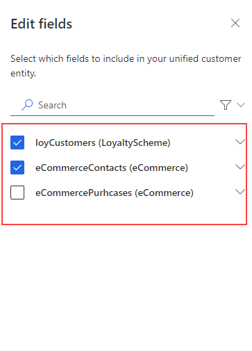
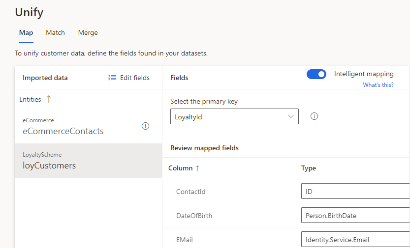
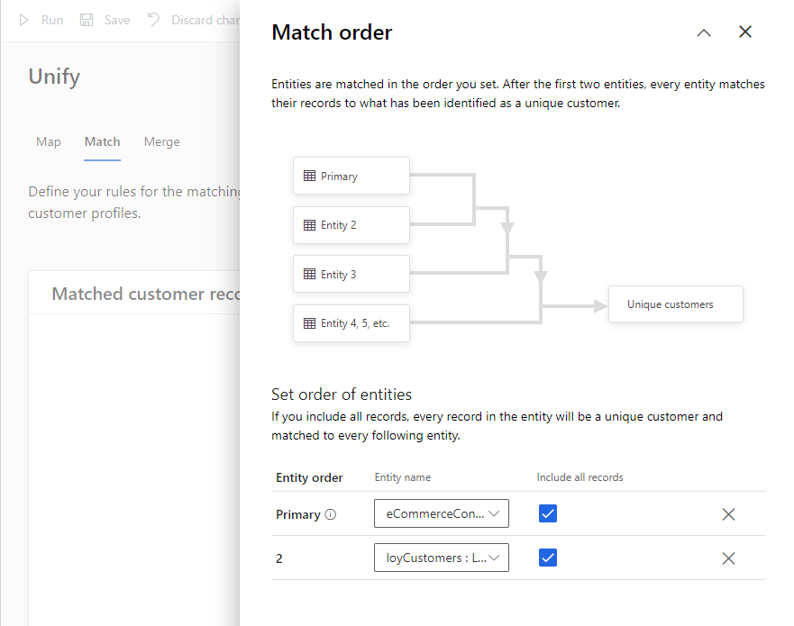
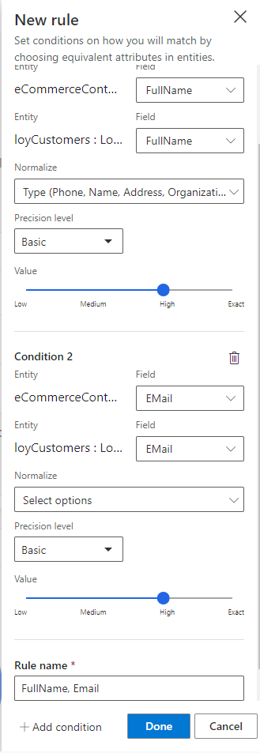
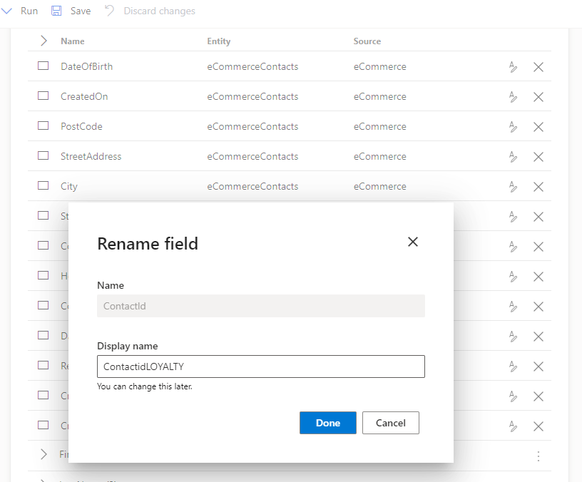
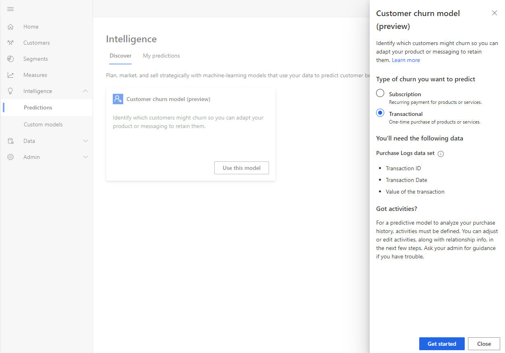
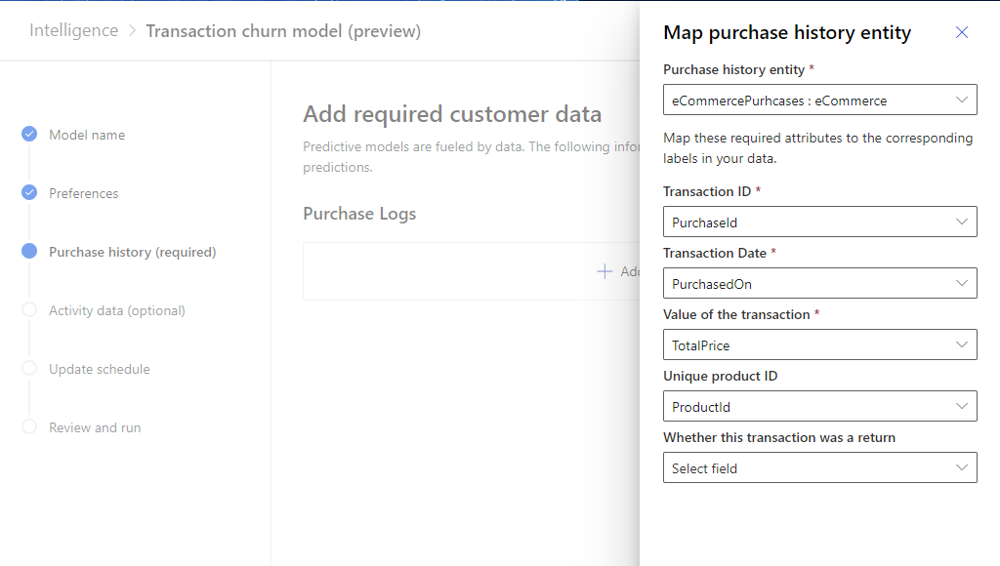
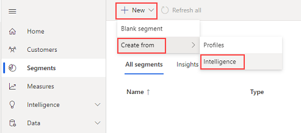

# Transactional churn prediction (preview) sample guide

This guide will walk you through an end to end example of Transactional Churn prediction in Customer Insights using the data provided below. All data used in this guide is not real customer data and is part of the Contoso dataset found in the *Demo* environment within your Customer Insights Subscription.

## Scenario

Contoso is a company that produces high-quality coffee and coffee machines, which they sell through their Contoso Coffee website. Their goal is to know which customers who typically purchase their products on a regular basis, will stop being active customers in the next 60 days. Knowing which of their customers is **likely to churn**, can help them save marketing efforts by focusing on keeping them.

## Prerequisites

- At least [Contributor permissions](permissions.md) in Customer Insights.
- We recommend that you implement the following steps [in a new environment](manage-environments.md).

## Task 1 - Ingest Data

Review the articles [about data ingestion](data-sources.md) and [importing data sources using Power Query connectors](connect-power-query.md) specifically. The following information assumes you familiarized with ingesting data in general. 

### Ingest customer data from eCommerce platform

1. Create a data source named **eCommerce**, choose the import option, and select the **Text/CSV** connector.

1. Enter the URL for eCommerce contacts https://aka.ms/ciadclasscontacts.

1. While editing the data, select **Transform** and then **Use First Row as Headers**.

1. Update the datatype for the columns listed below:

   - **DateOfBirth**: Date
   - **CreatedOn**: Date/Time/Zone

   [!div class="mx-imgBorder"]
   

1. In the 'Name' field on the right-hand pane, rename your data source from **Query** to **eCommerceContacts**

1. Save the data source.

### Ingest Online Purchase Data

1. Add another data set to the same **eCommerce** data source. Choose the **Text/CSV** connector again.

1. Enter the URL for **Online Purchases** data https://aka.ms/ciadclassonline.

1. While editing the data, select **Transform** and then **Use First Row as Headers**.

1. Update the datatype for the columns listed below:

   - **PurchasedOn**: Date/Time
   - **TotalPrice**: Currency
   
1. In the 'Name' field on the right-hand pane, rename your data source from **Query** to **eCommercePurchases**.

1. Save the data source.

### Ingest customer data from loyalty schema

1. Create a data source named **LoyaltyScheme**, choose the import option, and select the **Text/CSV** connector.

1. Enter the URL for eCommerce contacts https://aka.ms/ciadclasscustomerloyalty.

1. While editing the data, select **Transform** and then **Use First Row as Headers**.

1. Update the datatype for the columns listed below:

   - **DateOfBirth**: Date
   - **RewardsPoints**: Whole Number
   - **CreatedOn**: Date/Time

1. In the 'Name' field on the right-hand pane, rename your data source from **Query** to **loyCustomers**.

1. Save the data source.

## Task 2 - Data Unification

Having ingested the raw data from your data sources into ‘entities’ you will now begin the **Map, Match, Merge** process to create a single Unified Customer Profile by merging data from each customer profile source. 

### Map

1. After your data finishes refreshing, map contacts from eCommerce and Loyalty data to common data types. In the left menu click **Unify - Map - Select Entities**

   Select the entities that represent the customer profile – **eCommerceContacts** and **loyCustomers** then click **Apply**. 

   [!div class="mx-imgBorder"]
   

2. Select **ContactId** as the Primary Key for **eCommerceContacts**.

3. Select **LoyaltyID** as the Primary Key for **loyCustomers**. Then click **Save** in the top left-hand corner.

   [!div class="mx-imgBorder"]
   

### Match

1. Click **Match** and then on **Set Order**.

2. In the **Primary** drop-down list select **eCommerceContacts : eCommerce** as the primary source and choose to **Include all records.**

3. In the **Entity 2** drop-down list select **loyCustomers : LoyaltyScheme** and choose to include all records. Then click **Done.**

   [!div class="mx-imgBorder"]
   

4. Click **Create a new rule**

5. Add your first condition using FulName
   * For eCommerceContacts select **FullName** in the Field drop-down
   * For loyCustomers select **FullName** in the drop-down 
   * Click the **Normalize** drop down and select  
     **Type (Phone, Name, Address, ...)** This will normalize the values within the FullName field. 
   * Set Precision Level to **Basic** and Value to **High**

6. Enter the name **FullName, Email** for the new rule.

   * Add a second condition for email address by clicking **Add Condition**
   * For entity eCommerceContacts select **EMail** in Field drop-down.
   * For entity loyCustomers select **EMail** in Field drop-down - Leave Normalize blank 
   * Set Precision Level to **Basic** and Value to **High**.

   Click **Done.**

   [!div class="mx-imgBorder"]
   

7. In the top left-hand corner click **Save** and then **Run.**

### Merge

1. Click **Merge**.

2. On the **ContactId** for **loyCustomers** Entity, click the edit button and rename the Display Name to **ContactIdLOYALTY **to differentiate the item from the other IDs ingested.

   [!div class="mx-imgBorder"]
   

3. Click **Save** and **Run** to start the Merge Process.

## Task 3 - Configuring the Out of Box Transaction Churn prediction

1. In the left-hand menu click on **Intelligence** and then **Discover**.

2. Go to **Create** tab and click on the **Use this model** under **Customer churn model**.

3. Select **Transactional **and click on **Get started**.

   [!div class="mx-imgBorder"]
   

4. Name the model **OOB eCommerce Transaction Churn Prediction** and the output entity name as **OOBeCommerceChurnPrediction**.

   [!div class="mx-imgBorder"]
   

5. Next, we need to define two conditions for our Churn Model:

   * **Prediction Window:** This is how far into the future do we want to predict customer churn. Select **at least 60** days.

   * **Churn definition:** A customer is considered churn after a period of time without purchases. Select **at least 60** days.

     [!div class="mx-imgBorder"]
     

6. Click on the next step **Purchase History (required)** and select **+ Add data** under Purchase Logs.

7. Add the **eCommercePurchases : eCommerce** Entity and map the fields from eCommerce to the corresponding fields required by the Model. Click on **Next** when done.

   [!div class="mx-imgBorder"]
   

8. Join the **eCommercePurchases : eCommerce** entity with **eCommerceContacts : eCommerce** and click on Save.

   [!div class="mx-imgBorder"]
   

9. The **Activity data (optional)** allows you to add any other information about customer behavior that the model can use in its prediction such as website visits, product searches, etc. We will skip this part for now.

10. Click on **Next** to set the model Schedule.

    The model needs to train with certain frequency so that it learns new patterns when there is new data ingested in CI. For this example, select **Monthly** and click on Next.

    [!div class="mx-imgBorder"]
    

11.  After reviewing all the details in the next screen, click on **Save and Run.**

**Note:** After running the model, it can take some time to view the results.

## Task 4 - Visualize Model Training Results and Explanation

After the model has successfully completed the training and scoring of the data, you can view the Transaction Churn Model Explanation page by clicking on **view** next to the name of your model:

[!div class="mx-imgBorder"]

**Model results page:**

[!div class="mx-imgBorder"]

**Model level explanation page:**

[!div class="mx-imgBorder"]

The model is graded **A, B** or **C** depending on the following conditions:

**Baseline**

* **A** when the model accurately predicted at least 50% of the total predictions, and when the percentage of accurate predictions for customers who churned is greater than the baseline by at least 10%.
* **B** when the model accurately predicted at least 50% of the total predictions, and when the percentage of accurate predictions for customers who churned is up to 10% greater than the baseline.
* **C** when the model accurately predicted less 50% of the total predictions, or when the percentage of accurate predictions for customers who churned is less than the baseline.

**Baseline:** Using the Prediction Time Window input for the model (e.g. 1 year), the model takes different fractions of time by dividing it by 2 until it reaches 1 month or less (e.g. 6, 3, 1.5 and 0.75 months). Then, the model uses these fractions and creates a business rule for customers who have not purchased within those periods - these customers are considered as Churned. The time-based business rule with the highest ability to predict who is likely to churn is chosen as baseline model.

**Likelihood to churn (number of customers)**

[!div class="mx-imgBorder"]

Likelihood of churn shows Groups of customers based on their predicted risk of churn. This data can help you later if you want to create a segment of customers with high churn risk. 

[!div class="mx-imgBorder"]

There are many factors that are taken into account when creating your predictions. Each of the factors has their importance calculated for the aggregated predictions a model creates. You can use these factors to help validate your prediction results. Or you can use this information later to create segments that could help influence churn risk for customers.

## Task 5 - Setup a Segment of High Churn-risk users

Observe that the Workflow upon setup, created an Entity. You can see this within Data -> Entities from the left-hand menu. You will see a new Intelligence section with the entity in it.   

1. Open the Segments section from the left-hand menu. We will manually create a new dynamic segment, click New in the top menu bar.  You’ll notice there is now an Intelligence options in the New -> Create From section.  Choose the new Intelligence option. 

   [!div class="mx-imgBorder"]
   

2. Select your OOBeCommerceChurnPrediction endpoint and setup the segment like this.

   [!div class="mx-imgBorder"]
   

3. Click Review and name your new Segment like this.

   [!div class="mx-imgBorder"]
   

4. Click **Save**

Now you have a segment that is dynamically updated which identifies high churn-risk customers for Contoso.  

You may want to re-run this task and take notice of all the fields that the model is outputting that you could create a segment or measure on as there are a number of them to play with. 