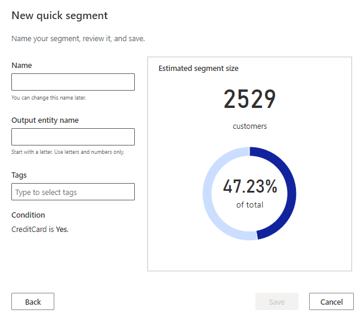

# Create and manage segments

Define complex filters around the unified customer entity and its related entities. Each segment, after processing, creates a set of customer records that you can export and take action on. Segments are managed on the **Segments** page. You can [create new segments](#create-a-new-segment) using the [segment builder](#segment-builder) or [create quick segments](#quick-segments) from other areas of the app.

## Segment Builder

The following image illustrates the various aspects of the segment builder. It shows a segment that results in a group of customers. The customers ordered goods in a specific time frame and gathered a number of reward points or spent a certain amount of money. 

:::image type="content" source="media/segment-builder-overview.png" alt-text="Elements of the segment builder." lightbox="media/segment-builder-overview.png":::

1 - Organize your segment with rules and subrules. Each rule or subrule consists of conditions. Combine the conditions with logical operators

2 - Choose the [relationship path](relationships.md) between entities that applies to a rule. The relationship path determines which attributes can be used in a condition.

3 - Manage rules and subrules. Change the position of a rule or delete it.

4 - Add conditions and build the right level of nesting using subrules.

5 - Apply set operations to connected rules.

6 - Use the attribute pane to add available entity attributes or create conditions based on attributes. The pane shows the list of entities and attributes, based on the selected relationship path, that are available for the selected rule.

7 - Add conditions based on attributes to existing rules and subrules or add it to a new rule.

8 - Undo and redo changes while building the segment.

The example above illustrates the segmentation capability. We've defined a segment for customers who bought at least $500 of goods online *and* have an interest in software development.

## Create a new segment

There are multiple ways to create a new segment. This section describes how to build your own segment from scratch. You can also create a *quick segment* based on existing entities or make use of machine learning models to get *suggested segments*. More information: [Segments overview](segments.md).

While creating a segment, you can save a draft. It will be saved as an inactive segment, and can't be activated it finished with a valid configuration.

1. Go to the **Segments** page.

1. Select **New** > **Build your own**.

1. On to the segment builder page, you define the first rule. A rule consists of one or more conditions and defines a set of customers.

1. In the **Rule1** section, choose an attribute of an entity you want filter customers by. There are two ways to choose attributes: 
   - Review the list of available entities and attributes in the **Add to Rule** pane and select the **+** icon next to the attribute to add. Choose if you want to add the attribute to an existing rule or use it to create a new rule.
   - Type the name of the attribute in the rule section to see matching suggestions.

1. Choose the operators to specify the matching values of the condition. Attribute can have one of four data types as value: numerical, string, date, or Boolean. Depending on the data type of the attribute, different operators are available to specify the condition. 

1. Select **Add condition** to add more conditions to a rule. To create a rule under the current rule, select **Add sub-rule**.

1. If a rule uses other entities than the *Customer* entity, you have to set the relationship path. The relationship path is required to inform the system over which relationships you want to access the unified customer entity. Select **Set relationship path** to map selected entity to the unified customer entity. If there's only one possible relationship path, the system will select it automatically. Different relationship paths can yield different results. Every rule can have its own relationship path.

   :::image type="content" source="media/relationship-path.png" alt-text="Potential relationship path when creating a rule based on an entity mapped to the unified customer entity.":::

   For example, the *eCommerce_eCommercePurchases* entity in the screenshot has four options to map to the *Customer* entity: 
   - eCommerce_eCommercePurchases > eCommerce_eCommerceContacts > Customer
   - eCommerce_eCommercePurchases > Customer
   - eCommerce_eCommercePurchases > eCommerce_eCommerceContacts > POS_posPurchases > Customer
   - eCommerce_eCommercePurchases > eCommerce_eCommerceContacts > POS_posPurchases > loyaltyScheme_loyCustomers > Customer
   When choosing the last option, we can include attributes from all listed entities in the rule conditions. We will likely get fewer results because the matching customer records need to be part of all entities. In this example, they have purchased goods through e-commerce(*eCommerce_eCommercePurchases*), at a point of sale(*POS_posPurchases*), and participate in our loyalty program (*loyaltyScheme_loyCustomers*). When choosing the second option, we can only choose attributes from the *eCommerce_eCommercePurchases* and the *Customer* entity. This likely results in more resulting customer profiles.

1. If you have multiple conditions in a rule, you can choose which logical operator connects them.

   - **AND** operator: All conditions must be met to include a record in the segment. This option is most useful when you define conditions across different entities.

   - **OR** operator: Either one of the conditions must be met to include a record in the segment. This option is most useful when you define multiple conditions for the same entity.

   :::image type="content" source="media/segmentation-either-condition.png" alt-text="Rule with two AND conditions.":::

   When using the OR operator, all conditions must be based on entities included in the relationship path.

   1. You can create multiple rules to create different sets of customer records. You can combine groups to include the customers required for your business case. To create a new rule, select **Add rule**. Specifically, if you can't include and entity in a rule due to the specified relationship path, you have to create a new rule to choose attributes form it.

      :::image type="content" source="media/segment-rule-grouping.png" alt-text="Add a new rule to a segment and choose the set operator.":::

   1. Select one of the set operators: **Union**, **Intersect**, or **Except**.

   - **Union** unites the two groups.

   - **Intersect** overlaps the two groups. Only data that *is common* to both groups is retained in the unified group.

   - **Except** combines the two groups. Only data in group A that *is not common* to data in group B is retained.

1. By default, segments generate the output entity containing all attributes of customer profiles that match the defined filters. If a segment is based on other entities than the *Customer* entity, you can add more attributes from these entities to the output entity. Select **Project attributes** to choose the attributes that will be appended to the output entity.  

   :::image type="content" source="media/segments-project-attributes.png" alt-text="Example of projected attributes selected in the side pane to be added to the output entity.":::
  
   Example: A segment is based on an entity that contains purchase data, which is related to the *Customer* entity. The segment looks for all customers from Spain that purchased goods in the current year. You can choose to append attributes like the price of the goods, or the purchase date to all matching customer records in the output entity. This information might be useful to analyze seasonal correlations to the total spending.

   > [!NOTE]
   > - Projected attributes only work for entities that have a one-to-many relationship with the customer entity. For example, one customer can have multiple subscriptions.
   > - You can only project attributes from an entity that is used in every rule of segment query you are building.
   > - Projected attributes are factored in when using set operators.

1. Before you save and run the segment, Select **Edit details** next to the segment name. Provide a name for your segment and  update the suggested **Output entity name** for the segment. You can also add a description to the segment.

1. Select **Run** to save and process your segment if all requirements are validated. Otherwise, it will be saved as an inactive segment draft.

1. Select **Back to segments** to go back to the **Segments** page.

> [!TIP]
> - The segment builder won't suggest valid values from entities when setting the operators for the conditions. You can go to **Data** > **Entities** and download the entity data to see which values are available.
> - Conditions based on the dates let you switch between fixed dates and a floating date range.
> - If you have multiple rules for your segment, you find a blue bar around the rule you are editing.
> - You can move rules and conditions to other places in the segment definition. Select [...] next to a rule or condition and choose how and where to move it.
> - The **Undo** and **Redo** controls in the command bar let you roll back back changes.

## Quick segments

Quick segments let you build simple segments with a single operator quickly for faster insights.

1. On the **Segments** page, select **New** > **Create from**.

   - Select the **Profiles** option to build a segment that is based on the *unified customer* entity.
   - Select the **Measures** option to build a segment around  measures you have previously created.
   - Select the **Intelligence** option to build a segment around one of the output entities you generated using either the **Predictions** or **Custom Models** capabilities.

2. In the **New quick segment** dialog box, select an attribute from the **Field** dropdown.

3. The system will provide more insights that help you create better segments of your customers.
   - For categorical fields, we'll show 10 top customer counts. Choose a **Value** and select **Review**.

   - For a numerical attribute, the system will show what attribute value falls under each customer's percentile. Choose an **Operator** and a **Value**, then select **Review**.

4. The system will provide you with an **Estimated segment size**. You can choose whether to generate the segment you've defined, or first revisit it to get a different segment size.

    > [!div class="mx-imgBorder"]
    > 

5. Provide a **Name** for your segment. Optionally, provide a **Display name**.

6. Select **Save** to create your segment.

7. After the segment has finished processing, you can view it like any other segment you've created.

## Next steps

[Export a segment](export-destinations.md) and explore the [Customer Card](customer-card-add-in.md) and [Connectors](export-power-bi.md) to get insights on the customer level.

[!INCLUDE[footer-include](../includes/footer-banner.md)]
