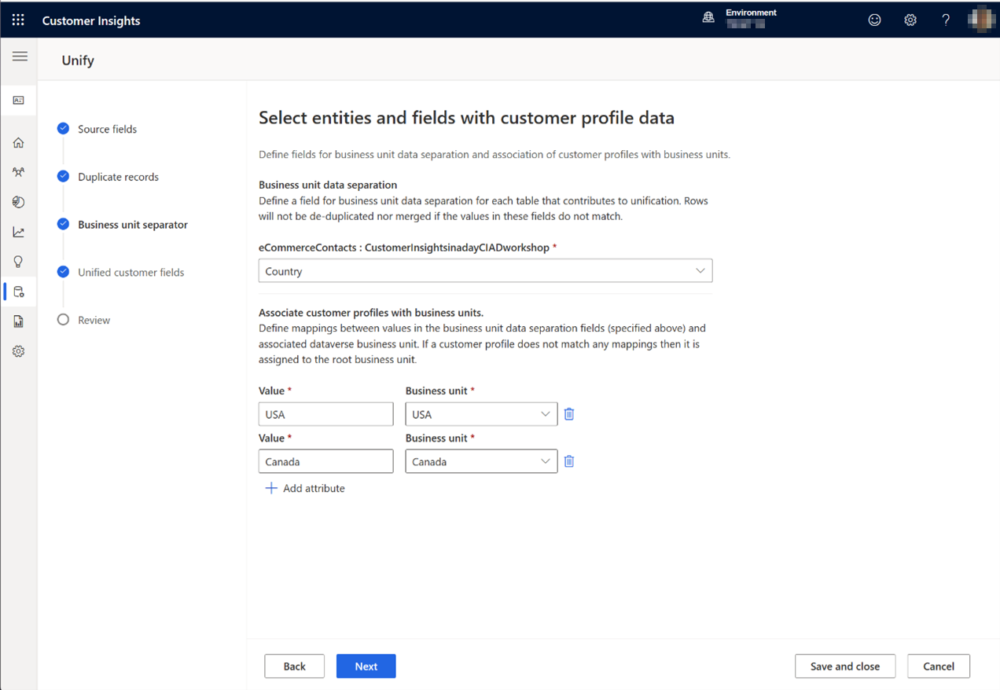

# Business unit (BU) data separation and Role-based access control (Public preview)
Business unit (BU) data separation and Role-based access control (RBAC) allow administrators to regulate access to customer profiles, segments, and measures based on business units. 

## Prerequisites
* Business units and associated teams are defined in Dataverse -> [guide to setting up BUs in Dataverse.](https://learn.microsoft.com/en-us/power-platform/admin/create-edit-business-units) 
* Users are assigned to appropriate business units and teams -> [guide to managing users and teams in Dataverse.](https://learn.microsoft.com/en-us/power-platform/admin/users-settings)
* Business unit data separation is enabled by an admin in **Settings** > **System** > **Business unit data separation**. Notice that it is not possible to disable business unit data separation on an instance after it has been enabled. 
* All data sources that contribute to unification must have a column that holds a value that identifies the business unit for every row of data. 
* A B2C Customer Insights instance.

## Access controls in Customer Insights
Data flows from upstream systems into Customer Insights, where it is processed. The processed data are then saved to Dataverse with ownership information for RBAC-backed activiation scenarios. The following details how access is controlled along this journey.

### Customer profiles, activities, customer measures, intelligence, enrichments
Access to a customer profile in Customer Insights is governed by which business unit team owns the profile and the Customer Insights role of the user. The *Administrator* and *Contributor* roles have access to all profiles regardless of owning business unit team. The *Marketing contributor* and *Viewer* roles have access only to customer profiles that belong to their business unit.

Note that the *Marketing contributor* role has access to only Segments (*build your own*) and Measures (*build your own*) in the Customer Insights user interface. Click [here](https://learn.microsoft.com/en-us/dynamics365/customer-insights/permissions) for more information about user roles in Customer Insights.

> [!NOTE]
   > * The **administrator** and **contributor** roles are highly privledged and **should only be given to users that belong to the *Org/Root* business unit**. They have access to all data, segments, measures, etc. regardless of business unit ownership and all functionality of Customer Insights. These users are typically responsible for preparing the data estate, i.e., setting up data sources, business unit data separation rules, unification rules, enrichments, intelligence models etc.

Ownership of the customer profiles is determined based on mappings that are configured in the Unify step:

1. Go to **Data** > **Unify** > **Business units**
2. Under **Business unit data separation**, select the column that identifies the business unit for each entity that contributes to unification. Note that additional unification rules cannot be added on the selected columns.
3. Under **Associate customer profiles with business units**, specify the mapping between the values in the columns that were selected above and business unit teams. For example, 'A' maps to the business unit A team, 'B' maps to the business unit B team, etc. 

*Screenshot of business unit mapping.*

Customer profiles are owned by teams within business units (as opposed to being owned by business units directly) to provide better control of data access. Only one team per business unit can be specified in the mapping rules. 

* Profiles will only be de-duplicated and unified if the business unit values match. 
* Profiles that do not match any of the mappings are assigned to the *Org* business unit.
* All profiles are assigned to the *Org* business unit if business unit data separation is not enabled.
* A profile belongs to exactly one business unit.
* The unification rules and customer profile schema are the same for all business units.

 > [!TIP]
   > * Any changes to the BU data separation configuration will trigger a full refresh. If your instance is in incremental mode, then a full refresh needs to be triggered manually after changes have been made.
   
Data that are tied to a customer profile, e.g., activities, customer measures, intelligence output, and enrichments inherit the business unit ownership from the associated profile. 

Intelligence models are trained on all data, i.e., no business unit data separation is enforced on training data. 
  
### Segments and business measures
Segments and measures are owned by the business unit of the user that created them. For example, if a user is member of business unit *A* then any segment and measure that user creates is owned by business unit *A*. Access is controlled by the RBAC settings on the segments definitions and measures definitions tables in Dataverse. The default setting is that segments and measures can be seen, edited, and deleted by other users that belong to the same business unit.

## Customer Insights and Dataverse
Customer Insights is an integrated part of the Microsoft Dynamics ecosystem, which means that it leverages the rich and [expressive security model that is built into Dataverse](https://learn.microsoft.com/en-us/power-platform/admin/wp-security-cds). 

### Dataverse security roles
To access any data from Customer Insights in Dataverse, the user needs to have the *Customer Insights Data Reader* security role in Dataverse. This role is assigned automatically to users that is granted any Customer Insights role. 

Click here for more information on [Dataverse security roles.](https://learn.microsoft.com/en-us/power-platform/admin/database-security)

### Dataverse teams
To access data from Customer Insights, the user needs to be member of one of the teams that were specified in the business unit mapping step. Note, that a user can only belong to a team that belongs to the same business unit as the user.

Click here for more information on how to assign users to [teams.](https://learn.microsoft.com/en-us/power-platform/admin/wp-security-cds#teams-including-group-teams)

## Default configurations
A typical business unit structure is depicted below. Marketing contributor users have access only to customer profiles that are owned by their business unit team. For example, if a marketing contributor user creates a segment with all customers, then it will only contain the customers that are owned by the business unit that the Marketing contributor belongs to. All other Customer Insights roles have access to all customer profiles in Customer Insights regardless of owning business unit.

*Example of a business unit structure with the Org parent business unit at the top and child business units A to D below*

 > [!NOTE]
   > * Only the default table configurations are currently supported. Altering RBAC settings in Dataverse can lead to unexpected results.
 

## Customer Insights with Customer Journey Orchestration
Customer Insights and Customer Journey Orchestration (CJO) are tightly integrated for a delightful activation journey. 

Marketing contributors in Customer Insights should be given the *Marketing Professional (BU level)* role in Dataverse to govern their access to data from Customer Journey Orchestration. In CJO they will only have access to customer profiles and segments that belong to their business unit.

 > [!NOTE]
   > * Customer Journey Orchestration can only process segments that contain members that belong to one business unit and has an owner that belongs to the same business unit.

## Customer Insights with Dataverse
Customer insights writes data into Dataverse with ownership and RBAC properties for easy activation, for example, through [model-driven applications](https://learn.microsoft.com/en-us/power-apps/maker/model-driven-apps/model-driven-app-overview). Using model-diven applications, data can easily be leveraged in customer service, sales, operations, and other business functions with the benefits of fine-grained RBAC controls.

## Customer Insights data consumption APIs
To maintain business unit data separation, all API based data consumption scenarios must call Dataverse APIs. Customer Insights APIs are not supported for these scenarios.

## Notes

* A customer profile cannot be owned by more than one business unit. 
* Segments and measures cannot be owned by more than one business unit nor be shared with other business units.
* Synonyms in the business unit mappings are not supported, i.e., the string that identifies the business unit must be idential for the same business unit - otherwise they will be parsed as different business units.
* Only *build your own* segments and measures are supported for the Marketing contributor role.
* Segments and Business measures are not stored in Dataverse yet.
* Modernized business units is not supported.

[!INCLUDE [footer-include](includes/footer-banner.md)]
