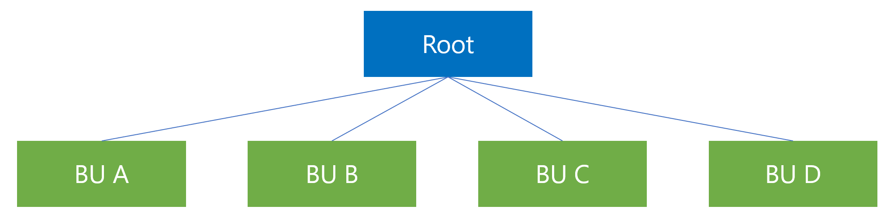

# Business unit support and role-based access control (preview)

[!INCLUDE [public-preview-banner](includes/public-preview-banner.md)]

By using business unit support, administrators can control access to customer profiles, segments, and measures based on business units. [Learn more about business units and role-based access control in Dataverse](/power-platform/admin/wp-security-cds).

For information on how business unit separation affects insights and activation in Customer Insights - Data and Customer Insights - Journeys, see [From CI‑Data to CI‑Journeys: How BU Separation affects Insights and Activation](https://community.dynamics.com/blogs/post/?postid=d4d7c64c-1ddc-f011-8544-000d3a110039).

[!INCLUDE [public-preview-note](includes/public-preview-note.md)]

## Prerequisites

- Define business units and associated teams in Dataverse. [Learn more about setting up business units in Dataverse.](/power-platform/admin/create-edit-business-units)
- Assign users to appropriate business units and teams. [Learn more about managing users and teams in Dataverse.](/power-platform/admin/users-settings)
- Assign the role *Customer Insights Data Read Access* to teams used in Customer Insights. [Learn more about assigning roles in Dataverse.](/power-platform/admin/manage-teams#manage-the-security-roles-of-a-team)
- Enable business unit data separation as an admin in **Settings** > **System** > **Business unit data separation**.
- Ensure all data sources that contribute to unification have a column that holds a value that identifies the business unit for every row of data.

> [!NOTE]
>
> - Parent-child scope isn't currently supported.
> - [Modernized business units](/power-platform/admin/wp-security-cds#matrix-data-access-structure-modernized-business-units) aren't supported.
> - Field-level security isn't supported.
> - **You can't disable business unit data separation on an environment after you enable it.**

## Access controls in Customer Insights - Data

### Customer profiles, activities, customer measures, intelligence, enrichments

Access to a customer profile in Customer Insights - Data depends on the business unit team that owns the profile, the business unit team of the user, and the application permissions of the user. The *Administrator*, *Contributor*, and *Viewer* roles have access to all profiles regardless of the owning business unit team. The *Marketing contributor* role has access only to customer profiles that belong to their business unit.

The *Marketing contributor* role only has access to the *customers*, *tables*, *segments*, and *measures* views in the Customer Insights - Data user interface. The Marketing contributor role has a limited set of functionality. [Learn more about user roles](user-roles.md).

> [!NOTE]
>
> The **administrator** and **contributor** roles are highly privileged and should only be given to users that belong to the *Root* business unit. The **viewer** role isn't bound by business unit and shouldn't be used in production if business unit data separation is enabled.

Ownership of the customer profiles is determined based on mappings that are configured on the [Unify](data-unification.md) page:

1. Go to **Data** > **Unify** > **Business units**
1. Under **Business unit data separation**, select the column that identifies the business unit for each entity that contributes to unification. You can't add unification rules on the selected columns.
1. Under **Associate customer profiles with business units**, specify the mapping between the values in the selected columns and business unit teams. Only teams that have the *Customer Insights Data Read Access* role are available for selection. For example, 'A' maps to the business unit A team and 'B' maps to the business unit B team.

   :::image type="content" source="media/BU_mappings.png" alt-text="Screenshot of business unit mapping.":::

Teams within business units (not business units directly) own customer profiles to provide better control of data access. You can specify only one team per business unit in the mapping rules.

- The system deduplicates and unifies profiles only if the business unit values match.
- Profiles that don't match any of the mappings are assigned to the *Org* business unit.
- All profiles are assigned to the *Org* business unit if business unit data separation isn't enabled.
- A profile belongs to exactly one business unit.
- The unification rules and customer profile schema are the same for all business units.

> [!NOTE]
> Any changes to the business unit data separation configuration trigger a full refresh. If your data sources use incremental updates, you need to manually trigger a [full refresh](incremental-refresh-data-sources.md#run-a-one-time-full-refresh-for-azure-data-lake-data-sources) after making changes.

Data related to a customer profile, such as activities, inherit the business unit ownership from the associated profile.

Intelligence models are trained on all data, regardless of business unit data separation.

## Default configurations

The following diagram shows a typical business unit structure. Marketing contributor users only access their business unit team's customer profiles. For example, if a marketing contributor user creates a segment with all customers, it only contains the customer profiles that map to the business unit of the segment owner.

*Example of a business unit structure with the Org parent business unit at the top and child business units A to D.*

### Segments and business measures

Segments and measures belong to the business unit of the user that created them. For example, if a user is a member of business unit *A* then any segment and measure that user creates belongs to business unit *A*. Access settings in Dataverse control access on the segment and measure definitions tables in Dataverse. By default, other users that belong to the same business unit can access segments and measures.

> [!NOTE]
>
> - One business unit owns segments and measures. You can't share them with other business units.
> - The marketing contributor role supports only *build your own* segments and measures and no projected attributes.
> - For building segments and measures, the marketing contributor role only has access to Customer profiles, Unified activities, Segments, and Customer measures.

## Next steps

- [Business unit integration with Dynamics 365 applications and Power Platform (preview)](business-unit-integration-dynamics365-power-platform.md)

[!INCLUDE [footer-include](includes/footer-banner.md)]
