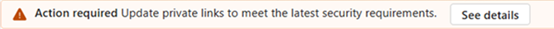
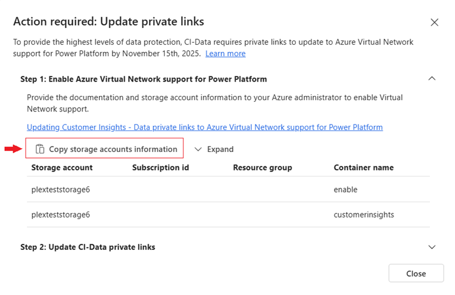
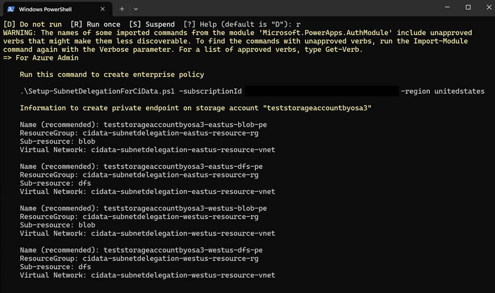

# Connect to storage accounts behind firewalls

> [!TIP]
> This article provides an updated method to connect Customer Insights - Data to storage that's behind a firewall using private endpoints. This is the preferred method to connect to firewalled storage, as usage of [Azure Private Link](private-link.md) is being phased out.

Sometimes you want Customer Insights – Data to connect to an Azure Data Lake Storage account that's behind a firewall (storage accounts where "Public network access" is disabled). To grant access to a storage account behind a firewall, you need to create a private endpoint.

:::image type="content" source="media/connect-to-storage-accounts-behind-firewalls/image1.png" alt-text="Screenshot of Azure Data Lake Storage account firewall settings.":::

There are three scenarios where Customer Insights – Data may need to connect to a firewalled Azure Data Lake Storage account:

1. The instance output is written to your firewalled storage account.
1. A data source connects to a firewalled storage account (see [Data sources overview](data-sources.md)).
1. Data is exported to a firewalled storage account (see [Exports overview](export-destinations.md)).

> [!IMPORTANT]
> Regardless of a storage account's network access setting, if a storage account has any private link connections, Customer Insights – Data also connects using a private link. Azure treats the storage account as if public access is disabled.

This article shows you how to set up secure connections to Azure Data Lake Storage accounts behind firewalls.

## Azure Virtual Network support for Power Platform

To connect Customer Insights – Data to a firewalled storage account, set up private endpoints to use **Azure Virtual Network support for Power Platform**. Azure Virtual Network support for Power Platform securely routes data between the storage account and Customer Insights – Data over your virtual network.

When you create a data connection, the "Validate private endpoint" button appears when “This storage account is behind a firewall” is selected. It shows whether the private endpoint exists. Ask your Power Platform and Azure admins to set up private endpoints using the guidance in this article for all firewalled storage accounts you want to use in Customer Insights – Data.

### Prerequisites to enable Azure Virtual Network support for Power Platform

- The Power Platform environment associated with Customer Insights – Data needs to be a Managed Environment.
- Minimum role requirements:
  - **Customer Insights – Data**: Admin (needed to create data connections).
  - **Power Platform**: Admin (needed to set up the Power Platform environment).
  - **Azure**: Admin (needed to create resources and private endpoints in Azure).

## Overview of enabling private endpoints

Create private endpoints in Azure before you set up data connections in Customer Insights – Data. After you create the Azure resources and grant permissions, adding private endpoints for another storage account is a simple manual task.

**Power Platform administrator**

- Run the "prepare" script to check the Power Platform region and create steps for the Azure admin to follow.
- The "prepare" script doesn't change the environment.

**Azure administrator**

- Run scripts with the information from the Power Platform admin to create resources (resource groups, virtual network, subnet) and let Power Platform request IP addresses from the subnets. This is a one-time task.
- Manually create private endpoints in `https://Portal.Azure.com` for each storage container.

**Power Platform administrator**

- Run a script to set up Power Platform to use the new private endpoints.

**Customer Insights – Data administrator**

- Create data connections and select “This storage account is behind a firewall.”
- If the private endpoints are set up correctly, the connection works.

## Updating legacy private links

Instances with older private links prompt you to update to private endpoints. The following screenshot shows the message.



Select **See details** to open the **Update private links** dialog.



1. Select **Copy storage accounts information** to copy details to the clipboard.
1. Send the copied details to your Power Platform admin and Azure admin, and ask them to create private endpoints. Wait for confirmation that the private endpoints are set up before you continue.
1. After you get confirmation that the resources are ready, select **Attempt connections update** in step two of this dialog to set up Customer Insights – Data to use the new private endpoints.
1. When all connections show **Completed**, the update is finished.

## Configuring private endpoints using Azure Virtual Network support for Power Platform

### Customer Insights – Administrator steps

1. Give this article and the storage accounts you want Customer Insights – Data to use to your Power Platform and Azure admins.
1. If you're prompted to update legacy private links, give the information from the “Copy storage accounts information” link in the "Update private links" dialog.
1. After you get confirmation that private endpoints are set up, create or update data connections.

### Power Platform administrator steps

1. **Required**: Check that the Power Platform environment is “Managed.”
    1. Sign in to `https://admin.powerplatform.com`.
    1. In Environment settings, make sure “Managed environments” is set to "Yes." See [Managed Environments overview](/power-platform/admin/managed-environment-overview)
1. Download and unzip the [Customer Insights - Data script package](https://download.microsoft.com/download/77c5dfb9-4555-4b30-9e96-08408855aab3/SubnetDelegationSetup.zip).
1. Open PowerShell and run the script: `PrepareCIDataPrivateEndpoints.ps1`
    1. Go to the folder where you unzipped the scripts.
    1. Type `./PrepareCIDataPrivateEndpoints.ps1` and press <kbd>Enter</kbd>.
    1. When prompted, enter the `EnvironmentID`, storage account name, and `SubscriptionId` given by your Customer Insights – Data admin.
1. Copy the output and send it to your Azure admin. They use the details to create private endpoints. Wait for your Azure admin to confirm that the private endpoints are ready before you go to the next step.
1. After you get confirmation from your Azure admin that private endpoints are created, run the script command `New-SubnetInjectionForPowerPlatformEnv.ps1` you generated in step three to set up your Power Platform to use the new private endpoints. This includes your `SubscriptionId` and `EnvironmentId` as input parameters.

> [!NOTE]
> - Ignore the standard warning about verbs that aren't discoverable.
> - You're prompted to sign in. Follow your usual sign in process.

**Example script output**



## Azure administrator steps

After the Azure admin gets the “For Azure admin” details from the Power Platform admin, create the resources and private endpoints for the secured storage accounts that Customer Insights – Data needs to use.

### Azure admin creates resources using scripts

1. Download and extract the [Customer Insights - Data script package](https://download.microsoft.com/download/77c5dfb9-4555-4b30-9e96-08408855aab3/SubnetDelegationSetup.zip). This link is the same as the scripts the Power Platform admin downloads.
1.  Launch PowerShell and run the **Setup-SubnetDelegationForCiData.ps1** command your Power Platform admin gives you. Enter your `SubscriptionId` and Power Platform region.

    When the script runs, it shows you values to enter. For example, you see a message like the following:  
    
    ```
    Pass the parameters as printed below.

    .\SetupVnetForSubnetDelegation.ps1
        -virtualNetworkSubscriptionId: 44444444-0a57-4571-b790-666666666666
        -virtualNetworkName: cidata-subnetdelegation-eastus-resource-vnet
        -subnetName: cidata-delegated
    ```

    When prompted for each value, enter the values shown.

        **What Setup-SubnetDelegationForCiData.ps1 does**

    - Creates one or two Azure virtual networks; one in each Azure region your Power Platform region uses. Most Power Platform regions have a primary and a secondary Azure region, but some have only a primary.
    - Creates a subnet in each virtual network.
    - Delegates each subnet to Power Platform so Power Platform can request an IP in the subnet.
    - Creates an enterprise policy that lets Power Platform find the subnets delegated to it.
1. Manually create private endpoints.
    1. Sign in to Azure portal.
    1. Use the storage account details your Power Platform admin gives you to manually create private endpoints.

### Azure admin creates private endpoints manually

Use the “For Azure Admin” details your Power Platform admin gives you to manually create private endpoints for each storage account.

- Each storage account needs at least two private endpoints (blob and DFS).
- If your Power Platform region has primary and secondary Azure regions, create four private endpoints for each storage account: a blob and DFS private endpoint in each Azure region.

**Manually create private endpoints**

1. Sign in to `https://Portal.azure.com`.
1. Go to the first storage account.
1. Under "Security + networking," select "Networking."
1. Select **+ Private endpoint** on the **Private endpoint connections** tab. Use the following values:

    - **Basics**: Subscription: The Azure subscription.
    - **Basics**: Resource group: The primary resource group.
    - **Basics**: Name: The recommended name or a name you choose.
    - **Basics**: Region: The region.
    - **Resource**: Target sub-resource: Blob or DFS as needed.
    - **Virtual network:** Virtual network: Select the value.

Go through the defaults and select “Create.” Repeat these steps to create private endpoints for each storage account, region, and target sub-resource as needed.

## Resources

Learn more about Power Platform region to Azure regions mapping: [Virtual Network support overview – Supported regions](/power-platform/admin/vnet-support-overview#supported-regions).

[!INCLUDE [footer-include](includes/footer-banner.md)]