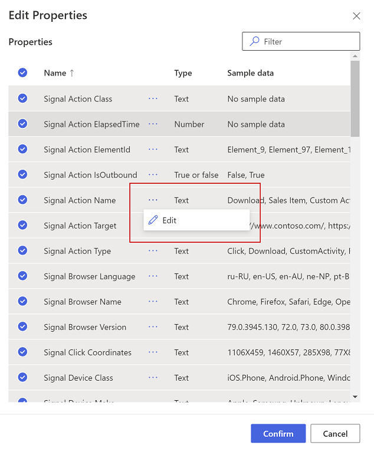
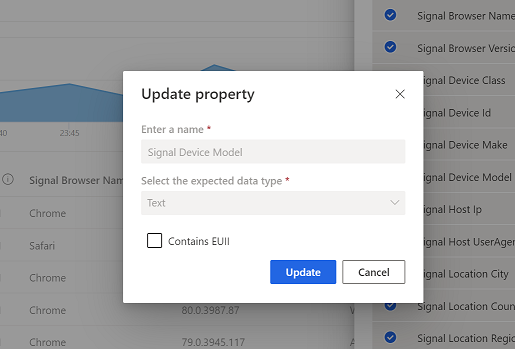

# Delete and export event data containing personal information

[!INCLUDE [cc-beta-prerelease-disclaimer](includes/cc-beta-prerelease-disclaimer.md)]

## Background

The European Union’s General Data Protection Regulation (GDPR) has been in effect since May 25, 2018. It gives significant rights to individuals with regard to their data. The GDPR is about protecting and enabling the privacy rights of individuals. You can read more about Microsoft's commitment to security and compliance at the [Microsoft Trust Center](https://www.microsoft.com/trust-center).

## Deleting and exporting event data containing end user identifiable information

The following sections describe how to delete and export event data that might contain end user identifiable information (EUII).

### Overview

Dynamics 365 Customer Insights engagement insights capability is committed to helping our customers meet their GDPR requirements. This includes the right to delete and export data that includes personal information such as user IDs, phone numbers, and email addresses. Team administrators can implement user requests regarding deleting or exporting their personal data, ensuring that engagement insights capability complies with GDPR requirements.

To delete or export data:

1. Tag event properties that contain data with personal information.
2. Delete or export data associated with specific values (for example: a specified user ID).

### Tag and update event properties

EUII data is tagged on an event property level. First, tag the properties being considered for deletion or export.

To tag an event property as containing personal information, follow these steps:

1. Open the workspace containing the event.

1. Go to **Admin** > **Events** to see the list of events in the selected workspace.
  
1. Select the event you want to tag.

1. Select **Edit properties** to open the pane listing all properties of the selected event.
     
1. Select **...** and then choose **Edit** to reach the **Update property** dialog.

   

1. In the **Update Property** window, choose **...** in the upper right corner, and then choose the **Contains EUII** box. Choose **Update** to save your changes.

   

   > [!NOTE]
   > Every time the event schema changes or you create a new event, it's recommended that you evaluate the associated event properties and tag or untag them as containing EUII data, if necessary.

### Delete or export tagged event data

If all event properties have been tagged appropriately as described in the previous step, an environment admin can issue a deletion request against the tagged event data.

To manage EUII deletion or export requests, go to **Admin** > **Settings** > **General**. Select **Go to admin center** and select **Workspaces**.   
In the **Manage end user identifiable information (EUII)**, select **Manage EUII**.

#### Deletion

For deletion, you can enter a list of comma-separated user IDs in the **Delete end user identifiable information (EUII)** section. These IDs will then be compared with all tagged event properties of all projects in the current environment via exact string matching. 

If a property value matches one of the provided IDs, the associated event will be permanently deleted. Due to the irreversibility of this action, you must confirm the deletion after selecting **Delete**.

#### Export

The export process is identical to the deletion process when it comes to defining event property values in the **Export end user identifiable information (EUII)** section. Additionally, you'll need to provide an **Azure blob storage URL** to specify the export destination. The Azure Blob URL must include a [Shared Access Signature (SAS)](https://docs.microsoft.com/azure/storage/common/storage-sas-overview).

After selecting **Export**, all events of the current team that contain matching tagged properties will be exported in CSV format to the export destination.

#### Good practices

* Try to avoid sending any events that contain EUII data.
* If you need to send events containing EUII data, limit the number of events and event properties that contain EUII data. Ideally, limit yourself to one such event.
* Make sure that as few people as possible have access to the sent EUII data.
* For events containing EUII data, make sure that you set one property to emit a unique identifier that can easily be linked to a specific user (for example, a user ID). This makes it easier to segregate data and to export or delete the right data.
* Only tag one property per event as containing EUII data—ideally one that only contains a unique identifier.
* Do not tag properties containing verbose values (for example, an entire request body). Engagement insights capability uses exact string matching when deciding which events to delete or export.
