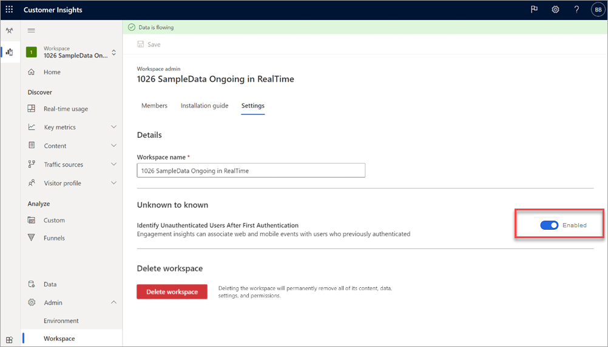

# Associate events with visitors' website activities with **Unknown to known**

The **Unknown to known** feature in Engagement insights allows you to associate events on a website with visitors who authenticated previously. If the feature is disabled, visitors who authenticated during an earlier visit and then left are not identified if they don’t authenticate again when coming back. 

For example, John visited a website last week, signed in his user account on the site, and browsed the product catalog. He returned the following week to browse more products without signing into his account. The site owner using the **Unknown to known** feature would know that John had returned and what he had done on the site. This allows for more accurate reporting and analysis of website activities.

The **unknown to known** Engagement Insights feature is in public preview now. 

## How to enable

You need to be a workspace admin to enable this feature. 

1 In Engagement insights, go to **Admin > Workspace**.
2 In the **Unknown to known** section, set the toggle to **Enabled**.



## Data Flow Diagram


## Adding JS Code to your site

A website **user authId** needs to be captured via the following Javascript sample in the Engagement insights SDK:

```
window, document
{
src:"https://download.pi.dynamics.com/sdk/web/mspi-0.min.js",
name:"myproject",
cfg:{
ingestionKey:<paste your ingestion key>",
autoCapture:{
view:true,
click:true
},
userMapping: true
},
user:{
authId: getLoggedInUserId()*,
email: getLoggedInUserEmail()*,
authType: "MSA",
name: "John Doe"
}
```

## Learn more
[Advanced web SDK instrumentation](https://docs.microsoft.com/dynamics365/customer-insights/engagement-insights/advanced-sdk-implementation).


[!INCLUDE[footer-include](../includes/footer-banner.md)]
