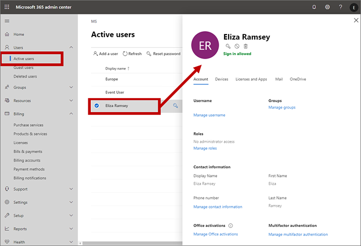

# Manage user accounts, user licenses, and security roles

[!INCLUDE [marketing-trial-cta](./includes/marketing-trial-cta.md)]

[!INCLUDE [azure-ad-to-microsoft-entra-id](./includes/azure-ad-to-microsoft-entra-id.md)]

Read this article to learn how to work with user accounts, user licenses, and security roles in Dynamics 365 Customer Insights - Journeys.

## User access and security groups

When you create a new environment in the Power Platform admin center and don't select a security group, all Microsoft Entra users get default access to the environment through automatic user sync. To restrict access when you create the environment, select a security group. Only users in the security group can use the environment.

If you created an environment and want to restrict access:

1. Sign in to the [Power Platform admin center](https://admin.powerplatform.com) as an administrator (Dynamics 365 administrator or Microsoft Power Platform administrator).
1. In the navigation pane, select **Manage**.
1. In the **Manage** pane, select **Environments**, and then choose the environment with which you want to associate the security group.
1. Select **Edit**.
1. In the **Edit details** pane, select the **Edit** icon in the **Security group** area.

    Only the first 200 security groups are returned. Use **Search** to look for a specific security group.

1. Select a security group, select **Done**, and then select **Save**.

    The security group is associated with the environment.

Learn more: [Control user access to environments: security groups and licenses](/power-platform/admin/control-user-access)

## Create user accounts and assign licenses

> [!WARNING]
> To use entities, tables, operations, or components associated with a specific app like Sales or Service, you must be licensed for those apps. The license requirement applies regardless of whether you create a custom app to access the data.

Like most model-driven apps in Dynamics 365—such as Dynamics 365 Sales, Dynamics 365 Customer Service, Dynamics 365 Field Service, Dynamics 365 Customer Insights - Journeys, and Dynamics 365 Project Service Automation—Customer Insights - Journeys integrates with the user management and licensing features of the Microsoft 365 admin center. To get started, each user who needs to use Customer Insights - Journeys must have a user account on your Microsoft 365 tenant. More about adding users: [Add users individually or in bulk to Microsoft 365](/office365/admin/add-users/add-users)

Unlike most Dynamics 365 apps, Customer Insights - Journeys uses capacity-based licensing instead of user-based (seat) licensing. This means you can add as many users to each Customer Insights - Journeys instance as you want for no extra charge. Any user with an account on your Microsoft 365 tenant can use the Customer Insights - Journeys app if you share the environment URL with them. Restrict access by setting up security groups. 

### Grant access to users that already have a Dynamics 365 license

Any user who already has a license for any model-driven app in Dynamics 365 can also use Customer Insights - Journeys. Just [assign the security roles and privileges](#assign-role) needed for the Customer Insights - Journeys features they use, and share the environment URL. You don't need to assign a user license in the Microsoft 365 admin center as you do with user or seat-based licenses.  

### Grant access to users without a Dynamics 365 license

> [!IMPORTANT]
> Customer Insights - Journeys is a tenant-level license. It doesn't require explicit seat assignment for users to use the app. To sync users who use your organization's [Microsoft Entra ID](/azure/active-directory/fundamentals/whatis) to the Customer Insights - Journeys app, give them the environment URL. When they try to use the environment, their identity syncs to Dynamics 365, and Dynamics 365 creates a user for them and assigns the Marketer role.
>
> If you have trouble letting users in, force the user assignment with a free Customer Insights - Journeys user license, as described in the steps later in this section.

For Microsoft 365 users who don't have a Dynamics 365 license, "buy" and assign a free Customer Insights - Journeys user license. Free Customer Insights - Journeys user licenses don't let users use other Dynamics 365 apps, but you can assign as many as you need for Customer Insights - Journeys.

> [!IMPORTANT]
> If you have a [self-service Customer Insights - Journeys license](direct-purchase.md), your tenant administrator must assign users to your license before you can assign them roles. Contact your tenant administrator and have them add users to your license.

> [!WARNING]
> The free Customer Insights (formerly Marketing) user license only lets users use Customer Insights - Journeys in rare cases. It doesn't let users use custom apps for Sales, Service, or other Dynamics 365 scenarios. It also doesn't include other Dataverse capacity entitlements.

If automatic user sync doesn't work, use a $0 User License to force the sync. Only use this workaround if automatic sync fails.

To use the $0 license work-around to sync users for the edge case:

1. Sign in to your [Microsoft 365 admin center](https://admin.microsoft.com) using an administrator account that has permissions to purchase services and assign licenses.

1. In the Microsoft 365 admin center, go to **Billing** > **Purchase services**.
1. On the **Purchase services** page, type "Customer Insights - Journeys" into the search field near the top of the page and then press Enter on your keyboard.

1. Select the **Dynamics 365 Customer Insights - Journeys User License** tile, which shows a price of **Free**.

    

1. Follow the instructions on your screen to complete the transaction.

1. Return to the Microsoft 365 admin center and go to **Users** > **Active users** and select the user you want to assign a license to. The settings for that user open in a fly-out.

    

1. Select the **Licenses and Apps** tab in the flyout and then select the **Dynamics 365 Customer Insights - Journeys User License** check box to assign the license to this user.

    

1. Select **Save changes** and then close the fly-out. The user now has a free Customer Insights - Journeys license and should be visible in the user-admin interface in a few minutes.

1. Assign the appropriate security roles to grant the new user access to the required Customer Insights - Journeys features, as described in the next section. The app doesn't allow access to any user who doesn't have at least one relevant security role.

More information: 
[Assign licenses to users in Microsoft 365 for business](/office365/admin/subscriptions-and-billing/assign-licenses-to-users)

## Assign security roles to users

Security roles enable administrators to control users' access to data through a system of access levels and privileges. The combination of access levels and privileges that are included in a specific security role sets limits on each user's view of data and on what actions the user can perform with that data.

You can assign more than one security role to a user. The effect of multiple security roles is cumulative, which means that the user has the permissions associated with all security roles assigned to the user.

Administrators can also create teams, apply security roles to those teams, and add users to each team. All users that belong to a team inherit the security roles applied to that team for as long as they remain a member, and lose those roles as soon as they leave the team (other than roles also granted to them personally or by other teams they are on).

> [!IMPORTANT]
> Assign at least one security role to every user. Users can't access the app without a security role.

To assign security roles to users and customize each role, follow these steps:

1. Go to admin.powerplatform.microsoft.com.
1. Select **Environments** in the left navigation, then choose the environment you want.
1. Open the **Settings** menu  at the top of the page. Under **Users + permissions**, select **Users**.
1. Select a user, then select **Manage Security Role** in the menu bar at the top of the page.
1. When the "Manage security roles" pane opens on the right, select the roles you want to assign to the user.
1. Select **Save** before closing the pane.

## Inspect and create customized copies of security roles

All model-driven apps in Dynamics 365 come with a collection of preconfigured security roles to help get you started. Each of these roles gives different levels of access to a group of entities that are typically used together by specific security roles. Each role has a name that shows which type of user should get the role.

### Inspect security roles

To check which permissions apply to an existing security role or to edit a role:

1. Open the **Settings** menu  at the top of the page, and select **Advanced settings**.

1. The advanced settings area opens in a new browser tab. This area uses a horizontal navigator at the top of the page instead of a side navigator. Go to **Settings** > **System** > **Security**.

1. Select the **Security roles** icon.

1. You see a list of security roles. Select a role to open the **Security role** window, which shows access levels for each available entity. Most entity names match features and areas of the app.

    

Here are a few notes for working with the **Security role** settings:

- Most entities added by Customer Insights - Journeys are on the **Custom entities** tab. The other tabs manage features that are either common for all model-driven apps in Dynamics 365, or specific to another app.
- There's a tab called **Marketing**, but it doesn't have entities related to Customer Insights - Journeys. The settings apply to the *enterprise marketing* feature included with several model-driven apps in Dynamics 365, though Customer Insights - Journeys uses the marketing lists feature provided here.
- Some security roles provided with Customer Insights - Journeys include permissions from all available tabs. This gives access to common features also needed by users in marketing roles.

Security roles are used in all model-driven apps in Dynamics 365. To learn more, see [Create users and assign security roles](/power-platform/admin/create-users-assign-online-security-roles) and [Security roles and privileges](/power-platform/admin/security-roles-privileges).

### Create a copy of a role

> [!IMPORTANT]
> Each time you update Customer Insights - Journeys, all standard out-of-box roles are updated to the latest versions so each role gets permissions for new features. You can't customize out-of-box roles. If you need custom security roles, start by copying an existing role that's close to what you want, then customize the copy. If you use custom security roles, update your custom roles after each app update to give access to new entities.

To create a copy of a role:

1. Open the **Settings** menu  at the top of the page and select **Advanced settings**.
1. The advanced-settings area opens in a new browser tab. This area uses a horizontal navigator at the top of the page instead of a side navigator. Navigate to **Settings** > **System** > **Security**.
1. Select the **Security roles** icon.
1. Select the check box next to the role you want to copy, then open the **More Actions** dropdown in the Security Roles toolbar, and select **Copy Role...**.

> [!div class="mx-imgBorder"]
>  

## Special permissions for marketing pages and assist edit

Two features of Customer Insights - Journeys require that users have security roles with unexpected privileges for some entities. These are:

- **To go live with marketing pages, elevated privileges are required for the *website* entity**  
    The error checker for marketing pages requires full organization-level access to the **Website** entity, which enables the feature to confirm that the page is configured correctly to be published on your Power Apps portal. Therefore, all users that need to check and/or go-live with a marketing page published on a portal must have a security role with the privileges shown in the table and illustration following this list. This doesn't affect captured forms or forms embedded on an external site or content management system (CMS).

- **To access assist edit, elevated privileges are required the for the *marketing email dynamic-content metadata* entity**    
    The [personalization feature](dynamic-email-content.md#personalization) enables users to generate dynamic expressions for use in email messages and content settings. The feature requires that the user has elevated access to application metadata, which enables assist edit to present details about database entities and records. Therefore, all users that need to use assist edit must have a security role with elevated access to the **Marketing email dynamic-content metadata** entity, as shown in the table and illustration following this list.

| Access level | Minimum "Website" entity privileges | Minimum "Marketing email dynamic-content metadata" entity privileges |
|-----------|--------------|------------------------------------------|
| Create | Organization | Business unit |
| Read | Organization | Organization |
| Write | Organization | Organization |
| Delete | Organization | Business unit |
| Append | Organization | Organization |
| Append to | Organization | Organization |
| Assign | Organization | Business unit |
| Share | Organization | Organization |

## Form and field level security

In addition to the entity-level security set directly on each security role, you can also control access to specific forms and/or fields. These work as follows:

- *Form-level security* restricts access to specific forms, so even if a user has a security role that grants access to a given entity (such as customer journeys), that user might not be able to access some of the forms of that entity (such as the insights) unless they have one of the other roles required by that form. Most of the entities added by Customer Insights - Journeys don't include any form-level security out of the box, so users that can access these entities can also access all the forms that belong to them, though some exceptions exist (including insights forms for some entities).
- *Field-level security* applies extra restrictions on specific fields, so even if a user can view a given form, some fields on that form could be hidden if they require an additional field security profile. Field security profiles are similar to, but separate from, the entity-level security roles otherwise described in this article.

You don't see form or field settings when you edit the security role, so manage these settings separately.

Form and field level security are concepts shared by all model-driven apps in Dynamics 365. To learn more, see [Field-level security](/power-platform/admin/field-level-security) and [Assign security roles to a form](/power-platform/admin/assign-security-roles-form).

## Security roles added by Customer Insights - Journeys

The tables in this section summarize the purpose of each role added by Customer Insights - Journeys. They should give you a good idea of which roles to assign each of your users. For details information about precisely which permissions and access levels any single role provides, inspect the permissions tables provided in the **Security roles** window, as described previously in [Inspect and customize security roles](#inspect-roles).

To see the permissions required for each role, see [Permissions for out-of-the-box roles](role-permissions.md)

### Core Customer Insights - Journeys security roles

> [!NOTE]
> Customer Insights - Journeys roles often start with the word "Marketing."

| Security&nbsp;role | Who&nbsp;needs&nbsp;it | Access&nbsp;granted |
|---------------|--------------|----------------|
| Marketing Professional - Business | Most standard marketers who require access to Customer Insights - Journeys core features, but don't need to configure the system | Nearly all entities in the **Customer Insights - Journeys** work area, including segments, customer journeys, emails, marketing pages, marketing lists, and related features and templates (but not including LinkedIn or lead-scoring features). This role grants only limited access to the **Settings** work area. It also grants access to fundamental entities like contacts, leads, accounts, activities (tasks, phone calls, appointments), and marketing lists. This role is provided access to insights forms through form-level security.|
| Marketing Manager - Business | Customer Insights - Journeys managers (who also administer the system) | All the same entities as the **Marketing Professional – Business** role, however,  this role also provides access to all views and settings in the **Settings** work area. This role is provided access to insights forms through from-level security. |
| Marketing, Business App Access | For internal use only, don't delete or modify | This is an internal security role used by the solution to perform internal tasks, such as syncing data. Don't delete or modify this role. |
| Marketing Services User | For internal use only, don't delete or modify | This is an internal security role used by the solution to perform internal tasks, such as syncing data. Don't delete or modify this role. |
| Lead Score Modeler | Customer Insights - Journeys strategists responsible for building lead-scoring models (must be combined with a core marketing role) | Can view and edit lead scoring models, view lead scores, and customize the lead-to-opportunity marketing business process for leads. All these features are in the **Lead management** section of the **Customer Insights - Journeys** work area.  |
| Lead Score Viewer | Marketers and salespeople that should see calculated lead scores (must be combined with one of the other marketing and/or sales roles) | Can view the score achieved by each lead. |
| Marketing Professional (BU level) - Business | Marketers in orgs with multiple business units  | Same access as **Marketing Manager - Business**, but privileges are scoped to "Local" - for example, only local business unit access.
| Marketing Manager (BU level) - Business* |  Customer Insights - Journeys managers in orgs with multiple business units | Same access as **Marketing Professional - Business**, but privileges are scoped to "Deep" - for example, only local + child business unit access.

"Marketing Professional" and "Marketing Manager" roles (without the "Business" suffix) are roles used in enterprise marketing and not related to the Customer Insights - Journeys product.

### Event Management security roles

| Security&nbsp;role | Who&nbsp;needs&nbsp;it | Access&nbsp;granted |
|---------------|--------------|----------------|
| Event Administrator | Managers who plan events and administer the event-management features. | All entities in the **Events** work area, and all event-related settings in the **Settings** work area. These users can create, read, write, delete, assign, and share records owned by themselves and other users in the same business unit. |
| Event Planner | All users involved with event planning. | All entities in the **Events** work area. Users with this role can create, read, write, and share these records with other users in the same business unit. However, they can only delete and assign the records that they own. |
| EventManagement S2S Inbound | For internal use only, don't delete or modify | This internal security role is used by the solution to perform internal tasks, such as syncing data. Don't delete or modify this role. |

### LinkedIn Lead Gen security roles

| Security&nbsp;role | Who&nbsp;needs&nbsp;it | Access&nbsp;granted |
|---------------|--------------|----------------|
| LinkedIn Lead Gen Forms Administrator | Administrators who are managing your organization's integration with LinkedIn | Users with this role can configure lead matching strategies, LinkedIn field mappings, and solution settings for the Dynamics 365 Connector for LinkedIn Lead Gen Forms. |
| LinkedIn Lead Gen Forms Salesperson | Users who need to sync their profiles and view leads generated from LinkedIn, but who don't need to configure the connection | These users can authorize LinkedIn user profiles to sync data to Dynamics 365, and view details about the synced submissions. |
| LinkedIn LeadGen S2SInbound | For internal use only, don't delete or modify | This internal security role is used by the solution to perform internal tasks, such as syncing data. Don't delete or modify this role. |

### Surveys security roles

The surveys package adds the following security role:

- Project Owner

## Don't modify or remove service users

Customer Insights - Journeys includes a preconfigured user called **D365 Marketing**, which must have the following security roles:

- EventManagement S2SInbound
- LinkedIn LeadGen S2SInbound
- Marketing Services User
- Marketing, Business App Access
- Marketing Service user extensible role
- Marketing service user real-time role

The system uses this account when performing important internal tasks. Customer Insights - Journeys stops working correctly if you remove the user or any of these required roles. Be sure not to remove or modify this user.

### Customer Insights - Journeys service users

After Customer Insights - Journeys features are deployed, several service users are created. Deleting these users breaks your deployment.

| Customer Insights - Journeys service user | Microsoft Entra ID | Customer Insights - Journeys area |
| ---- | ---- | ------- |
| Customer Experience Platform PROD | 3e56e0fc-542f-4522-bac1-c7cab1017459 | All other areas not listed explicitly in this table |
| D365 Dataverse Data | ca179245-7fe3-4d70-a945-09c79f85cf41 | Personalization of messages during customer journey execution |
| D365 Experimentation | 729028a7-33d3-428b-b7be-0cff66ad5495| Customer journey experimentation |
| D365 Interactives | c88804dd-52b8-4e23-b62d-f0e38f5cef35 | Handling flows triggered by organic users |
| D365 Lifecycle Mgmt | c5efd687-df01-42cb-a6b6-391f24349886 | Lifecycle and provisioning scenarios |
| D365 Native Segments | afc9dd19-c23a-4dc8-9fb7-0ad8cec474ff | Segmentation |
| D365 Personalization | db13e196-bc9c-42fe-9c55-12558c3a16fa | Design of personalized messages |
| D365 Sms Channel | bd3e2b66-87c7-4fb7-90c3-de39038fbb14 | Text messages sending |
| D365 Workflow | ba069707-8fa6-41af-b08d-2d01a0d731e5 | Customer journey execution |
| D365 Landing Forms | a5e884b3-2cac-4051-8cf3-f0d4df550afd | Marketing Forms scenarios |

### Customer Insights - Journeys service user roles

| Customer Insights - Journeys service role | Customer Insights - Journeys area |
| ---- | ------- |
| Cxp Channels Application User | Communication channels |
| Cxp Content Composition Services | Library |
| Cxp Channel Definitions Services User | Custom channel |
| Cxp Consent Services User | Consent management |
| Cxp CDP-A Export Services User | Analytics |
| Cxp Dataverse Datasource Services User | Personalization of messages |
| Cxp Email Services User | Email sending |
| Cxp Form Services User | Customer Insights - Journeys forms |
| Cxp Frequency Capping Services User | Interaction processing |
| Cxp Image Generator Services User | QR code processing |
| Cxp Notifier Services User | Checks if there are any callback registrations or message processing steps defined; if there are, it sends interaction events to CDS |
| Cxp Orchestration Analytics Services User | Analytics |
| Cxp Orchestration Engine Services CI User | Customer journey execution |
| Cxp Orchestration Services User |  Customer journey execution |
| Cxp PushNotification Services User | Push notifications |
| Cxp Segmentation Services User | Segmentation |
| Cxp Services User | Shared scenarios |
| Cxp SMS Services User | Text message sending |
| Cxp TeamsEventsIntegration Services User | Teams attach scenarios |

Customer Insights - Journeys receives continuous updates and enhancements, so new services, and therefore more roles, can be added with upgrades. Service user roles and their privileges for marketing entities can change during upgrades for the same reason.

One service user, **# Dynamics Marketing Dataverse Datasource**, impersonates a service that resolves dynamic content. Dynamic content uses placeholders for personalized messages or data-bound parameters in customer journeys.

**# Dynamics Marketing Dataverse Datasource** has the **Service Reader** role, which lets it access any Dataverse data in the environment.

### Customer Insights - Journeys field security profiles

After you deploy Customer Insights - Journeys features, several field security profiles appear under **Advanced Settings** > **Security** > **Field Security Profiles**. Deleting these profiles breaks text message (SMS) and push notification flows.

| Customer Insights - Journeys field security role | Customer Insights - Journeys area |
| ---- | ------- |
| CxpApplicationUser - Mobile app channel instance secrets  | Push notification channel |
| CxpApplicationUser - Mobile app secrets  | Push notification channel |
| Marketers - Mobile app channel instance secrets | Push notification channel |
| Marketers - Mobile app secrets   | Push notification channel |
| Customer Journey Orchestration Shared SMS Channels Profile | SMS channel |

[!INCLUDE [footer-include](./includes/footer-banner.md)]
