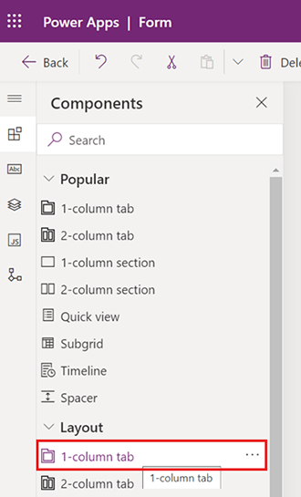
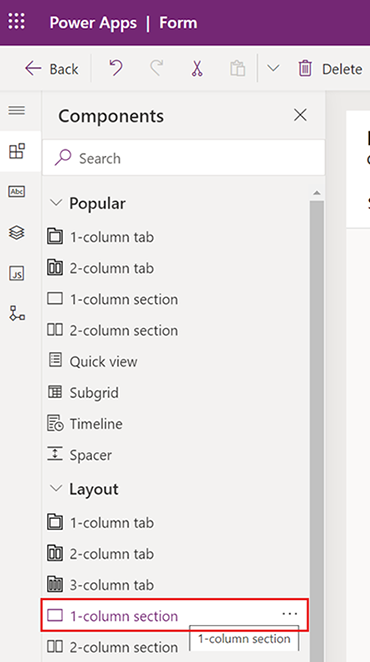
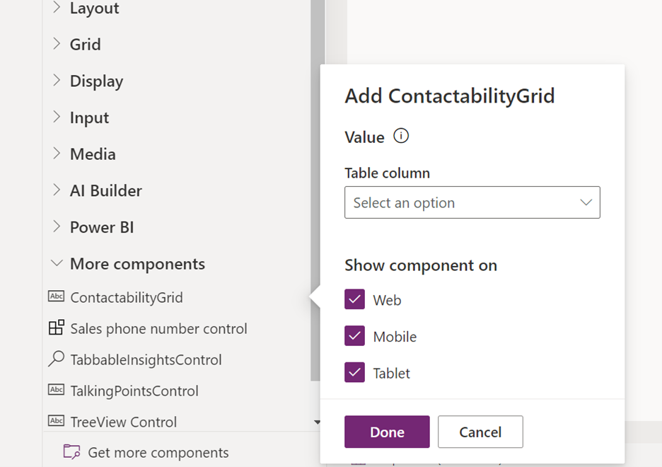
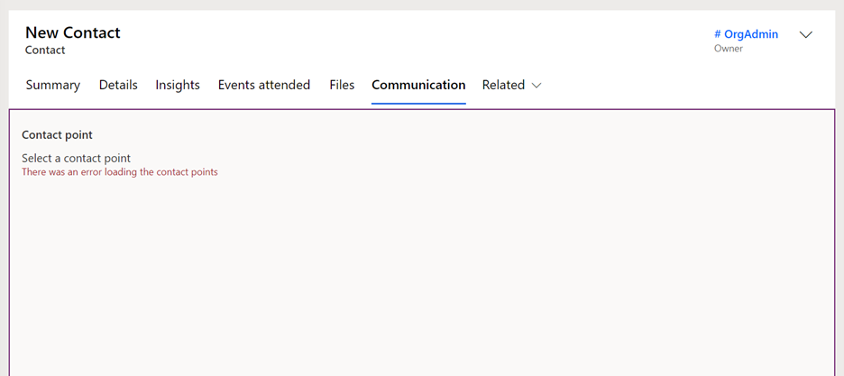

# Add a contactability grid control to custom forms

This article explains how to add a contactability consent control to custom forms. Learn more: [View and manage consent records](real-time-marketing-email-text-consent.md#view-and-manage-consent-records).

> [!IMPORTANT]
> Ensure that the ["Manage consent on contact and lead forms"](real-time-marketing-email-text-consent.md#view-and-manage-consent-records) feature switch is turned on, as that is a pre-requisite for the custom control to work.

1. Go to the [maker portal](https://make.powerapps.com/).
1. From the **Tables** menu, select the **Contact** or **Lead** table depending on which custom form you want to add the contactability grid control to.
1. Go to the **Forms** for the table and select the form where you want to add the control.
    > [!NOTE]
    > You may not have forms defined as a customization, but instead in your own solution. In that case, instead of selecting the **Tables** menu in step two, you should select the **Solutions** menu and then select your solution that contains the form.
1. From the list of components, add a new **1-column tab** to the layout of the form.
    > [!div class="mx-imgBorder"]
    > 
1. Select the **Expand this tab by default** and **Expand first component to full tab** options for this tab and name the tab "Communication."
    > [!div class="mx-imgBorder"]
    > 
1. Add a **1-column section** component on this tab.
    > [!div class="mx-imgBorder"]
    > 
1. Once added, expand the **More Components** section, and add the **ContactabilityGrid** control onto the new section.
    > [!div class="mx-imgBorder"]
    > 
1. Once complete, the contactability consent control looks like the screenshot below:
    > [!div class="mx-imgBorder"]
    > 

[!INCLUDE [footer-include](./includes/footer-banner.md)]
