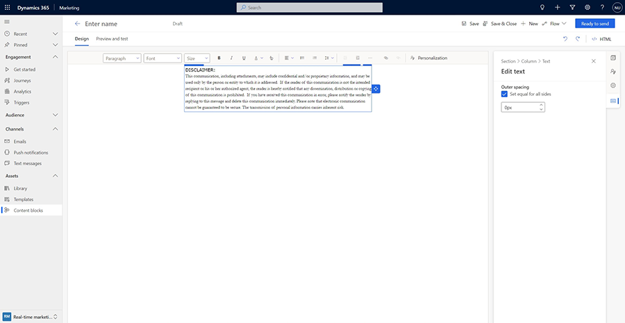
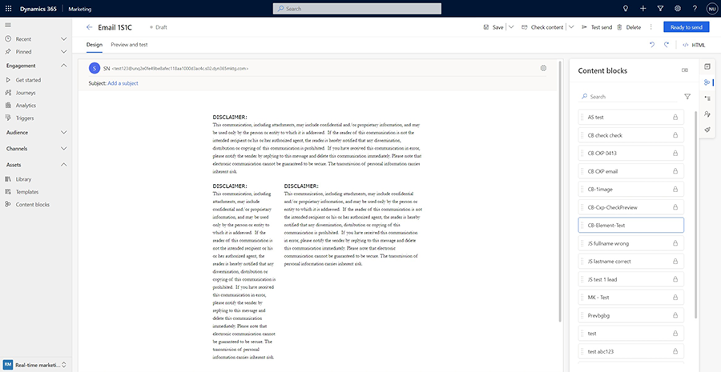
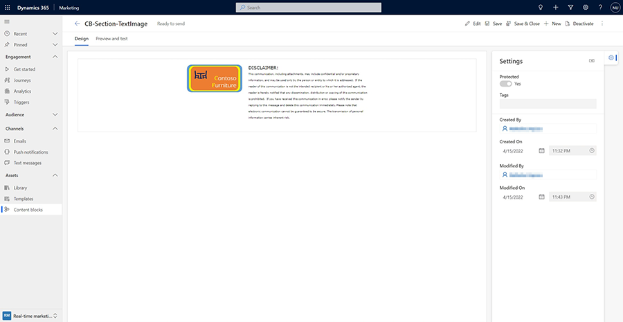
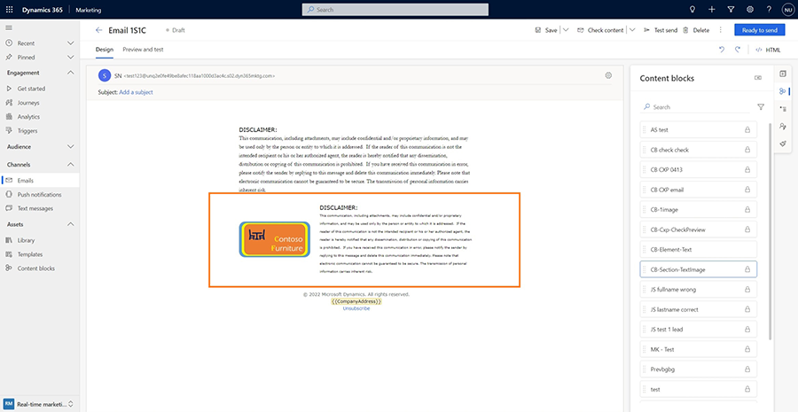
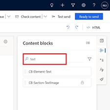
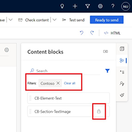
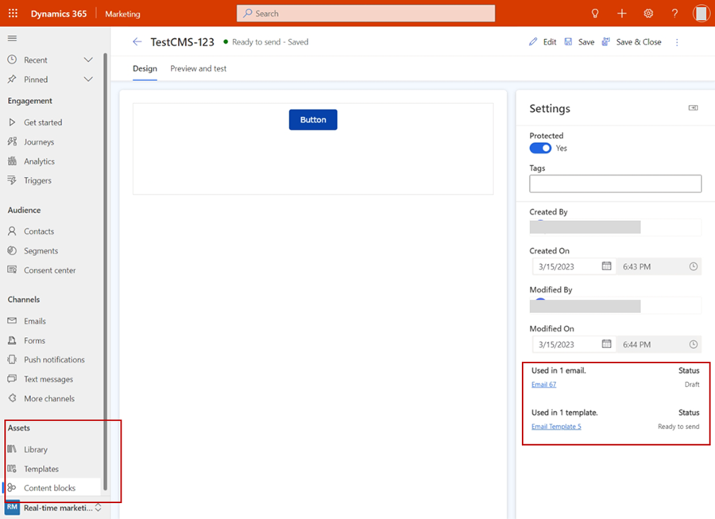

# Create content blocks that you can reuse in multiple designs

> [!VIDEO https://learn-video.azurefd.net/vod/player?id=074dbf31-68f8-466a-a0b8-74fab0b0c41d]

> [!NOTE]
> Unless a style is explicitly set in the element properties, the default style is replaced with the email theme style.

Content blocks are premade pieces of content that you can insert into emails. They can contain text, images, links, buttons, and more – anything that can be used as content in an email. They also can include formatting and layout. When inserted, all of the content (including the layout, if present) contained within the content block becomes part of the email.

Suppose you need to include a short blurb about your company (what it does, annual revenue, awards, etc.) or some legal boilerplate text in certain emails. Creating a content block with this content allows the content to be inserted quickly into any email. Content blocks can also be used for standardizing how certain information is presented. For example, you can create a “product info” content block with a standard layout and styles to show a product name, description, image, and link to details. Other email authors can reuse the content block to easily achieve a professional, consistent look for their emails, saving them time. 

## How are content blocks different from email templates? 

A content block is a *fragment of content* that optionally can also include layout. A content block is meant to be used as is in emails, providing a quick and easy way to reuse content. An email can contain multiple content blocks. Content blocks can be inserted and removed as needed. The same content block can be used in multiple emails. Updating a content block may or may not update emails that include it, depending on whether it's a "static" or "dynamic" content block (more on this below). 

Email templates, on the other hand, are structured layouts for an *entire email* with placeholder content that's expected to be updated. Only one template can be used to create an email. Updating a template doesn't update existing emails. Finally, templates can include content blocks, but the reverse isn't possible.

## Element versus layout content blocks

The two types of content blocks are based on what they *contain*:

- **Element content blocks:** These content blocks include one or more elements (text, image, button, link, etc.) only, but no layout. Below is an example of an element content block that contains some text:

    > [!div class="mx-imgBorder"]
    > 

    Because this content block type only contains elements, it doesn’t have its own layout and takes the shape of section or column that it's placed in. In the screenshot below, the same text content block from above has been inserted into three differently sized columns:

    > [!div class="mx-imgBorder"]
    > 

Unless a style is explicitly set in the element properties, the default style is replaced with the email theme style. 

- **Section content blocks:** These content blocks include one or more sections and therefore retain their layout. Sections can include any combination of elements such as text, image, button, link, etc. Here's an example:

    > [!div class="mx-imgBorder"]
    > 

    Such a section retains its layout when inserted into an email:

    > [!div class="mx-imgBorder"]
    > 

## Static vs dynamic content blocks

> [!NOTE]
> Dynamic content blocks are currently in preview. To enable them, go to **Settings** > **Feature switches** and set the "Dynamic content blocks (preview)" feature switch (in the **Email editor** group) to **On**.

There are also two types of content blocks based on *what happens when their content is updated*: 

- **Static content blocks**: Each email receives its own copy of a static content block. Updating the content block doesn't affect existing emails that already include it. Use this type for content that rarely changes, or when you want updates to apply only to newly created emails.
- **Dynamic content blocks**: When you insert a dynamic content block, the email stores a reference to it rather than a copy. The content is fetched when the email is sent, so any updates to the content block are automatically reflected in all emails that include it. Use this type for content that must always be current in any email that uses it (for example, product information).

## When should you use content blocks?

Content blocks are versatile and can be used in many scenarios to drive efficiency, ease of use, and consistency while reducing common mistakes during content creation. Here are a few suggestions:

1. Commonly used content, such as boilerplate text (legal text, terms and conditions, intro, or closing text), can be saved as an element content block and then quickly inserted into emails. This saves time and ensures that the correct content is used each time. Make it a dynamic content block if all emails must always use the most current content (for example, copyright year or business hours).
1. Use section content blocks to create easy-to-use components, such as headers and footers, that can then be used any number of times to not only save time, but also to achieve a consistent look for your emails.
1. Content blocks can also include dynamic text. This opens up more possibilities to create advanced reusable content. For example, you can create an “Order” content block that lists all the items ordered by a customer in a tabular format (assuming your customer relationship management system (CRM) is set up so that the *Contact table* is related to the *Order* table). Once created, the “Order” content block can be used by everyone on your team, including those who aren't familiar with using dynamic text or who don't know the data model of your CRM.
1. Use a dynamic content block for frequently updated content that you always want to be current in every email. For example, to include a "promotion of the week" in certain emails, add a dynamic content block to those emails. Each week, you only need to update the content block once, and all emails that include it automatically show the latest content.

## Creating a content block

There are two ways to create content blocks: from the content block editor or from the email designer.

- **From the content block editor:** Navigate to the **Content blocks** menu item in the left navigation menu to see a list of available content blocks. You can select any of the blocks to edit or select **+New** in the command bar at the top to create a new content block from scratch. To create an element content block, drag and drop elements onto the canvas and enter the content. To create a section content block, drag and drop layouts and then insert elements and content within those layouts.
- **From the email designer:** You can select and save any content from your emails as content blocks. Select an element (for example, text or an image) or a section and then select the **Content block** context menu item. You see a **Save as content block** dialog that allows you to replace an existing content block or create a new one.

### Properties of a content block 

When creating a content block, you can set the following properties: 

- **Title**: The name of the content block so you can find it later.
- **Type**: Controls how updates affect emails that include the content block:
    - **Static**: Updating the content block doesn't update existing emails that include it.
    - **Dynamic**: Updating the content block automatically updates all emails that include it.
- **Tags**: Optional labels or categories that make content blocks easier to find. You can add multiple tags.
- **Ready to send**: Content blocks have two states:
    - **On** (default): The content block is in the *Ready to send* state. It's available for insertion into emails, but can't be edited until you switch it back to *Draft*.
    - **Off**: The content block is in the *Draft* state. It can be edited, but it isn't available for insertion into emails.
- **Protected**: Available for static content blocks only. Dynamic content blocks are always protected. This setting controls whether an email author can edit the content (and layout, if present) after inserting the content block into an email.
    - **Yes**: The content block is protected, and its content and layout can't be changed in the email. Use this setting when consistency is required.
    - **No** (default): The email author can edit the inserted content block in that email only. These edits don't update the original content block.

## Using a content block

Using a content block is as simple as finding it in the list of available blocks and inserting it into the desired place in an email. First, open an email in the email designer, then select the content block tab in the canvas toolbar to see the list of available content blocks. Each content block in the list displays the following identifiers:
- **Lock icon**: Indicates a static content block that's protected. You can't modify its content after inserting it into an email.
- **Dynamic**: Indicates a dynamic content block that automatically updates all emails that include it. If this label is absent, the content block is static.
- **Layout**: Indicates the content block contains a layout (section type). If this label is absent, the content block is an element with no layout.

You can search content blocks by name or by tags. 

- **Search:** Find all content blocks that have "text" in their name:

    > [!div class="mx-imgBorder"]
    > 

- **Search:** Find all content blocks that have the tag "Contoso":

    > [!div class="mx-imgBorder"]
    > 

## Updating a content block

A content block can only be updated from **Assets** > **Content blocks**. Open the content block for editing. You can edit a content block only when it's in the *Draft* state. If it's in the *Ready to send* state, select **Edit** to switch it to *Draft*.

Updating a static content block doesn't update emails that already use it. Check the **Settings** pane to see which emails and templates use the content block, so you know which ones to update manually. When you update a dynamic content block, the same list shows which emails will be updated automatically.

> [!div class="mx-imgBorder"]
> 

> [!IMPORTANT]
> When you update a dynamic content block, all emails that use it are updated. If any of those emails are used in a live journey, the updated content is sent after the content block is published as *Ready to send*. If the journey is actively sending to a large audience, different recipients might receive different versions of the email.

When finalizing updates to the content block, you can update the existing content block or save it as a new content block. Saving as a new content block doesn't change the existing content block. 

## Deleting a content block 

Content blocks can only be deleted from the **Assets** > **Content blocks** area. 

When you delete a static content block, emails that use it aren't affected because each email contains its own copy of the content block. 

When you delete a dynamic content block, it's also removed from all emails that use it. A confirmation message tells you how many emails are affected and identifies them. 

## Limitations

- Links included in a dynamic content block can’t be used for branching in journeys (this limitation does not apply to static content blocks).

  
[!INCLUDE [footer-include](./includes/footer-banner.md)]
