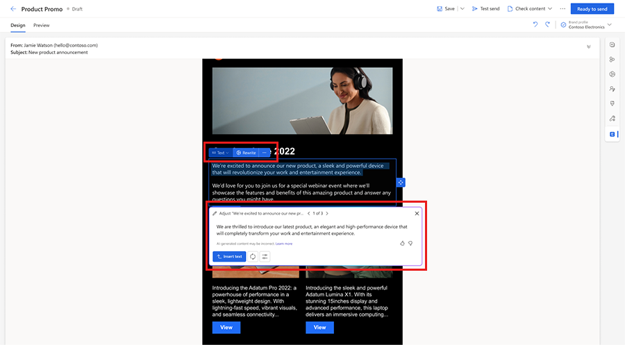
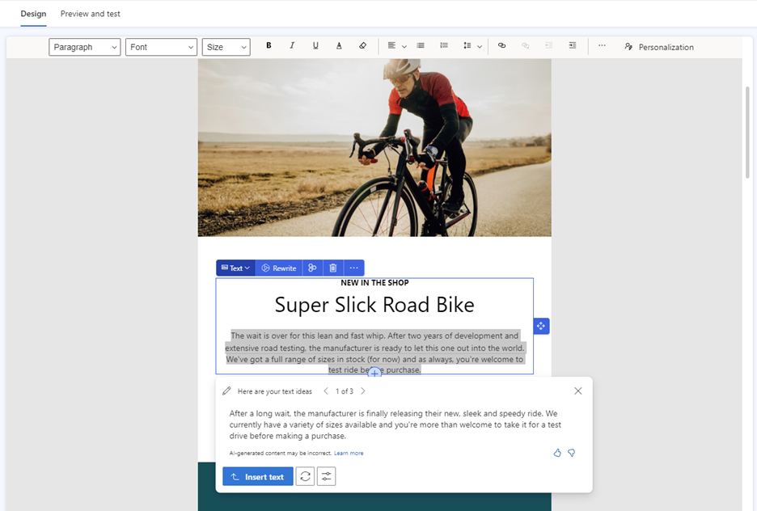

# Preview: Copilot - Refresh and perfect your message

> [!IMPORTANT]
> A preview feature is a feature that is not complete, but is made available before it’s officially in a release so customers can get early access and provide feedback. Preview features aren’t meant for production use and may have limited or restricted functionality.
> 
> Microsoft doesn't provide support for this preview feature. Microsoft Dynamics 365 Technical Support won’t be able to help you with issues or questions. Preview features aren’t meant for production use, especially to process personal data or other data that are subject to legal or regulatory compliance requirements.

This article is an overview of the content rewrite copilot feature. It explains how to use content rewrite to refine your email, forms, and message content.

> [!NOTE]
> Editing text with the content rewrite copilot is available for the following types of content:
> - Emails, email templates
> - Forms
> - Text messages
> - Push notifications

> [!NOTE]
> The content rewrite copilot is currently available in the United States in the English language only.

> [!Tip]
> Learn about using the content ideas copilot to create inspiring email copy: [Make email creation fun and more efficient with AI-powered content ideas in Dynamics 365 Customer Insights - Journeys](https://cloudblogs.microsoft.com/dynamics365/it/2022/11/30/engage-your-customers-faster-with-ai-powered-marketing-email-content/)

## What is the content rewrite copilot?

The content rewrite copilot helps you rapidly iterate on your content to optimize your messaging. Whether you're creating content for email, text messages, push notifications, or forms, using Copilot, you can easily rephrase messages, adjust the tone of voice, and shorten or lengthen copy.

Select any text and use the content rewrite copilot to:
- Rewrite the text and choose from different variations
- Change tone of voice to be more engaging, formal, casual, luxurious, or adventurous  
- Shorten or lengthen copy

## Enable Copilot

> [!NOTE]
> The content rewrite copilot together with all other Copilot features is now enabled by default and is visible in the email, push notification, SMS, and form editors in the United States.

To turn on or off the content rewrite copilot feature switch:
1. Go to **Settings** > **Overview** > **Feature switches**.
1. Enable or disable the **Global Opt-in consent** toggle.

## How to use Copilot to refresh or perfect your content

> [!div class="mx-imgBorder"]
> 

1. Select a **text element** in your email, form, SMS or push notification message.
1. Select **Rewrite** from the text element contextual menu.
1. To generate different variants of your text, select **Get ideas**. Copilot generates a set of text suggestions. It might take a short while to generate the content (up to 15 seconds, depending on the usage).
1. Browse the generated ideas using the navigation buttons in the content rewrite dialog.
1. To update your text with generated content, select **Insert text**.
1. Select **Tone** and then **Choose one tone** for your content from the dropdown.
1. To shorten your text, select **Shorten**.
1. To lengthen your text, select **Lengthen**.
1. To generate more ideas for the same key points, select **Get more ideas**.

> [!NOTE]
> AI-generated content may be incorrect. It's your responsibility to edit generated content so that your final copy is accurate and appropriate.

> [!NOTE]
> The content rewrite copilot is accessible only for text with a minimum of 10 words. If the text snippet is shorter or empty, the content rewrite copilot feature is disabled.

> [!Tip]
> You have the option to refresh only a specific part of your paragraph instead of making changes to the entire paragraph. To do this, follow these steps:
> 1. Select the text you want to update.
> 1. To make modifications to the selected text, utilize any of the copilot options: "Get ideas," "Tone," "Shorten," or "Lengthen."

> [!div class="mx-imgBorder"]
> 

## How does the Copilot technology work?

The content rewrite copilot assistant is built on a machine learning model called GPT-3.5. Trained on a vast number of text samples from the internet, GPT-3.5 generates new text that looks and sounds similar to text that was written by a human. Copilot masks any personal data in generated ideas and shows only the results that are long enough and unique enough to be useful.

## What data does Copilot collect?

The only time a human reviews the content of generated ideas is if you report it to Microsoft (using a quick feedback survey built into the content rewrite copilot feature).

## What if I'm not satisfied with the generated content?

Copilot uses your text as a base to generate new suggestions for your email. Make sure to provide in your text the information you want to get across to your audience.
 
If you aren't satisfied with the generated content, try one or more of the following:
1. Continue browsing through generated ideas to make sure you’ve reviewed all of them.
1. Get more ideas using the **Regenerate** button in the content rewrite dialog.
1. Rephrase your text to get new ideas.

Copilot generates original content, but it isn’t always factual. In addition, because the underlying technology behind content rewrite uses AI that has been trained on a wide range of internet sources, some text suggestions may include questionable or inappropriate content. It's your responsibility to edit generated suggestions so that your final copy is accurate and appropriate.

> [!IMPORTANT]
> If you encounter inappropriate content being generated, report it to Microsoft using this feedback form: [Report abuse](https://msrc.microsoft.com/report/abuse?ThreatType=URL&IncidentType=Responsible%20AI&SourceUrl=https://dynamics.microsoft.com/marketing/overview/). It will help improve the functionality moving forward.
>
> Microsoft may disable the content rewrite copilot feature for selected customers if abuse of the functionality is detected.

[!INCLUDE[footer-include](./includes/footer-banner.md)]