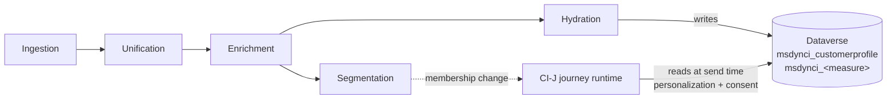
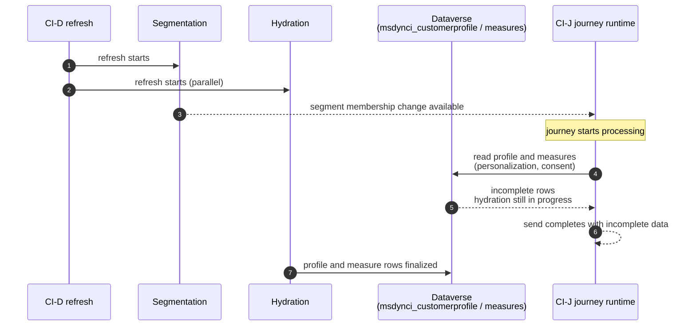

# Align journey quiet times with Customer Insights - Data refresh

When Customer Insights - Data and Customer Insights - Journeys are used together, journey runtime components such as personalization and consent evaluation read profile and measure data from the same Dataverse tables that Customer Insights - Data writes during a refresh. If a journey processes contacts while a refresh is still in progress, it can read incompletely updated data. This article describes how the timing arises and how to use journey quiet times to make sure journey processing only runs against fully updated profiles and measures.

## How Customer Insights - Data refreshes profiles and segments

A Customer Insights - Data system refresh runs a graph of nodes that work together to keep customer profiles and derived data up to date. Five of these nodes are relevant to journeys:

| Node | What it does | Learn more |
|------|--------------|------------|
| Ingestion | Brings source data into Customer Insights - Data. | [Get started with Customer Insights - Data](https://learn.microsoft.com/en-us/dynamics365/customer-insights/data/get-started) |
| Unification | Matches and merges data into unified customer profiles. | [Data unification overview](https://learn.microsoft.com/en-us/dynamics365/customer-insights/data/data-unification) |
| Enrichment | Cleans and augments unified data. | [Data enrichment overview](https://learn.microsoft.com/en-us/dynamics365/customer-insights/data/enrichment-hub) |
| Segmentation | Evaluates segment definitions and produces segment membership. | [Manage segments](https://learn.microsoft.com/en-us/dynamics365/customer-insights/data/segments) |
| Hydration | Writes profiles and measures to Dataverse as the `msdynci_customerprofile` table and one Dataverse table per measure (`msdynci_<measure>`). | [View tables in Customer Insights - Data](https://learn.microsoft.com/en-us/dynamics365/customer-insights/data/tables), [Create and manage measures](https://learn.microsoft.com/en-us/dynamics365/customer-insights/data/measures) |

Hydration is what makes Customer Insights - Data records available to other applications that read Dataverse, including the Customer Insights - Journeys runtime. The integration between the two products is described in [Use Customer Insights - Data profiles and segments in Customer Insights - Journeys](https://learn.microsoft.com/en-us/dynamics365/customer-insights/journeys/real-time-marketing-ci-profile).

> [!NOTE]
> Segmentation and hydration run as parallel steps within the refresh. The refresh does not guarantee that hydration has completed by the time updated segment membership becomes available.

## How journeys read Customer Insights - Data at runtime

A journey reads Customer Insights - Data records when it processes a customer. This applies to [segment-based journeys](https://learn.microsoft.com/en-us/dynamics365/customer-insights/journeys/real-time-marketing-segment-based-journey) and to [trigger-based journeys](https://learn.microsoft.com/en-us/dynamics365/customer-insights/journeys/real-time-marketing-trigger-based-journey) whose customer data type is set to **Profile (Customer Insights - Data)**. Two reads happen at runtime:

- [**Personalization**](https://learn.microsoft.com/en-us/dynamics365/customer-insights/journeys/real-time-marketing-personalization) expands tokens by reading from `msdynci_customerprofile` and any referenced measure tables.
- [**Consent evaluation**](https://learn.microsoft.com/en-us/dynamics365/customer-insights/journeys/real-time-marketing-compliance-settings) checks consent attributes that, for Customer Insights - Data sourced contacts, are stored on the same profile entity. See also [Manage consent for email, SMS, and custom channel messages](https://learn.microsoft.com/en-us/dynamics365/customer-insights/journeys/real-time-marketing-email-text-consent) and [Build segments using consent-based criteria](https://learn.microsoft.com/en-us/dynamics365/customer-insights/journeys/real-time-marketing-consent-segments).

Both reads use the current state of Dataverse at the moment the journey processes the contact.

Segments referenced by active journeys are kept on a frequent refresh cadence, as described in [Optimize segment refresh](https://learn.microsoft.com/en-us/dynamics365/customer-insights/journeys/auto-segment-management). The period during which timing matters can therefore recur multiple times per hour, not only at scheduled refresh times.

## Symptoms when journeys run during a refresh

When a journey processes a contact before hydration has finished writing the matching profile or measure rows, the journey can read incomplete data.

Common symptoms include:

- **Empty or default personalization values.** A token that maps to a measure that has not yet been hydrated renders as empty or as the configured fallback.
- **Contacts skipped at the consent gate.** If a consent attribute on the profile has not yet been written, the contact is treated as not consented and is not sent the message.
- **Inconsistent measure values within a single send.** Two contacts in the same batch can be processed on either side of the hydration update, producing different values.

These symptoms are more pronounced when continuous segment evaluation is enabled, because the period during which incomplete data can be read is no longer limited to a discrete window.

## Recommended configuration: align quiet times with the refresh window

[Quiet times](https://learn.microsoft.com/en-us/dynamics365/customer-insights/journeys/journey-quiet-times) let you configure a window during which a journey doesn't send messages. Messages that would otherwise be sent during a quiet time are held and processed when the quiet time ends.

To make sure a journey only evaluates personalization and consent against fully updated data, configure quiet times on the journey to cover the Customer Insights - Data refresh window, including a buffer.

```mermaid
gantt
    title CI-D refresh window vs CI-J quiet times
    dateFormat  HH:mm
    axisFormat  %H:%M

    section CI-D refresh
    Ingestion        :a1, 02:00, 25m
    Unification      :a2, after a1, 20m
    Enrichment       :a3, after a2, 20m
    Segmentation     :a4, after a3, 30m
    Hydration        :a5, after a3, 45m

    section CI-J journey
    Quiet times (held)  :crit, 01:45, 195m
    Normal sending      :active, 05:00, 120m
```

Configure the quiet time so that it:

1. **Begins before** the Customer Insights - Data refresh starts, with a few minutes of margin.
2. **Ends after** hydration has completed, not after segmentation has completed. Hydration generally takes longer than segmentation.
3. **Includes a buffer** for variance in refresh duration. Refresh duration changes with data volume, so a quiet time that fits the median refresh can be too short for a heavier run.

For details on configuring quiet times, see [Use quiet times in your journey](https://learn.microsoft.com/en-us/dynamics365/customer-insights/journeys/journey-quiet-times). Quiet times can be configured separately for commercial and transactional messages, and can use either the journey's time zone or each customer's time zone.

### Steps to apply this configuration

1. Identify the Customer Insights - Data refresh schedule for the environment. See [Schedule system refresh](https://learn.microsoft.com/en-us/dynamics365/customer-insights/data/schedule-refresh).
2. Measure the typical end-to-end refresh duration, including hydration, over a representative period. Use the longest observed duration as the basis for your quiet time, not the average.
3. Set quiet times on every journey that uses personalization tokens or evaluates consent against Customer Insights - Data sourced entities.
4. Review the configuration after changes to segment definitions, measure definitions, or source data volumes, because any of these can change refresh duration.

## Considerations

- **Scope of quiet times.** Quiet times apply to messages sent by the journey. Other applications that read the same Dataverse tables outside the journey runtime are not affected by this setting.
- **Quiet times defer sends; they don't change the underlying data.** A journey that processes after a quiet time ends reads Dataverse at the moment processing happens. The recommendation works because, by that moment, the data has been fully hydrated.
- **Time zones.** Quiet times are evaluated in the journey's time zone or in the customer's time zone, depending on configuration. Customer Insights - Data refresh schedules are typically configured in UTC. Convert times explicitly when configuring quiet times.

## Related information

- [Use Customer Insights - Data profiles and segments in Customer Insights - Journeys](https://learn.microsoft.com/en-us/dynamics365/customer-insights/journeys/real-time-marketing-ci-profile)
- [Use quiet times in your journey](https://learn.microsoft.com/en-us/dynamics365/customer-insights/journeys/journey-quiet-times)
- [Set up quiet times to prevent messages from being sent during unwanted hours](https://learn.microsoft.com/en-us/dynamics365/customer-insights/journeys/real-time-marketing-quiet-times)
- [Schedule system refresh](https://learn.microsoft.com/en-us/dynamics365/customer-insights/data/schedule-refresh)
- [Optimize segment refresh](https://learn.microsoft.com/en-us/dynamics365/customer-insights/journeys/auto-segment-management)
- [Personalize content](https://learn.microsoft.com/en-us/dynamics365/customer-insights/journeys/real-time-marketing-personalization)
- [Consent management overview](https://learn.microsoft.com/en-us/dynamics365/customer-insights/journeys/real-time-marketing-compliance-settings)
- [View tables in Customer Insights - Data](https://learn.microsoft.com/en-us/dynamics365/customer-insights/data/tables)
- [Create and manage measures](https://learn.microsoft.com/en-us/dynamics365/customer-insights/data/measures)
