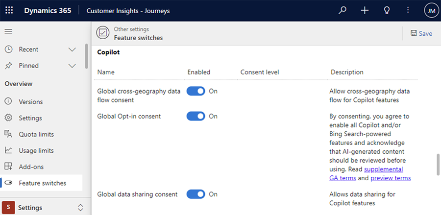

# Give consent to use Copilot in Customer Insights - Journeys

There are three levels of consent to use generative AI Copilot features in Customer Insights - Journeys. Consent is global for all users and all Copilot features in Customer Insights - Journeys, except for the Copilot for model-driven apps and capabilities of it, which is controlled uniquely by [the following Power Platform Admin Center settings](/power-apps/maker/model-driven-apps/add-ai-copilot). Consult that documentation to learn how you can control Copilot provided by the Power Platform used in Customer insights.
Within Customer insights the three levels of consent, which can be found at **Settings** > **Feature switches** > **Copilot**, are the following:
- **Global Opt-in consent**: **On** indicates you agree to enable all Copilot and/or Bing Search-powered features and acknowledge that AI-generated content should be reviewed before use. Default is **On**.
- **Global cross-geography data flow consent**: **On** indicates that you agree that data may be stored and processed outside of your geographic region, compliance boundary, or national cloud instance. If you're in a region where Azure OpenAI is deployed such as the United States and Switzerland, this field doesn't display (the default is **On** and can't be changed). Default is **Off** for all other regions where Azure OpenAI isn't deployed.
- **Global data sharing consent**: **On** indicates that you agree to allow Microsoft to capture and review inputs and outputs from Copilot features to improve Microsoft's models, features, and services. Default is **Off**.

## Required roles to provide consent

A Dynamics 365 Customer Insights - Journey admin role is required to change consent for opt-in and cross-geography levels.

## Give consent in Customer Insights - Journeys

1. Go to **Settings > Feature switches**, and then go to the **Copilot** section.

    > [!div class="mx-imgBorder"]
    > 

1. Enable or disable consent.
1. Select **Save**.

[!INCLUDE [footer-include](includes/footer-banner.md)]
