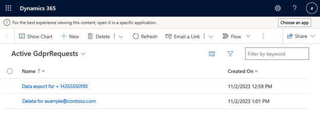

# Data subject request (DSR) handling

A data subject request (DSR) is an inquiry from an individual to see or delete the personal data that your organization stores, processes, and transmits. To view, create, or delete DSRs, in your web browser, take the base organization URL and append the following path and query:

```
/main.aspx?pagetype=entitylist&etn=msdynmkt_gdprrequest
```

The full, appended URL looks like this: `https://example.crm10.dynamics.com/main.aspx?pagetype=entitylist&etn=msdynmkt_gdprrequest`

Once you enter the URL in your browser, you'll see a screen with all the DSRs submitted:

> [!div class="mx-imgBorder"]
> 

Two types of DSRs are supported:

- Export
- Delete 

To create a new DSR, select the **New** button, fill in the Name, Request type, and Input. Input should contain the end user identifier that will be used for querying the data for export or deletion, such as an email address or phone number. Once all the required fields are filled out, create the request by selecting the **Save** button.

> [!div class="mx-imgBorder"]
> 

Field Progress is updated by the system and starts in **InProgress** state. Once the required DSR operation has been completed, the value will be changed to **Completed**. 

The **Data** field is only relevant for **Export** requests. Once the request is completed, it contains a file with all the data associated with the end user identifier from the input, such as interactions or saved email copies.

> [!div class="mx-imgBorder"]
> 

These requests work only on internal data that aren't directly accessible from Dataverse. To completely fulfill the end user's request, don’t forget to delete/export all the associated Dataverse rows, such as contact, lead, account, consent, and previous DSRs from that user, data from customizations, or data from other applications such as Sales and Service.

[!INCLUDE [footer-include](./includes/footer-banner.md)]