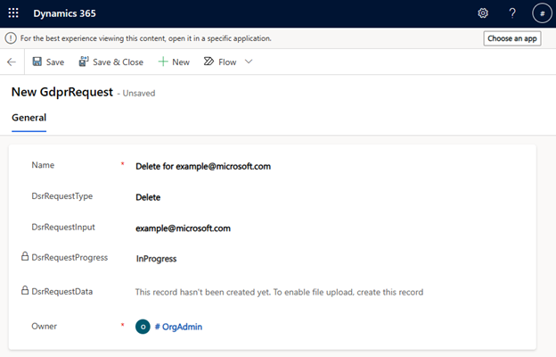

# DSR request handling in Customer Insights - Journeys

To view, create and delete DSR requests, in your web browser, take the base organization URL and append the following path and query: 

```
/main.aspx?pagetype=entitylist&etn=msdynmkt_gdprrequest
```

so that the full URL looks like this: [https://example.crm10.dynamics.com/main.aspx?pagetype=entitylist&etn=msdynmkt_gdprrequest](https://example.crm10.dynamics.com/main.aspx?pagetype=entitylist&etn=msdynmkt_gdprrequest)

You'll see a screen with all the DSR requests submitted:

> [!div class="mx-imgBorder"]
> 

There are two types of DSR supported: 

- Export
- Delete 

To create a new DSR, select the **New** button, fill in the Name, Request type and Input. Input should contain the end user identifier that will be used for querying the data for export or deletion, such as an email address or phone number. Once all the required fields are filled out, create the request by selecting the **Save** button.

> [!div class="mx-imgBorder"]
> 

> [!div class="mx-imgBorder"]
> 

Field Progress is updated by the system and starts in **InProgress** state. Once the required DSR operation has been completed, the value will be changed to Completed. The Data field is only relevant for **Export** requests and once the request is completed, it contains a file with all the data associated with the end user identifier from the input, such as interactions or saved email copies. 

> [!div class="mx-imgBorder"]
> 

Note that these requests work only on internal data that aren't directly accessible from Dataverse. To completely fulfill the end-users request, please don’t forget to delete/export all the associated Dataverse rows, such as Contact, Lead, Account, consent, previous DSR requests from that user, data from customizations and data from other applications such as Sales and Service.