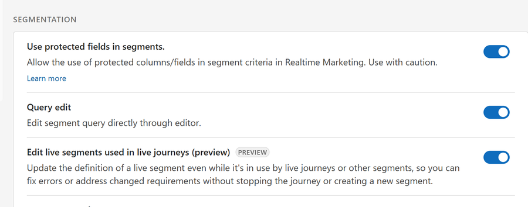
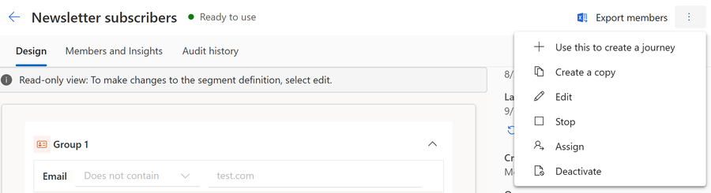
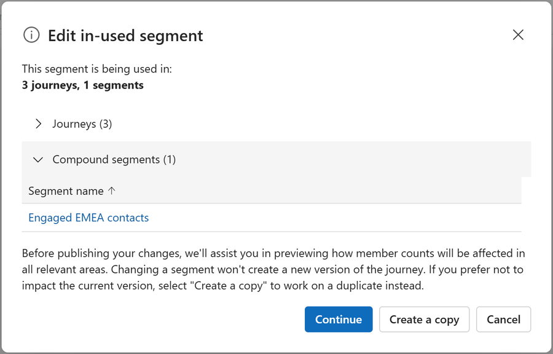
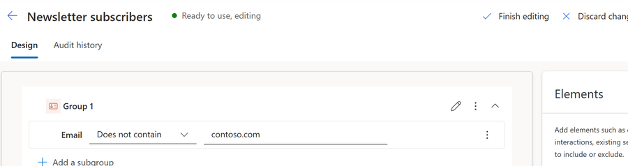
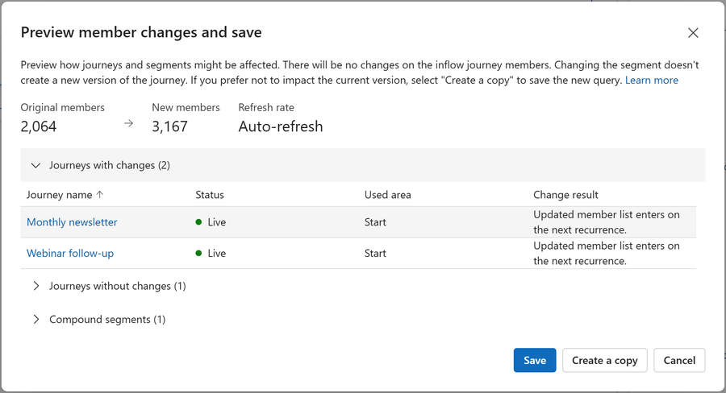
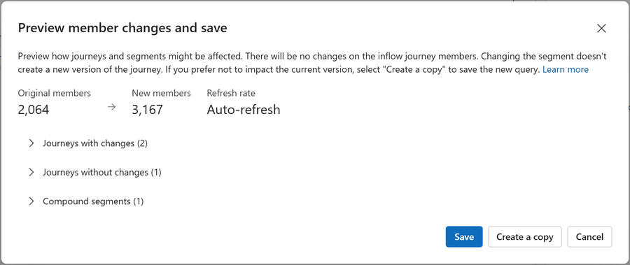
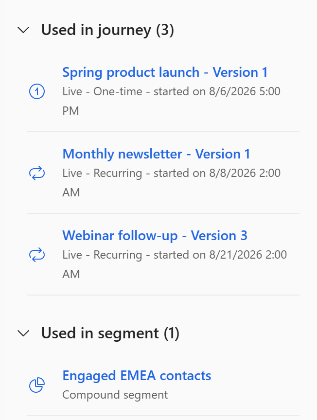
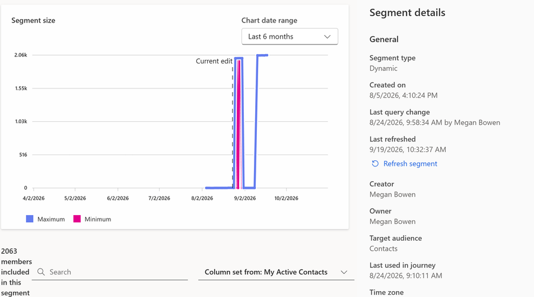

# Edit live segments used in live journeys (preview)

[!INCLUDE [preview-banner](~/../shared-content/shared/preview-includes/preview-banner.md)]

Requirements change after a campaign starts. You spot a typo in a query, a stakeholder asks you to widen the audience, or you realize an exclusion is missing. Previously in Dynamics 365 Customer Insights - Journeys, a live journey locked a segment it used. To change the segment, you had to stop the journey, create a new version, and start it again. That process interrupted the campaign and split your analytics across two journey versions.

Live segment editing removes that restriction. You can change the definition of a segment while the journeys that use it keep running, and your changes flow into those journeys at the next segment refresh. The journey isn't stopped, and no new journey version is created.

[!INCLUDE [preview-note](~/../shared-content/shared/preview-includes/preview-note.md)]

## Turn on live segment editing

Live segment editing is off by default. An administrator must turn it on.

1. Go to **Settings** > **Overview** > **Feature switches**.
1. Under **Segmentation**, set **Edit live segments used in live journeys** to **On**.
1. Select **Save** in the upper-right corner.

> [!div class="mx-imgBorder"]
> 

While the switch is off, the previous behavior applies: you can't edit segments that journeys or other segments depend on.

Learn more: [Use feature switches to enable or disable optional and preview features](admin-feature-switches.md)

## Two ways to edit a segment

The **Edit** command behaves differently depending on whether anything currently depends on the segment. Knowing which situation you're in tells you how much care the change needs.

| Consideration | Segment not used anywhere | Segment used by a live journey |
|---|---|---|
| What depends on it | Nothing | One or more live journeys, or other segments |
| Risk of the edit | Low - only this segment is affected | Higher - the audience of a running campaign changes |
| Confirmation before you edit | None | Dialog listing the journeys and segments that depend on it |
| Confirmation before you save | None | Dialog showing the estimated member count and what's affected |
| When it takes effect | At the next segment refresh | Depends on journey type - see [When your changes take effect](#when-your-changes-take-effect) |
| Effect on running journeys | None | New members flow in at the next refresh |

Both paths use the same segment builder. Only the confirmation steps and the consequences differ.

## Edit a segment that isn't used in a journey

If no journey or segment depends on the segment, editing works as it always has.

1. Go to **Audience** > **Segments** and open the segment.
1. Select **Edit**.
1. Change the query.
1. Save and publish the segment.

The segment recalculates on its normal schedule. Because nothing consumes it, there's no impact beyond the segment itself.

## Edit a segment used in a live journey

When live journeys or other segments depend on the segment, Customer Insights - Journeys adds two confirmation steps: one before you start editing, so you understand what you're touching, and one before you commit, so you can see the effect of what you changed.

1. Go to **Audience** > **Segments** and open the segment you want to change.

1. Select the **More commands** ellipsis, and then select **Edit**.

   > [!div class="mx-imgBorder"]
   > 

   The **Edit in-used segment** dialog lists the live journeys that use this segment and any segments that include it. Review the list to confirm you understand what your change affects. Selecting a journey or segment in the list opens it in a new tab, so you don't lose your place.

   > [!div class="mx-imgBorder"]
   > 

1. Select **Continue**.

   The segment opens for editing. The segment stays live throughout: it keeps running its current definition, and the journeys using it are unaffected until you save.

1. Change the query.

   Your changes are local to your browser session until you save them. Anyone else who opens this segment while you're working sees the original definition, not your unsaved changes.

   > [!div class="mx-imgBorder"]
   > 

1. Select **Finish editing**.

   The **Preview member changes and save** dialog summarizes the change before you commit it:

   - An **estimate** of the resulting member count, shown as **Original members** next to **New members**.
   - **Journeys with changes**, listing the journeys whose audience your change affects, with a **Change result** column that explains when each journey picks the change up.
   - **Journeys without changes**, listing the journeys that aren't affected, so you can see at a glance which campaigns actually shift.
   - **Compound segments**, listing any segments that include this segment and are therefore also affected.

   > [!div class="mx-imgBorder"]
   > 

1. Choose how to proceed:

   | Option | What it does |
   |---|---|
   | **Save** | Applies your changes to the live segment. The journeys using it pick up the new membership at the next refresh. |
   | **Create a copy** | Saves your changes as a new segment and leaves the original untouched. Use this when you want to keep the live campaign exactly as it is. |
   | **Cancel** | Closes the dialog and returns you to editing. To abandon your changes entirely, select **Discard changes** in the command bar. |

   > [!div class="mx-imgBorder"]
   > 

> [!IMPORTANT]
> Your changes only exist in your browser until you select **Save** or **Create a copy**. If you navigate away or close the tab, they're discarded. The **Editing** state you see while working isn't saved to the segment record, so the segment never appears to be stuck mid-edit for other users.

## See where a segment is used

Before changing a segment, check what depends on it. Open the segment and review its usage information, which shows:

- The journeys that use the segment, and the journey type.
- The journey version, so you can tell apart multiple versions of the same journey.
- The journey start date.
- Other segments that include this segment.

The same information appears in the dialog when you select **Edit**, so you can review it without leaving the editing flow.

> [!div class="mx-imgBorder"]
> 

## Update a segment without creating a new journey version

This feature offers a significant benefit, so it's important to be clear about what changes and what doesn't change.

When you select **Save**, Customer Insights - Journeys updates and republishes **the segment**. It doesn't modify the journey, so:

- The journey isn't stopped or paused.
- No new journey version is created.
- The journey keeps its original start date, its analytics, and its history.
- People already moving through the journey continue uninterrupted.

The journey simply reads the segment's updated membership the next time it looks. That's why the audience changes without the journey itself changing.

Editing the **journey** - adding a tile, changing a message, changing entry criteria - is a different operation and still creates a new journey version. Only the segment definition can be changed in place this way.

> [!TIP]
> If you want a different audience *and* a different journey design, edit the journey as usual. Use live segment editing when the journey is right and only the audience definition needs correcting.

## When your changes take effect

Saving a segment doesn't immediately recalculate it. A segment execution that's already running finishes with the definition it started with, and your new definition is picked up at the next execution. This condition means there's a short window after you save where members calculated from the previous definition can still arrive.

How quickly your change reaches a journey depends on the journey type.

| Journey type | When your change applies |
|---|---|
| **One-time** | A one-time journey reads its audience once, when the run starts. Your change only affects the run if you save it, and the segment recalculates, before that snapshot is taken. After the snapshot, the current run is unaffected. |
| **Recurring** | Each occurrence takes its own snapshot. The occurrence that's already running keeps the audience it started with. Your change applies from the **next occurrence** onward. |
| **Ongoing** | An ongoing journey checks the segment periodically and admits newly qualifying people as it goes. Your change is picked up at the next segment refresh, and new members start flowing in from that point. |
| **Trigger-based** | The journey uses the updated segment membership once the segment has refreshed. |

The segment's own refresh schedule determines how long "the next refresh" takes. Learn more: [Understand automated segment refresh and data freshness](auto-segment-management.md)

The segment's role in the journey also matters.

| Segment role | When your change applies |
|---|---|
| **Entry audience** | Follows the journey type in the previous table. |
| **Exclusion segment** | Controls who's allowed in. Applies to people admitted after the next refresh - it doesn't remove people who already entered. |
| **Exit (suppression) segment** | Checked at every journey step, so the change takes effect as each person reaches their next step. This role is the fastest-acting role and the best way to stop people mid-journey. |
| **Segment used in a condition** | Evaluated when a person reaches the condition, using the membership available at that moment. |
| **Parent (compound) segment** | Applies after the parent segment re-evaluates. |
| **Child (nested) segment** | See [Nested and compound segments](#nested-and-compound-segments). |

## Confirm when a segment was last changed

After you save a change - or when you're investigating why a journey's audience shifted - you can check when the segment definition was last edited.

Two places show this information:

- **The Members and Insights tab**: The **Segment size** chart marks each saved change with a vertical line. **Current edit** marks the most recent change, and **Previous edit** marks the one before it, once the segment has more than one recorded change. Because the lines are plotted against the membership line, you can see at a glance whether a rise or drop in members lines up with an edit. Set **Chart date range** to a period that includes the edit you're looking for - a change made weeks ago doesn't appear in the default **Last 7 days** range.
- **The side pane**: The **Segment details** pane on the right shows **Last query change**: the exact date and time of the most recent edit, together with the user who made it.

The chart lines record only *when* a change was saved. Neither the lines nor the side pane show *what* changed in the segment definition. Only the most recent edit identifies its author - the **Previous edit** line is a timestamp on its own.

This information appears for every segment, not only for segments edited while they're live.

> [!div class="mx-imgBorder"]
> 

> [!TIP]
> If a journey's audience changes unexpectedly, compare the **Current edit** timestamp against when the change in membership appeared. If membership shifted shortly after that timestamp, a segment edit is the likely cause, and the side pane tells you who to ask about it.

## What happens to people already in the journey

Removing someone from a segment doesn't remove them from a journey they already entered. This behavior prevents a segment edit from silently cutting off customers partway through a campaign, possibly after they receive part of a message sequence.

After you save a narrower segment definition:

- People who newly match the segment enter the journey at the next refresh.
- People who no longer match, but already entered, **continue and complete the journey**.
- People who already finished aren't affected and don't re-enter.

To stop people who are already in a journey, use an **exit segment** instead. Exit segments are checked at each step, so affected people leave the journey when they reach their next step.

## Nested and compound segments

You can edit child segments and parent segments alike, but changes to a child segment reach a journey in two stages:

1. The child segment re-evaluates with your new definition.
1. The parent segment re-evaluates, using the child's updated membership.

Only then does the journey see the change. Plan for both evaluations to complete, especially before a one-time journey's snapshot or a recurring journey's next occurrence. Editing the parent segment directly avoids the extra stage.

## Static segment groups are read-only while you edit

If your segment contains a static group - a fixed list of people rather than a query - that group becomes read-only while you're editing a segment that a live journey uses. During live editing you can't:

- Upload a CSV file.
- Create a new manual static list.
- Add or remove individual members of a static group.
- Delete a static group.

You can still edit the query-based (dynamic) groups in the same segment, and the static group keeps its existing members. If you need to change a static list that a live journey uses, select **Create a copy** to work on a separate segment, or stop the journey first.

## Segments from Customer Insights - Data

Segments that originate in Dynamics 365 Customer Insights - Data are still edited in Customer Insights - Data, not in Customer Insights - Journeys. Changes have to complete a Customer Insights - Data refresh and then sync to Customer Insights - Journeys before a journey can use them, so allow noticeably more time than for a segment built in Customer Insights - Journeys.

Learn more: [Use Customer Insights - Data profiles and segments in Customer Insights - Journeys](real-time-marketing-ci-profile.md)

## Things to watch for

- **Changes aren't instant.** Nothing recalculates the moment you save. Every change waits for the next segment execution, and then for the journey to read the result.
- **There's a brief overlap after saving.** A segment execution already in progress completes with the previous definition, so members from the old definition can still arrive shortly after you save.
- **The member count is an estimate.** The number in the **Finish editing** dialog helps you sanity-check the size of your change. It isn't a preview of the exact membership.
- **Only one person should edit at a time.** Other users see the published definition while you work, so concurrent edits to the same segment can overwrite each other.
- **Check the whole dependency list.** A segment can feed several journeys and other segments at once. The dialog shown when you select **Edit** is the reliable place to confirm the full impact.

## Related information

- [Understand automated segment refresh and data freshness](auto-segment-management.md)
- [Understand and verify segment member counts](understand-verify-segment-member-counts.md)
- [Create a segment-based journey](real-time-marketing-segment-based-journey.md)
- [Segmentation overview](real-time-marketing-segments.md)
- [Edit email components in a live journey](edit-email-in-live-journey.md)
- [Use feature switches to enable or disable optional and preview features](admin-feature-switches.md)

[!INCLUDE [footer-include](./includes/footer-banner.md)]
