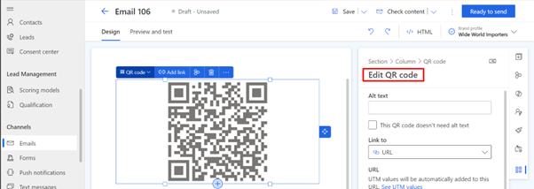
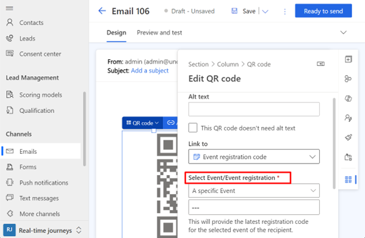
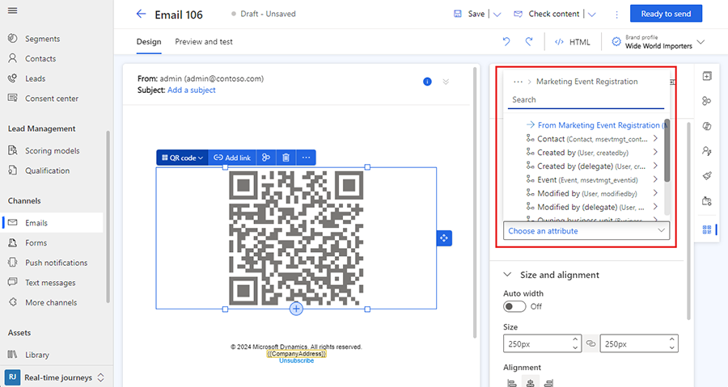

# Use QR codes for event registration, links to content, or URLs

Adding a QR code to your emails is a convenient way to link to key information and increase customer engagement. You can use QR codes to allow email recipients to register for an event, or you can use a code to link to a survey, a file, or a specific URL. You can even connect a QR code to a journey trigger, enabling you to use dynamic data from the trigger for event details and personalized registration codes.

## Add a QR code link to a URL, a survey, or a file

You can add a QR code to link to various sources of information in just a few steps:

1. Create an email in the email designer.
1. Open the **Elements** pane and drag a QR code element into your email.
1. In the **Edit QR code** pane, choose the **Link to** dropdown and select what you want the QR code to link to. When linking to a file or a video, you can either upload a new file or link to an existing piece of media in your asset library.

    > [!div class="mx-imgBorder"]
    > 

1. Using the options in the **Edit QR code** pane, you can further customize the size, alignment, and border spacing of the QR code. You can also enable tracking of recipient usage.

## Add a QR code link to an event registration

Using QR codes for events, you can:

- Link to crucial event details, including personalized information derived from a trigger like:
    - Recipient's name.
    - Event date and time.
    - Venue details.
    - Specific instructions or additional information.

- Facilitate faster check-ins:
    - A personalized QR code is an efficient way for attendees to check in at the event.
    - Event organizers can employ QR code scanners or mobile apps to effortlessly validate registrations, reducing the time and resources traditionally required for manual check-ins.

- Tailor the QR code functionality to accommodate various event scenarios.
    - For example, if there are different types of events or if the same event occurs multiple times, the QR code can be adapted to convey specific details related to each instance.

To link to an event, you must first [create the event](set-up-event.md). After you create your event, create an email and add a QR code as described in the previous steps. The options you choose for your QR code depend on whether you want to link to a specific event, or whether you want to use a trigger to supply event details for the QR code.

### Link a QR code to a specific event

To link to a specific event:

1. Select the QR code and open the **Edit QR code** pane.
1. On the **Link to** dropdown, select **Event registration code**.
1. On the **Select Event/Event registration** dropdown, select **A specific event**.
1. In the lookup field below the dropdown, find the event you want to link to.

> [!IMPORTANT]
> When using a QR code to link to a specific event, the QR code only provides a registration ID. To implement verification, check-in, and registration features, event organizers must do some custom development. One way to do this could be by creating a custom smartphone app.

> [!div class="mx-imgBorder"]
> 

### Use trigger attributes to supply event details

You can use a trigger as a data source for dynamic data for event details including a QR code that shows a personalized registration code for the recipient, enabling faster check-ins. To create a QR code link to a personalized, dynamic registration code:

1. Select the QR code and open the **Edit QR code** pane.
1. On the **Link to** dropdown, select **Event registration code**.
1. On the **Select Event/Event registration** dropdown, select **From other source**.
1. On the **Choose an attribute** dropdown, select the data source to link to.

> [!div class="mx-imgBorder"]
> 

It's recommended to test your email by sending a preview email to yourself or a colleague.

The integration of QR codes in event-related emails, driven by triggered journeys and dynamic data, not only enhances personalization but also significantly contributes to the efficiency of event management, particularly during the check-in process.
