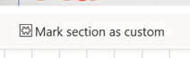

# Use enhanced HTML controls and import HTML snippets

This article details how to use live coding and custom code tagging in the Customer Insights - Journeys email editor.

As a marketer, you want to send emails that are engaging and personalized for your customers. Sometimes, you may need to modify the HTML or add custom HTML code to achieve specific design features and layout options. However, editing the HTML or importing custom HTML code can cause rendering issues and display differences across various email clients and devices. To help you deal with these issues, the Customer Insights - Journeys email editor includes enhanced HTML controls that allow you to edit emails in real-time and protect your custom code from post-processing.

This feature lets you:
- Mark a section of an email as custom and make sure that it's kept from post-processing and rendering changes.
- Code in HTML and see the changes right away in the email.
- Import HTML code into the email editor as a custom section.

The next sections explain how to use the enhanced HTML controls feature in the email editor and describe its advantages and limitations.

> [!NOTE]
> Be aware that when you create a custom section, any rendering support is lost.

## Enable the enhanced HTML controls

To turn on or off this feature:
1. Go to **Settings** > **Overview** > **Feature switches**.
1. **Enable** or **disable** the enhanced HTML controls toggle inside **Email editor** section.

## How to use the enhanced HTML controls

> [!NOTE]
> To get the best experience, move the dock to the bottom of the page, as shown below.
> :::image type="content" source="media/use-dock-for-enhanced-experience.png" alt-text="Use dock at the page bottom for better experience.":::

To mark sections of an email as custom, you need to use the **Mark section as custom** feature. This feature allows you to indicate that certain parts of the email shouldn't be modified by post-processing and should retain their original rendering behavior. You can also select any section of the email and edit the HTML code directly in the code editor.

To use the custom code tagging feature, follow these steps:
1. Select the section of the email that you want to mark as custom.
1. Select the **Mark section as custom** button on the top left corner of the HTML editor window.

    > [!div class="mx-imgBorder"]
    > 

1. See the selected code wrapped with the custom code tags in the code editor and the marked code highlighted with a green border in the live preview of your email and in HTML window.

To import an HTML code snippet, select the **Import code snippet** button on the top of the HTML editor window. This opens a window where you can import a code snippet that you can use in your emails. 

To insert a code snippet into your email, follow these steps:
1. Select the section where you want to import the code. 
1. Select the **Import code snippet** button on the HTML editor window.

    > [!div class="mx-imgBorder"]
    > 

1. See the code snippet added to the HTML editor and the live preview of your email highlighted with a green border in the live preview of your email and in the HTML window.

## Benefits and limitations of the enhanced HTML controls feature

The enhanced HTML controls feature provides several benefits for marketers who want to use custom HTML code in their emails. Some of the benefits are:

- It simplifies the email creation process by allowing you to code and preview your emails in real-time.
- It gives you more control over how you display information and how it renders across devices and email clients.
- It protects your custom code from post-processing and ensures that it displays as intended.
- It reduces the need for external tools and services to edit and test your emails.
- It helps you avoid rendering issues and support tickets by providing you with user-friendly HTML editor.

However, the enhanced HTML controls feature also has some limitations that you should be aware of. Some of the limitations are:

- By marking section as custom all email client compatibility processing will be disabled and you should test your emails before sending.
- It doesn't support dynamic content or personalization tokens. These features may not display correctly or may cause errors in the email client.

You should use the enhanced HTML controls feature with caution and follow best practices for creating emails with custom HTML code.