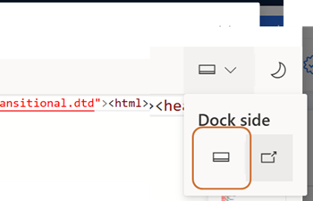

# Preview: Using Enhanced HTML Controls and Importing HTML Code Snippets in Email Editor

A guide for marketers on how to use the new feature of live coding and custom code tagging in Dynamics 365 Customer Insights - Journeys email editor.

> [!IMPORTANT]
> A preview feature is a feature that is not complete, but is made available before it’s officially in a release so customers can get early access and provide feedback. Preview features aren’t meant for production use and may have limited or restricted functionality.
>
> Microsoft doesn't provide support for this preview feature. Microsoft Dynamics 365 Technical Support won’t be able to help you with issues or questions. Preview features aren’t meant for production use, especially to process personal data or other data that are subject to legal or regulatory compliance requirements.

As a marketer, you want to send emails that are engaging and personalized for your customers. Sometimes, you may need to modify the HTML or add a new custom HTML code to get specific design features and layout options. However, editing the HTML or importing a new custom HTML code can cause rendering issues and display differences across various email clients and devices. To help you deal with these issues, Dynamics 365 Customer Insights - Journeys introduces a new feature of enhanced HTML controls that allows you to edit your emails in real-time and protect your custom code from post-processing.

This feature lets you:
- Mark a section of the email as custom and make sure that they are kept from post-processing and rendering changes.
- Code in HTML and see the changes right away in the email.
- Import HTML code into the email editor as a custom section.

This document will show you how to use the enhanced HTML controls feature in Dynamics 365 Customer Insights - Journeys email editor and describe its advantages and limitations.

> [!NOTE]
> Please be aware that when you create a section custom, any rendering support is lost.

## Enable Copilot

To turn on or off this feature:
1. Go to **Settings > Overview > Feature switches**.
1. **Enable** or **disable** the enhanced HTML controls toggle inside Email editor section.

## How to use the enhanced HTML controls feature

> [!NOTE]
> To get the best experience, move the dock to the bottom of the page as shown below.

> [!div class="mx-imgBorder"]
> 

To mark sections of the email as custom, you need to use the “**Mark section as custom**” feature. This feature allows you to indicate that certain parts of the email should not be modified by post-processing and should retain their original rendering behaviour. You can also select any section of the email and edit the HTML code directly in the code editor. 

To use the custom code tagging feature, follow these steps:
- Select the section of the email that you want to mark as custom.
- Select the “**Mark section as custom**” button on the top left corner of the HTML editor window.

> [!div class="mx-imgBorder"]
> 

- See the selected code wrapped with the Custom code tags in the code editor and marked code highlighted with a green border in the live preview of your email and in HTML window.

To import HTML code snippet, you need to select the “**Import code snippet**” button on the top of the HTML editor window. This will open a window where you can import a code snippet that you can use in your emails. 

To insert a code snippet into your email, follow these steps:
- Select the section where you want to import the code. 
- Select the “**Import code snippet**” button on the HTML editor window.

> [!div class="mx-imgBorder"]
> 

- See the code snippet added to the HTML editor and the live preview of your email highlighted with a green border in the live preview of your email and in HTML window.

## Benefits and limitations of the enhanced HTML controls feature

The enhanced HTML controls feature provides several benefits for marketers who want to use custom HTML code in their emails. Some of the benefits are:

- It simplifies the email creation process by allowing you to code and preview your emails in real-time.
- It gives you more control over how you display information and how it renders across devices and email clients.
- It protects your custom code from post-processing and ensures that it displays as intended.
- It reduces the need for external tools and services to edit and test your emails.
- It helps you avoid rendering issues and support tickets by providing you with user-friendly HTML editor.

However, the enhanced HTML controls feature also has some limitations that you should be aware of. Some of the limitations are:
- By marking section as custom all email client compatibility processing will be disabled and you should test your emails before sending.
- It does not support dynamic content or personalization tokens. These features may not display correctly or may cause errors in the email client.

Therefore, you should use the enhanced HTML controls feature with caution and follow the best practices for creating emails with custom HTML code. 

## Conclusion

The enhanced HTML controls feature is a handy and powerful tool for marketers who want to use custom HTML code in their emails. It allows you to modify your emails in real-time, label your custom code, and import code snippets that work well with hybrid layouts. It also helps you simplify the email creation process, avoid rendering issues, and reduce support tickets. However, you should also know the limitations of this feature and test your emails before sending them to your customers. 