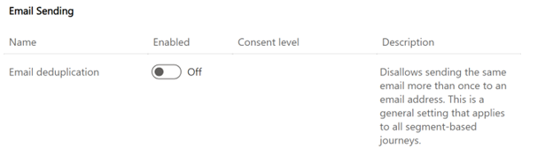

# Prevent duplicate emails to shared email addresses

When email deduplication is enabled, the journey checks the email addresses of the contacts in the segment (once they reach the email tile) and only send one email to each unique address. For example, if three contacts have the same email address, only one of them receives the email. The other two are reported as **blocked** under the **Duplicate recipient address** category in the **Delivery and interaction details**.

When email deduplication is disabled (default), the journey sends the email to every contact in the segment, even if they share an email address.

## How to enable email deduplication

1. Go to **Settings** and select **Feature switches**.

2. Enable the **Email deduplication** feature toggle in the "Email sending" section.

> [!div class="mx-imgBorder"]
> 

## How to view duplicated email addresses

You can view duplicated email addresses by going to your journey or email **Delivery and interaction details**.

When you view the insights, you see all duplicated email addresses in the **blocked** section under the **Duplicate recipient address** category.

> [!NOTE]
> When an email is blocked due to duplication, the customer proceeds to the next step in the journey. If you want customers to exit a journey when duplication is detected, you can use the journey exit by trigger option. For the trigger, choose "Email blocked" and for the **Reason**, select *contains* the keyword "Duplicate." To learn more, see [Exit when a trigger occurs](real-time-marketing-segment-based-journey.md#other-journey-configurations).

> [!IMPORTANT]
> Email deduplication works on the email level per journey. So, email duplication will not be detected if you are:
> 1. Sending the same email across multiple journeys. For each journey, the email will be sent once.
> 2. Sending the same email in different tiles in the journey. E.g, A/B testing, attribute branching, etc. Each email is considered unique email even if you are sending the same email.

[!INCLUDE [footer-include](./includes/footer-banner.md)]
