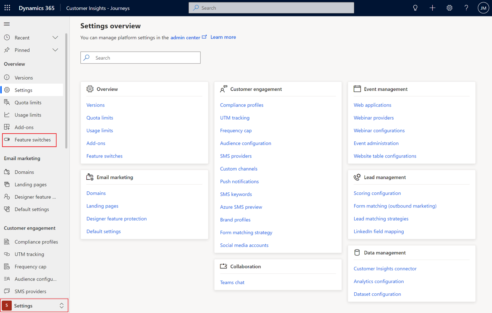
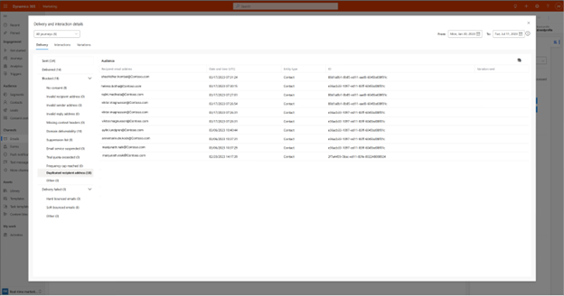

# Email deduplication

Email deduplication allows you to stop sending the same email more than once to the same email address. The email deduplication is a general setting that applies only to segment-based journeys.

Email deduplication happens per journey per email tile. With this you can:
- Execute multiple journeys simultaneously on the same email address.  
- Send the same email twice to an email address if the same email is used in two tiles in the customer journey.  
- If a customer journey is set up on a way like "run every week/day", for example, then we'll send the same email to the same email address once per week/day.  Email deduplication is disabled by default.

## How to enable email deduplication

1. Go to **Settings** and select **Feature switches**. 

> [!div class="mx-imgBorder"]
> 

2. Enable the feature in the Email Sending section. 

> [!div class="mx-imgBorder"]
> 

## How to view duplicated email address

You can view duplicated email addresses by going to your journey or email “**Delivery and interaction details**”.

When you view the insights, you'll see all duplicated email addresses in the **blocked** section, under the “**Duplicate recipient address**” category.

> [!div class="mx-imgBorder"]
> 