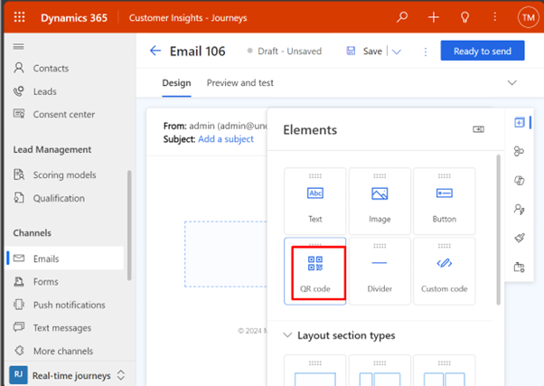
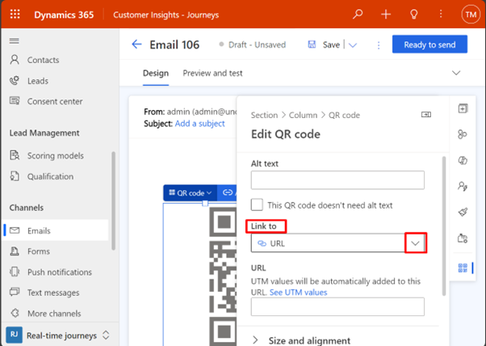

# Use QR Codes to create and design a marketing email message

Using QR codes in your emails can provide a convenient and engaging experience for your customers. Automated and triggered journeys streamline the email marketing process, while QR codes expedite event check-ins, saving time for both organizers and attendees. You can design your emails to use the trigger as a data source for dynamic data for event details that includes a QR code that: 

1. Contains crucial event details, including personalized information derived from the trigger like:
    - Recipient's name
    - Event date and time
    - Venue details
    - Any specific instructions or additional information

2. Facilitating Faster Check-ins:
    - The personalized QR code serves as a quick and efficient way for attendees to check in at the event.
    - Event organizers can employ QR code scanners or mobile apps to effortlessly validate registrations, reducing the time and resources traditionally required for manual check-ins.

3. Tailor the QR code functionality to accommodate various event scenarios.
    - For example, if there are different types of events or if the same event occurs multiple times, the QR code can be adapted to convey specific details related to each instance.

## Design your email content using QR Code

Use Customer Insights - Journeys to create a [trigger-based journey](real-time-marketing-trigger-based-journey.md) that starts when a contact registers for the webinar on your website.

Follow the steps below on how a QR Code can help you with all your content personalization:

**Step 1**: To create a trigger-based journey that starts when a contact registers for your event, you need to first define a **trigger** that captures the registration data from your website or app. Learn more [here](real-time-marketing-triggers.md).

**Step 2**: Next, you need to design your email content that confirms the registration and provides the QR code to the contact. You can use the **email designer** tool to create your email template. Learn more [here](email-design.md).

**Step 3:** To add a QR code to your email, you need to drag and drop a QR code tile from the content panel to the email canvas. 
- You can customize the appearance of the QR code by changing its size, color, and alignment. You also need to specify the data that the QR code will contain, which is the unique registration ID of the contact. To do this, you need to select the QR code tile and select the edit icon.

> [!div class="mx-imgBorder"]
> 

> [!div class="mx-imgBorder"]
> 

- In the QR code settings panel, you need to select the **Link to** section in the right panel. Select the dropdown and choose the attribute as per your requirement such as **Event Registration Code**.

> [!div class="mx-imgBorder"]
> 

**Step 4:** After you select your attribute, you'll be asked to select the Event registration tile. In this case, you can select your specific event for a particular QR Code.

> [!div class="mx-imgBorder"]
> 

**Step 5:** After you finish designing your email content, you need to save and publish your email and journey. You can also test your email and journey by sending a preview email to yourself or a colleague. Now, whenever a contact registers for your event, they'll receive a confirmation email with a QR code that they can scan to check in or access other event-related content.

## Conclusion

The ability to use the specific event option ensures that the QR code functionality can be tailored to diverse event types or scenarios. The integration of QR codes in event-related emails, driven by triggered journeys and dynamic data, not only enhances personalization but also significantly contributes to the efficiency of event management, particularly during the check-in process.
