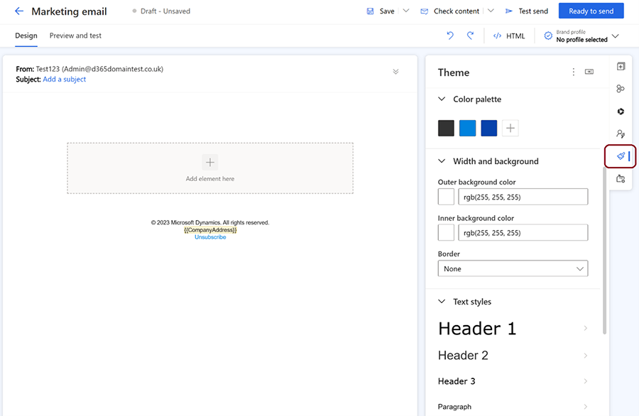
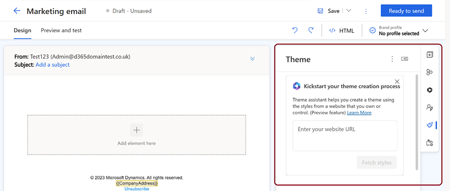

# Copilot - Style your emails with AI-assisted themes (preview)

[!INCLUDE [preview-banner](~/../shared-content/shared/preview-includes/preview-banner.md)]

> [!WARNING]
>  The following Copilot public preview features will be discontinued and removed in May 2025: 
> - Style your emails with AI-assisted themes
> - Style your forms with AI-assisted themes
> - Style your brand profiles with AI-assisted themes 

This article describes the email theme functionality, which uses Copilot to customize the appearance of email fields, buttons, and text.

> [!NOTE]
> Unless a style is explicitly set in the element properties, the default style is replaced with the email theme style.

[!INCLUDE [preview-note](~/../shared-content/shared/preview-includes/preview-note.md)]

## What is the theme functionality?

Theme allows you to control the style of your email elements such as fields, buttons, and text. You can access the theme feature by selecting the brush icon in the right pane of the email designer. Theme applies the same style to all elements of the same type in your email. For example, if you change the color of a text field, all text fields in your email change to the same color.

## Edit email element styles using the theme functionality

To edit the style of email elements, select the theme (brush) icon in the right pane, then select the element type from the theme section. Choose from input fields, buttons, text, labels, or error messages. Once you select an element type, customize its properties such as font, color, size, border, and background. You can preview the changes in the email editor.

> [!div class="mx-imgBorder"]
> 

## How to use the theme Copilot assistant

> [!IMPORTANT]
> You must only use the theme assistant with websites that you own and operate. The theme assistant should not be used to copy third-party websites.

The theme assistant is a Copilot feature that helps you match the style of your email with your existing website. You can use the theme assistant to fetch the style from a website that you own and apply it to your email theme. To use the theme assistant:

1. Enter the website URL in the theme assistant section and select **Fetch styles**. This process may take a few minutes.
1. Once the theme assistant fetches the style from your website, it applies the style to your email theme. You can see the changes in the email editor.
1. If you're happy with the result, you can save your email theme. If you want to make further adjustments, you can edit the style of your email elements using the theme pane.

> [!div class="mx-imgBorder"]
> 

[!INCLUDE [footer-include](./includes/footer-banner.md)]
