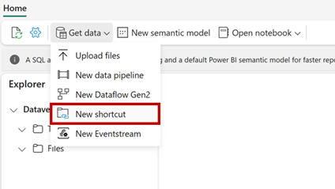
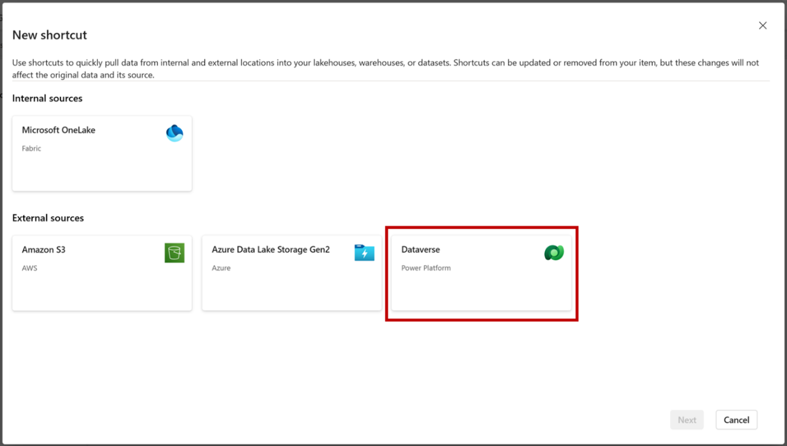

# Customer Insights - Journeys integration with Microsoft Fabric overview

> [!IMPORTANT]
> As of July 31, 2024, Customer Insights - Journeys integration with Microsoft Fabric is generally available. To avoid service disruptions, preview users of the integration with Microsoft Fabric must follow the [Transition to general availability guidance](fabric-integration.md#transition-to-general-availability). Access to the preview version/folder will be removed on December 7.

In Customer Insights - Journeys, you can effortlessly create custom Power BI reports tailored to your business needs by using Microsoft Fabric capabilities. Harness seamless access to data to gain a complete understanding of your campaigns, lead management, market performance, and customer engagement, enabling you to identify new opportunities.

Integrating Dynamics 365 Customer Insights - Journeys with Microsoft Fabric automatically makes all your marketing data available for analysis in Microsoft Fabric without having to copy data, build extract, transform, and load (ETL) pipelines, or use third-party integration tools. Fabric integration allows you to get direct access to your marketing data storage and effortlessly create custom reports in Power BI (PBI) without the need to export the data.

Dynamics 365 data doesn’t leave the Dataverse governance boundary. As data gets updated, changes are reflected in Microsoft Fabric automatically. Dataverse also generates an enterprise-ready Synapse Lakehouse and SQL endpoint for your Dynamics 365 data. This makes it easier for data engineers and Database (DB) admins to combine data from multiple sources and build custom analytics with Spark, Python, or SQL. 

Makers can build low-code apps and automation to orchestrate business processes and react to insights found in Microsoft Fabric using connectors to over 1,000 apps. Add those insights back to Dataverse as external or virtual tables through the SQL endpoint and makers can turn them into low-code apps with Power Apps, Power Pages, or Power Automate using skills they already have.

## Onboarding

The following sections explain how to set up Power BI and access your Customer Insights - Journeys data by creating shortcuts in Fabric.

### Set up Power BI

1. [Launch Power BI](https://app.powerbi.com) with Microsoft Fabric.
1. Enable or check if Fabric is enabled for your tenant. Learn more: [Enable Microsoft Fabric for your organization](/fabric/admin/fabric-switch)

    :::image type="content" source="media/setting-up-pbi.png" alt-text="Set-up Power BI screenshot." lightbox="media/setting-up-pbi.png":::

1. The Fabric integration feature is only available in premium workspaces. If you don’t have [Fabric capacity](/fabric/enterprise/licenses) or Power BI premium capacity, you can sign up for free Fabric trial capacity: [Fabric trial](/fabric/get-started/fabric-trial).
1. It's highly recommended that you create a new Power BI workspace to work with your Customer Insights - Journeys data.
1. To confirm that you can create a premium workspace, go to **Workspace settings** > **License info** and ensure that you have **Trial**, **Fabric**, or **Premium** capacity selected.

    :::image type="content" source="media/set-workspace-settings.png" alt-text="Create your workspace as per your requirement." lightbox="media/set-workspace-settings.png":::

### Create Fabric shortcuts for the Customer Insights Journeys folder

1. Start by [opening Fabric](https://app.fabric.microsoft.com).
1. Create or open a Workspace.
1. Create or open a Lakehouse.
1. From the Lakehouse choose **Get data** and select **New shortcut**.

    > [!div class="mx-imgBorder"]
    > 

1. Select **Dataverse** from the shortcut source types.

    > [!div class="mx-imgBorder"]
    > 

1. Supply your Dataverse environment URL (Example: orgname.crm.dynamic.com) and the credentials that you want to access the environment with. Dataverse shortcuts utilize a delegated authorization model. All data access through the shortcut utilizes this credential. This credential must have System Administration permission in the Dataverse environment. Be sure to secure access to this workspace before sharing this data with your users.
1. Choose the tables that you want to create a shortcut to. Each table is its own shortcut in the Lakehouse. Customer Insights - Journeys interaction data tables appear in the left menu under the **"Customer Insights Journeys"** folder. The Customer Insights Journeys folder only lists the interaction types for which data has been generated up to that point.

    > [!IMPORTANT]
    > If you don't see all your Dataverse tables (CDS2 folder), you may need to configure your Dataverse environment. Use [Link to Fabric](/power-apps/maker/data-platform/azure-synapse-link-view-in-fabric) to update the available tables.
    
    :::image type="content" source="media/link-to-fabric-through-shortcut.png" alt-text="Link to fabric through shortcut." lightbox="media/link-to-fabric-through-shortcut.png":::

> [!NOTE]
> If some of your Dataverse tables aren't visible in Fabric, use the **Link to Microsoft Fabric** feature in the PowerApps maker portal. Learn more about prerequisites and review the setup instructions: [Link your Dataverse environment to Microsoft Fabric and unlock deep insights](/power-apps/maker/data-platform/azure-synapse-link-view-in-fabric)

### Work with Customer Insights - Journeys interactions in Power BI

1. With your tables now available in your Lakehouse, you can now start analyzing your Customer Insights - Journeys data with Fabric. Use Dataverse shortcuts with Spark Notebooks, the SQL endpoint, and Power BI reports.

    From your Lakehouse, you can open the SQL endpoint.

    :::image type="content" source="media/use-sql-analytics-endpoint.png" alt-text="Use SQL analytics endpoint." lightbox="media/use-sql-analytics-endpoint.png":::

    And you can start writing queries against your data.

    :::image type="content" source="media/use-sql-analytics-endpoint-to-write-queries.png" alt-text="Use SQL analytics endpoint to write queries." lightbox="media/use-sql-analytics-endpoint-to-write-queries.png":::

1. Leverage Fabric capabilities including Power BI to create reports from your data or have Copilot help you get started. Here are a couple of resources to get started:
   - [Tutorial: Fabric for Power BI users](/power-bi/fundamentals/fabric-get-started)
   - [Get started with Microsoft Fabric](/training/paths/get-started-fabric/)

> [!NOTE]
> You can find detailed information on Customer Insights - Journeys interaction data schema here: [Overview of Customer Insights - Journeys - Common Data Model](/common-data-model/schema/core/applicationcommon/foundationcommon/crmcommon/solutions/customerinsightsjourneys/overview)

## Frequently asked questions

| Question                      | Answer               | 
|:-----------------------------------|:------------------------------|
| What license do I need to enable Customer Insights - Journeys integration with Fabric? | You need a Power BI premium license or [Fabric capacity](/fabric/enterprise/licenses). If you don't have a Power BI premium license or Fabric capacity, you can sign up for a free Fabric trial capacity: [Fabric (preview) trial](/fabric/get-started/fabric-trial). | 
| What is the Customer Insights - Journeys interaction data schema? | You can find detailed information on the Customer Insights - Journeys interaction data schema here: [Overview of Customer Insights - Journeys - Common Data Model](/common-data-model/schema/core/applicationcommon/foundationcommon/crmcommon/solutions/customerinsightsjourneys/overview) |
| Why don't I see all Customer Insights - Journeys interaction tables when creating shortcuts in Fabric? | The Customer Insights - Journeys folder only lists the interaction types for which data has been generated up to that point. | 
| Why do I see more email delivered versus email sent interactions? | In the event of an email remote bounce, we list two "email delivered" interactions for the same message with the same time stamp despite no message being delivered to the contact/lead/Customer Insights - Data Profile email address. This is because the second interaction is intended to "erase" the first one. To count them properly, you should use the ["DeliveredCount"](/common-data-model/schema/core/applicationcommon/foundationcommon/crmcommon/solutions/customerinsightsjourneys/emaildelivered#DeliveredCount) field. |
| How quickly is Customer Insights - Journeys data available? | Data changes in Customer Insights - Journeys tables will be available within up to three hours. |
| Why don't I see all my **outbound marketing** data in Fabric? | Initially, only some outbound marketing data generated after the feature's general availability date (July 2024) will be available for custom reporting. We're in the process of performing historical outbound marketing data migrations for all orgs. [Contact us](troubleshoot-faq.md#how-can-i-create-a-support-ticket-from-the-power-platform-admin-center) for further assistance. |

## Transition to general availability

> [!NOTE]
> Preview customers should transition to the general availability version of the feature. Access to the preview version/folder will be removed on December 7.

To transition from the public preview to the general availability (GA) version of the custom reporting with Fabric feature, follow these steps in order:

1. **Delete preview shortcuts**: Remove any shortcuts that point to the preview analytics folder.
    :::image type="content" source="media/fabric-ga-delete-shortcuts.png" alt-text="Screenshot showing where to delete shortcuts.":::
1. **Create new shortcuts**: Navigate to the **Customer Insights - Journeys** folder and create new shortcuts following the same steps you used previously.
    :::image type="content" source="media/fabric-ga-create-shortcuts.png" alt-text="Screenshot showing Customer Insights - Journeys folder.":::
    :::image type="content" source="media/fabric-ga-create-shortcuts-2.png" alt-text="Screenshot showing an example of creating a shortcut.":::
1. **Update the semantic model**: Go to the SQL analytics endpoint view. Select the **Reporting** tab and update the semantic model.
    :::image type="content" source="media/fabric-ga-update-semantic.png" alt-text="Screenshot showing a button to update the semantic model.":::
1. **Refresh Power BI reports**: Refresh your Power BI reports. Data from the GA folder should now be visible.

## Learn more

Here are some additional resources for this topic:
- [OneLake shortcuts](/fabric/onelake/onelake-shortcuts)
- [Tutorial: Fabric for Power BI users](/power-bi/fundamentals/fabric-get-started)
- [Get started with Microsoft Fabric](/training/paths/get-started-fabric/)
- [Develop dynamic reports with Microsoft Power BI](/training/paths/develop-dynamic-reports-microsoft-power-bi/)
- [Lakehouse end-to-end scenario: overview and architecture](/fabric/data-engineering/tutorial-lakehouse-introduction)
- [Implement medallion lakehouse architecture in Microsoft Fabric](/fabric/onelake/onelake-medallion-lakehouse-architecture)
- [Organize a Fabric lakehouse using medallion architecture design](/training/modules/describe-medallion-architecture/)

[!INCLUDE [footer-include](./includes/footer-banner.md)]
