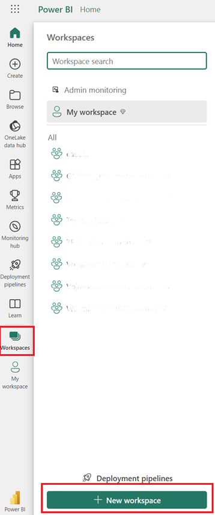
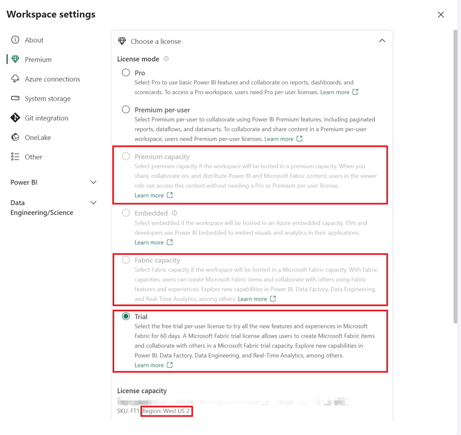
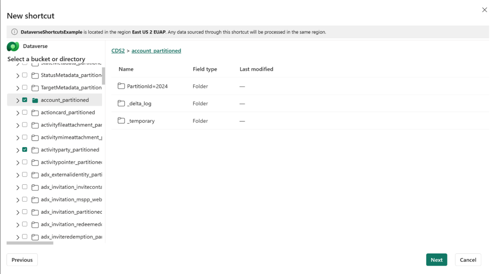
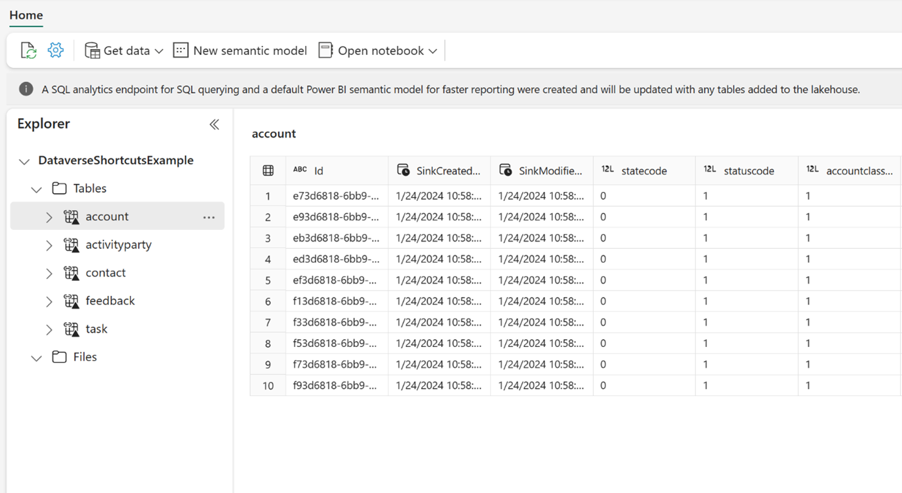
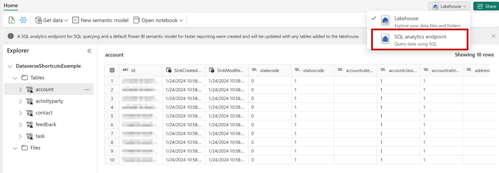
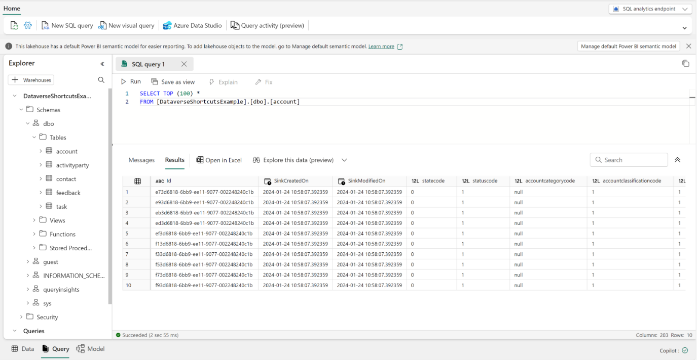

# Customer Insights - Journeys integration with Microsoft Fabric

In Customer Insights - Journeys, you can effortlessly create custom Power BI reports tailored to your business needs by using Microsoft Fabric capabilities. Harness seamless access to data to gain a complete understanding of your campaigns, lead management, market performance, and customer engagement, enabling you to identify new opportunities.

The integration of Dynamics 365 Customer Insights - Journeys with Microsoft Fabric automatically makes all your marketing data available for analysis in Microsoft Fabric without having to copy data, build ETL (extract, transform, and load) pipelines, or use third-party integration tools. Fabric integration allows you to get direct access to your marketing data storage and effortlessly create your custom reports in Power BI (PBI) without the need to export the data.

Dynamics 365 data doesn’t leave the Dataverse governance boundary. As data gets updated, changes are reflected in Microsoft Fabric automatically. Dataverse also generates an enterprise-ready Synapse Lakehouse and SQL endpoint for your Dynamics 365 data. This makes it easier for data engineers and Database (DB) admins to combine data from multiple sources and build custom analytics with Spark, Python, or SQL. 

Makers can build low-code apps and automations to orchestrate business processes and react to insights found in Microsoft Fabric using connectors to over 1,000 apps. Add those insights back to Dataverse as external or virtual tables through the SQL endpoint and makers can turn them into low-code apps with Power Apps, Power Pages, or Power Automate using skills they already have. 

## Onboarding

### Setup PBI

1. Launch Power BI with Microsoft Fabric https://app.powerbi.com 
2. Enable/ check if MS Fabric is enabled for your tenant. More information can be found here: [Enable Microsoft Fabric for your organization | Microsoft Learn](https://learn.microsoft.com/en-us/fabric/admin/fabric-switch)
 
  > [!div class="mx-imgBorder"]
  > 

3. This feature is only available in Power BI premium workspaces. If you don’t have Power BI premium capacity, you can sign up for a Free Fabric trial capacity by visiting here: [Fabric (preview) trial - Microsoft Fabric | Microsoft Learn](https://learn.microsoft.com/en-us/fabric/get-started/fabric-trial)
4. It's highly recommended that you create a new Power BI workspace to direct link to Dataverse. The workspace you choose to link with Dataverse must be assigned to a premium capacity in the same region as your Dataverse environment.
1. To confirm that you can create a premium workspace, choose workspace settings > premium and ensure that you have **Trial**, **Fabric**, or **Premium** capacity selected.

  > [!div class="mx-imgBorder"]
  > 

  > [!div class="mx-imgBorder"]
  > 

### Link to MS Fabric from Power Apps

1. Launch Power apps maker portal here: https://make.preview.powerapps.com/ 
1. Choose the right **environment** on the top right side.

  > [!div class="mx-imgBorder"]
  > 

3. Select **Tables** on the left navigation pane, and then select **Analyze > Link to Microsoft Fabric** on the command bar. You need to be a system administrator to link to Fabric.
 
  > [!div class="mx-imgBorder"]
  > 

4. If you're linking to Fabric for the first time, a wizard appears. You can launch Fabric with the same option in subsequent runs. 
    - The wizard validates your Fabric subscription settings the first time. If needed, the wizard asks you to create a **one-time connection** to Microsoft Fabric within the same step. 
    - The wizard asks you to select an existing Fabric workspace or to create a new one. **Choose the workspace that you’ve created in step #1**.  
    - When done, select **Create** in the wizard to create the workspace, create shortcuts, and to perform the initialization for the first time.

  > [!div class="mx-imgBorder"]
  > 

When complete, Fabric lakehouse opens in a separate browser tab.

It might take up to 60 minutes to update data in OneLake including the conversion to delta parquet format. If your environment contains much data, the initial load time might take longer. When you open Fabric lakehouse, the links appear as “**unidentified**” until the initial sync is completed. More information: [Troubleshooting common issues](https://learn.microsoft.com/en-us/power-apps/maker/data-platform/azure-synapse-link-view-in-fabric#troubleshooting-common-issues)

The workspace you choose to link with Dataverse must be assigned to a premium capacity in the same region as your Dataverse environment. If you choose to create a new workspace, the system requires that you have access to a Power BI / Fabric premium capacity within the same region as your Dataverse environment. The wizard might detect missing prerequisites including insufficient capacity at the beginning.

### Create MS Fabric shortcuts for Dynamics 365 Customer Insights - Journeys analytics folder (Public preview)

1. Start by opening Fabric fabric.microsoft.com
1. Create or open a Workspace.
1. Create or open a Lakehouse.
1. From the Lakehouse choose “Get data” and select “New shortcut”.

  > [!div class="mx-imgBorder"]
  > 

5. Select Dataverse from the shortcut source types.

  > [!div class="mx-imgBorder"]
  > 

6. Supply your Dataverse environment URL (Example: orgname.crm.dynamic.com) and the credentials that you want to access the environment with.  Dataverse shortcuts utilize a delegated authorization model.  All data access through the shortcut utilizes this credential.  This credential must have the System Administration permission in the Dataverse environment.  Be sure to secure access to this workspace before sharing this data with your users.
7. Choose the table(s) that you want to create a shortcut to.  Each table will be its own shortcut in the Lakehouse. If you’re not seeing all your tables, you may need to configure your Dataverse environment (step 2).  Use “Link to Fabric” to update the available tables.

  > [!div class="mx-imgBorder"]
  > 

  > [!div class="mx-imgBorder"]
  > 

### Work with marketing interactions in PBI

1. With your tables now available in your lakehouse, you can now start analyzing your data with Fabric.  Use Dataverse shortcuts with Spark Notebooks, the SQL endpoint, and Power BI reports.

From your lakehouse, you can open the SQL endpoint and start writing queries against your data.

  > [!div class="mx-imgBorder"]
  > 

  > [!div class="mx-imgBorder"]
  > 

2. Choose the **Data** tab, and select **New report**. Use Power BI to create a new report from your data or have Copilot help you get started.

## Known limitations during preview

1. This feature is in preview. Preview features aren't ready for production use and are provided to validate and to provide feedback to product team.
1. You need to have a Power BI premium capacity, Fabric premium capacity or Trial capacity in the same region as your Dataverse environment. Power BI premium per user capacity won't be sufficient. 
1. Don't delete any MS Fabric artifacts such as Lakehouse, SQL endpoint etc. during preview.
1. Depending on the size of data, initial sync may take 30 minutes or more. In the case of large tables, initial sync may take longer before you can consume data in Microsoft Fabric. 
1. After the initial sync, data changes in tables will be reflected in Microsoft Fabric up to 24 hours later.
1. Initially, only new data (RTJ and some OBM data) post the date of activating preview will be available for custom reporting. 
1. It's possible that there will be changes (for example, new attributes) in RT Journeys schema during preview. 
