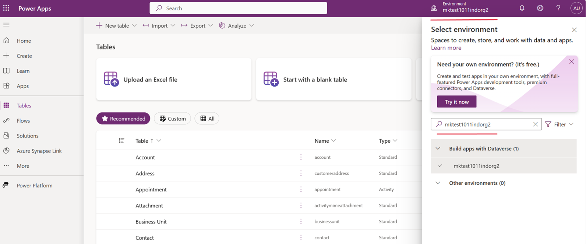
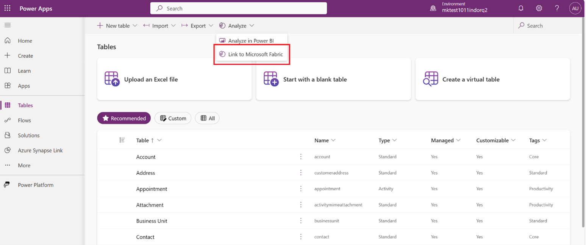
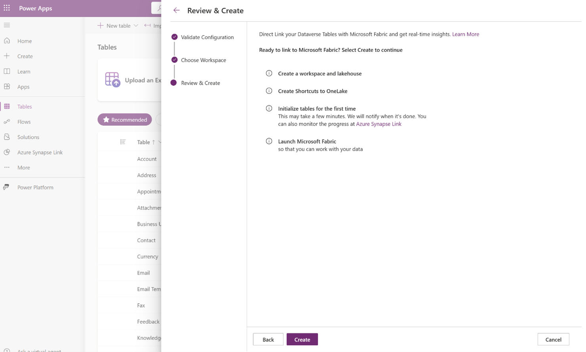

# Preview: Customer Insights - Journeys integration with Microsoft Fabric

> [!IMPORTANT]
> A preview feature is a feature that is not complete, but is made available before it’s officially in a release so customers can get early access and provide feedback. Preview features aren’t meant for production use and may have limited or restricted functionality.
> 
> Microsoft doesn't provide support for this preview feature. Microsoft Dynamics 365 Technical Support won’t be able to help you with issues or questions. Preview features aren’t meant for production use, especially to process personal data or other data that are subject to legal or regulatory compliance requirements.

In Customer Insights - Journeys, you can effortlessly create custom Power BI reports tailored to your business needs by using Microsoft Fabric capabilities. Harness seamless access to data to gain a complete understanding of your campaigns, lead management, market performance, and customer engagement, enabling you to identify new opportunities.

The integration of Dynamics 365 Customer Insights - Journeys with Microsoft Fabric automatically makes all your marketing data available for analysis in Microsoft Fabric without having to copy data, build extract, transform, and load (ETL) pipelines, or use third-party integration tools. Fabric integration allows you to get direct access to your marketing data storage and effortlessly create custom reports in Power BI (PBI) without the need to export the data.

Dynamics 365 data doesn’t leave the Dataverse governance boundary. As data gets updated, changes are reflected in Microsoft Fabric automatically. Dataverse also generates an enterprise-ready Synapse Lakehouse and SQL endpoint for your Dynamics 365 data. This makes it easier for data engineers and Database (DB) admins to combine data from multiple sources and build custom analytics with Spark, Python, or SQL. 

Makers can build low-code apps and automations to orchestrate business processes and react to insights found in Microsoft Fabric using connectors to over 1,000 apps. Add those insights back to Dataverse as external or virtual tables through the SQL endpoint and makers can turn them into low-code apps with Power Apps, Power Pages, or Power Automate using skills they already have.

## Onboarding

The following sections explain how to set up Power BI and link to Fabric.

### Set up Power BI

1. [Launch Power BI](https://app.powerbi.com) with Microsoft Fabric.
1. Enable or check if Fabric is enabled for your tenant. Learn more: [Enable Microsoft Fabric for your organization](/fabric/admin/fabric-switch)

    :::image type="content" source="media/setting-up-pbi.png" alt-text="Set-up Power BI screenshot." lightbox="media/setting-up-pbi.png":::

1. The Fabric integration feature is only available in Power BI premium workspaces. If you don’t have Power BI premium capacity, you can sign up for free Fabric trial capacity: [Fabric (preview) trial](/fabric/get-started/fabric-trial)
1. It's highly recommended that you create a new Power BI workspace to directly link to Dataverse. The workspace you choose to link with Dataverse must be assigned to a premium capacity in the same region as your Dataverse environment.
1. To confirm that you can create a premium workspace, go to **Workspace settings** > **Premium** and ensure that you have **Trial**, **Fabric**, or **Premium** capacity selected.

    :::image type="content" source="media/set-workspace-settings.png" alt-text="Create your workspace as per your requirement." lightbox="media/set-workspace-settings.png":::

### Link to Fabric from Power Apps

1. Launch the [Power apps maker portal](https://make.preview.powerapps.com/).
1. Choose the correct **environment** on the top right side.

    > [!div class="mx-imgBorder"]
    > 

1. Select **Tables** on the left navigation pane, then select **Analyze** > **Link to Microsoft Fabric** on the command bar. You need to be a system administrator to link to Fabric.
 
    > [!div class="mx-imgBorder"]
    > 

1. If you're linking to Fabric for the first time, a wizard appears. You can launch Fabric with the same option in subsequent runs.
    - The wizard validates your Fabric subscription settings the first time. If needed, the wizard asks you to create a **one-time connection** to Fabric within the same step.
    - The wizard asks you to select an existing Fabric workspace or to create a new one. **Choose the workspace that you created in the previous section**.  
    - When done, select **Create** in the wizard to create the workspace, create shortcuts, and to perform the initialization for the first time.

    > [!div class="mx-imgBorder"]
    > 

When complete, Fabric Lakehouse opens in a separate browser tab.

It may take up to 60 minutes to update data in OneLake including the conversion to Delta parquet format. If your environment contains a lot of data, the initial load time might take longer. When you open Fabric Lakehouse, the links appear as **unidentified** until the initial sync is completed. Learn more: [Troubleshooting common issues](/power-apps/maker/data-platform/azure-synapse-link-view-in-fabric#troubleshooting-common-issues)

The workspace you choose to link with Dataverse must be assigned to a premium capacity in the same region as your Dataverse environment. If you choose to create a new workspace, the system requires that you have access to a Power BI and Fabric premium capacity within the same region as your Dataverse environment. The wizard might detect missing prerequisites including insufficient capacity at the beginning.

### Create Fabric shortcuts for the Customer Insights - Journeys analytics folder (Public preview)

1. Start by [opening Fabric](https://app.fabric.microsoft.com).
1. Create or open a Workspace.
1. Create or open a Lakehouse.
1. From the Lakehouse choose **Get data** and select **New shortcut**.

    > [!div class="mx-imgBorder"]
    > 

1. Select **Datavers**e from the shortcut source types.

    > [!div class="mx-imgBorder"]
    > 

1. Supply your Dataverse environment URL (Example: orgname.crm.dynamic.com) and the credentials that you want to access the environment with.  Dataverse shortcuts utilize a delegated authorization model. All data access through the shortcut utilizes this credential. This credential must have System Administration permission in the Dataverse environment. Be sure to secure access to this workspace before sharing this data with your users.
1. Choose the tables that you want to create a shortcut to. Each table is its own shortcut in the Lakehouse. If you don't see all your tables, you may need to configure your Dataverse environment.  Use **Link to Fabric** to update the available tables.

    :::image type="content" source="media/link-to-fabric-through-shortcut.png" alt-text="Link to fabric through shortcut." lightbox="media/link-to-fabric-through-shortcut.png":::

### Work with marketing interactions in Power BI

1. With your tables now available in your Lakehouse, you can now start analyzing your data with Fabric. Use Dataverse shortcuts with Spark Notebooks, the SQL endpoint, and Power BI reports.

    From your Lakehouse, you can open the SQL endpoint.

    :::image type="content" source="media/use-sql-analytics-endpoint.png" alt-text="Use SQL analytics endpoint." lightbox="media/use-sql-analytics-endpoint.png":::

    And you can start writing queries against your data.

    :::image type="content" source="media/use-sql-analytics-endpoint-to-write-queries.png" alt-text="Use SQL analytics endpoint to write queries." lightbox="media/use-sql-analytics-endpoint-to-write-queries.png":::

1. Choose the **Data** tab, and select **New report**. Use Power BI to create a new report from your data or have Copilot help you get started.

## Known limitations during preview

- You need to have a Power BI premium capacity, Fabric premium capacity, or trial capacity in the same region as your Dataverse environment. Power BI premium per user capacity isn't sufficient.
- Don't delete any Fabric artifacts such as Lakehouse, SQL endpoint, etc. during preview.
- Depending on the size of data, initial sync may take 30 minutes or more. In the case of large tables, initial sync may take longer before you can consume data in Fabric. 
- After the initial sync, data changes in tables will be reflected in Fabric up to 24 hours later.
- Initially, only new data (real-time journeys and some outbound marketing data) generated after the date of activating the preview will be available for custom reporting. 
- It's possible that there will be changes (for example, new attributes) in the real-time journeys schema during preview. 
